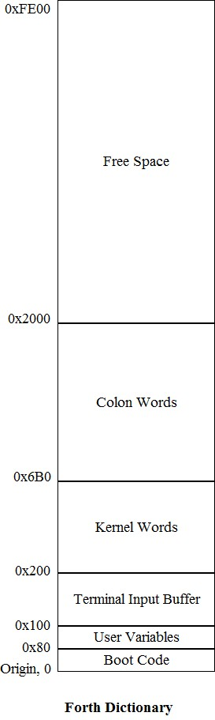
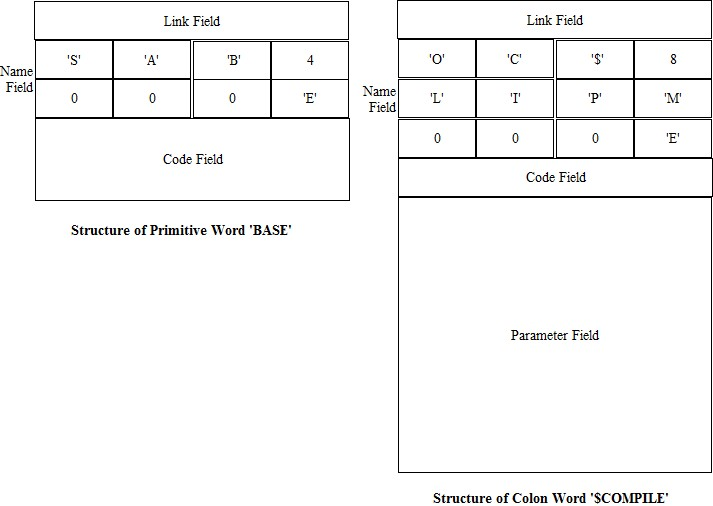
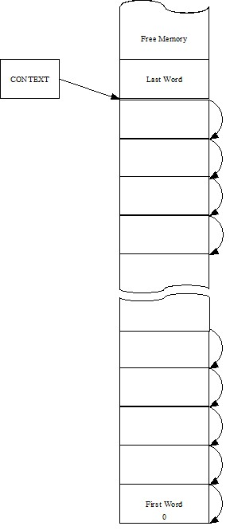
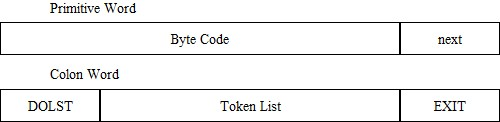
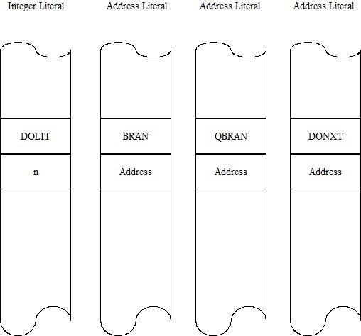
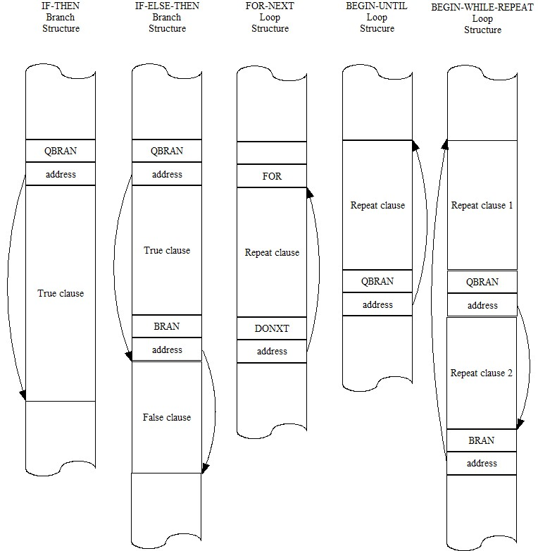
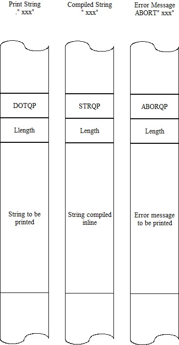

# ceForth_33

Dr. Chen-Hanson Ting,
July, 2019

# Chapter 1. How to Write Forth in C

1990年、Bill Muenchと私がマイクロコントローラ用のeForthモデルを開発したとき、メモリは乏しく、eForthを実装する唯一の方法はアセンブラでした。当時、C言語で書かれたForthのシステムはいくつかあり、その代表的なものはWil BadenのthisForthとMitch BradleyのForthmacsでした。しかし、しかし、この2つの実装は、Unix環境をベースにした大型コンピュータ向けのもので、勉強はしたものの、その複雑なmake処理については理解することができなかった。eForthをゼロから作るには、C言語とUnixの知識が足りなかったのです。

シリコンバレーForth Interest Groupでは、C言語でForthをどう書くかという議論が断続的に行われていて、C言語のエキスパートでもあるJohn Harboldは、C言語でForthを書くことは可能だと断言し、その方法をコードで示してくれた。でも、それは私の頭のずっと上を飛び交っていました。

2009年、C言語についての私自身の問題点、そしてC言語でForthを書くことの問題点を真剣に考え始めました。そして、Virtual Forth Machine(VFM)は、他のアセンブリ言語と同じようにC言語で簡単に書くことができることに気づきました。VFMは単にForthの原始的な言葉の集合で、特定のマイクロコントローラのアセンブリで書くのも、理想化された汎用CPU用に設計されたC言語で算術演算をエミュレートするのも非常に簡単であった。私が問題にしたのは、Forth辞書の構築である。Forth辞書は、Forthのワードをリンクしたリストで、レコードという形式になっている。各レコードは、固定長のリンクフィールド、可変長の名前フィールド、固定長のコードフィールド、可変長のパラメータフィールドの4つのフィールドを持っている。私が理解したところでは、初級Cコンパイラは、これらのレコードの構築とリンクのためのデータ構造を持っていなかった。このレコードの構築とリンクには、thisForthやForthmacにあるような複雑な方法が必要だったのだ。

Chuck Mooreは私にアセンブラの書き方と、メタコンパイラでMuP21の辞書を構築する方法を教えてくれました。私は彼のメタコンパイラを使って、P8、P24、eP16、eP32チップ用のeForthシステムを構築したことがありました。Forthのメタコンパイラは、マクロアセンブラやC言語よりもずっと強力でした。私がしなければならなかったのは、巨大なデータ配列を割り当てて、すべてのレコードを含む辞書を構築することだけでした。 このデータ配列は、アセンブリファイルやCのヘッダーファイルの中でVFMのコードにコピーすることができる。VFMをバイトコードで定義すると、辞書の中身はデータだけとなり、実行可能なCコードはない。バイトコードの優れた点は、Forthシステムを基盤となるマイクロコントローラから完全に分離し、CコンパイラがあればどんなマイクロコントローラにもForthシステムを移植できることだ。

直接スレッド型Forthモデルでは、プリミティブワードのレコードはバイトコードのみを含む。コロンワードは、コードフィールドにバイトコードのセルを1つ持ち、パラメータフィールドにトークンリストを持つ。トークンは、他のワードのコードフィールド・アドレスである。

Forthの辞書をデータ配列に埋め込むことは、C言語の基本的なプログラミングモデル、すなわち実行可能なCコードはコードセグメントに、データと変数はデータセグメントにコンパイルされる、ということにうまく適合する。C言語はコンパイル言語であるため、データセグメントでコードを実行することはなく、コードセグメントへのコードやデータの書き込みは違法とみなされます。Forthはインタプリタ型言語であり、コードとデータを区別せず、ユーザが新しいコードを辞書に追加することを推奨している。そこで、VFMのコードをコードセグメントに、Forthのワードをデータセグメントに書き込むという妥協策をとりました。VFMには新しい疑似命令を追加しないが、Forthの辞書には新しいコロンワードを自由に追加できる、という制限を受け入れた。

Forthシステムの設計は、Cを含む各種マイクロコントローラをターゲットとしたVFMマシンの構築と、Forth辞書の構築の2つの独立したタスクに分離できるようになりました。 その際、それぞれの作業に最適な独立したツールを使用することができます。Forth辞書の構築には、長年使ってきたF#を選びました。現在、私の理解では、C、C++、C#には、VFMと一緒に辞書を構築するのに必要なツールはありません。

2009年、私はC言語で2種類のeForthを書きました。64プリミティブのceForth 1.0と、32プリミティブのceForth 1.1です。これらはcygwinの下でgccによってコンパイルされました。私は、自分のエゴのために、自分ができることを示すために、これらを実行しました。実用に耐えるとは思っていませんでした。

2011年、Arduino Uno Kitに惹かれ、eForthを328eForthとして移植しました。この実装の問題点は、一般的なArduino IDEのツールチェーンと互換性がないことでした。フラッシュメモリ内の辞書に新しいForthのワードを追加する必要があったのです。Arduinoでは、実行時にフラッシュメモリに書き込むことは許可されていませんでした。フラッシュメモリに書き込む特権を得るためには、Arduino IDEが独占しているブートロード部を置き換えてフラッシュメモリに書き込む必要がありました。 

Arduinoに対応するため、ceForth 1.1をArduino Unoにスケッチ形式で移植しました。ceForth_328.cppは、基本的にはC言語プログラムです。フラッシュメモリには何も書き込めないという制約の中、RAMメモリにForth辞書を拡張した。すると、うまくいった。 しかし、新しいForth語のために残されたRAMメモリは1.5KBしかなく、電源が落ちる前に新しいワードを保存することはできなかった。このとき述べたように、これはArduino UnoでForthを試してみようという新しい人々を誘うためのお誘いにすぎませんでした。実際のアプリケーションでは、328eForthを使う必要があったのです。

2016年、台湾のFIGグループの友人、Derek Laiが、彼と彼の息子Rickyが作ったWiFiBoy Kitsをいくつかくれました。それは、WiFi無線機を内蔵したESP8266チップを使用していました。同じチップを使ったもっとシンプルなキットNodeMCUが、eBayでわずか3.18ドルで売られているのを発見しました。160MHzの32ビットCPU、150KBのRAM、4MBのフラッシュ、多数のIOデバイスを搭載した、これまでで最も安価で強力なマイクロコントローラキットだったのです。これらに加えて、802.11のWiFiに対応しています。

ESP8266の製造元である中国上海のEspressif Systems社は、多数のソフトウェア開発キットをリリースし、このチップに対するソフトウェアのサポートをユーザーコミュニティに委ねました。多くのエンジニアがこの課題に取り組み、コミュニティ向けにさまざまなプログラミングツールを提供しました。Espressifはその後、ロシアのエンジニアIvan Grokhotkovを雇い、ESP8266のコードをコンパイルできるようにArduino IDEを拡張させました。この新しいArduino IDEの拡張により、私のようなホビーユーザーでもIoTの実験ができるようになりました。ESP8266の大容量メモリは、私がArduino UnoのATmega328で抱えていた問題を解決し、ESP8266をForthの良いホストにしてくれました。

数時間でceForthがNodeMCU Kitにうまく移植されたのには、とても驚かされました。ESP8266に適合させるための変更はごくわずかで、Forthの辞書も全く変更する必要がありませんでした。全てはC言語のコードで移植できたからです。一般的に、新しいマイクロコントローラにForthを移植するのには、だいたい2週間くらいかかりました。この時間のほとんどは、特定のアセンブラの癖に対処したり、頑固なCPUアーキテクチャにVFMを無理やり合わせ込むために浪費されていた。ところが、C言語がまるで万能アセンブラのように振る舞ってくれるのだ。

Arduino IDE上でC言語で書かれたForthを使って、いくつかのNodeMCUキットをWiFiネットワーク上で互いに会話させることができました。私はまだESP8266に内蔵されているTensilicaのL106チップを全く理解していませんでしたし、WiFiやそのプロトコルも全て理解していませんでした。私がしたことは、いくつかのことをするために必要なライブラリ関数を調べることでした。IoT for Dummies! です。C言語で書かれたシンプルなForthには価値があるようです。そこで、ceForth 1.0をceForth 2.3に更新し、人々が何らかの利用法を見出すことを期待します。スタックのための循環バッファや、VFMを実行するためのストリームライン化されたFinite State Machineのような、いくつかの重要な改良が行われました。

Microsoft Visual Studio Community 2017の下でC++に移行し、最新のWindows PCでコンパイルとテストができるようになりました。 espForth for ESP8266は2017 Bay Area Maker FaireでSVFIGブースで展示されました。

最近、ESP8266がESP32にアップグレードされ、3つのCPUコアとはるかに大きなRAMメモリを持つようになりました。 SVFIGのRon GoldingがAIR(AIロボット)に使うことになったので、espForthを移植し、esp32forthとしました。2019年のBay Area Maker Faireでデモを行いました。

ちょうどフェアーの準備をしているときに、妻が脳梗塞で倒れ、救急車で搬送されました。 フェアーの後、彼女はカリフォルニア・パシフィック・リージョナル・リハビリテーション・センターに送られました。私は、コンピュータを持ってくるのを忘れて、彼女の病院のベッドで泊まり込みました。私は、コンピュータがなくても生きていけることを彼女に証明したのです。私は、彼女が当然受けるべき、私の関心を一心に集めました。私は、自分のForth in Cについて考える時間がたくさんあった。 

私は、私の美しく作られたForthの有限状態マシンについて熟考した。
```
{ primitives[cData[P++]](); }
```
これは、連続したバイトコードを読み込んで、順番に実行するものだ。データ配列から連続したバイトを読むことができれば、データ配列に連続したバイトを書き戻すことができるはずだ。Cには可変長配列が組み込まれていないが、可変長レコードを大きなデータ配列に書き込むことを妨げるものではない。

2週間後、娘が私のパソコンを持ってきてくれたので、私は自分でデータレコードを書いてみるようになった。最初に試したのはPythonで、大きな配列にいろいろと書き込んで、それを読み出すことができた。まず、配列にバイトを追加する`writeByte(c)`と、整数を追加する`writeInteger(n)`を用意しました。そこから、Forthの原始的なワードを組み立てる`CODE()`、コロンのワードを組み立てる`COLON()`、コロンのワードにトークンリストを付加する`LABEL()`というマクロ関数を定義しました。これらはマクロアセンブラと同じような働きをする。他にやることもないので、esp32forth_54の辞書を全部作り、esp32forth_54のForthメタコンパイラが生成するヘッダーファイルrom_54.hとバイト単位で比較した。

妻がリハビリセンターから退院した後、私はNodeMCU ESP32S Kitに戻り、esp32forthにマクロアセンブラを追加し、rom_54.hのヘッダファイルを取り除いたのです。この新しいesp32forth_61システムでは、すべてが1つのesp32forth_61.inoファイルに収められています。1つのCファイルには、ESP32キット上で完全なForthシステムを立ち上げるために必要なすべての情報が含まれていました。しかし、トークン・リストのラベルを使用して分岐やループのターゲット・アドレスに印を付けて前方参照を手動で解決しなければならないため、満足できるものではありませんでした。マクロアセンブラを拡張して、すべての前方参照を自動的に解決して、制御構造を1回のパスで構築できるようにしました。これが esp32forth_62 です。

その後、ceForth_23は新しいマクロアセンブラを搭載してceForth_33にバージョンアップしました。Forthシステムを試してもらうのに、1つのファイルを配布するだけで良いのはとても良いことです。また、F#のメタコンパイラをドキュメント化し、Forthに詳しくない人に説明する手間も省ける。ForthをForthで説明するのは愚かなことです。Forthを説明するためには、C言語やアセンブリなど、他の言語を使わなければならないのです。これが、当初のeForth Modelの意図でした。


# Chapter 2. Running ceForth

2年前、私の以前の本やForthの実装の入手状況を尋ねられたことがあります。紙の本はほとんどなくなっていた。コンピュータに保存してある電子的なコピーは時代遅れになっているようでした。それらはすべて、新しいコンピュータで新しいフォーマットで、新しい命を求めて声高に叫んでいたのです。 

私の86eForth 1.0は最悪でした。これは1990年にPC-DOSコンピュータ上でMASMによってコンパイルされたものです。 MASMはとっくに製造中止になっていたので、私はそれを復活させるためのより良い方法を見つけなければなりませんでした。そんなとき、MASMはまだ使えるが、Visual StudioのC++の陰に隠れていることを知りました。

ceForth 1.0と1.1はcygwin上のgccで開発されました。CygwinはPC上で動く不自由なLinuxでしたが、Windowsとは異質なシステムでした。コンパイルや実行の仕方をすっかり忘れていた。Visual Studioに移行する時期が来ました。

## Install Visual Studio 2019 Community 

ceForth 1.0は、Visual Studio 2017 CommunityでceForth_23にバージョンアップされました。その後、Visual Studio 2019 CommunityでceForth_33にバージョンアップしています。

ceForth_33.cppは、Visual Studio C++のWindows Console Applicationです。Visual Studio C++でコンパイルし、Windows上で実行するための合理的なC言語プログラムです。ceForthを実行するには、まずVisual Studio IDEをインストールする必要があります。その後、ceForth_33.cppをコピーして、実行させることができます。

Visual Studio 2019 Communityをwww.microsoft.com からダウンロードし、PCにインストールします。 Visual Studioを開くと、そのロゴページが表示されます。

しばらくすると、そのスタートページが表示されます。

"新しいプロジェクトを作成する"をクリックします。

新しいプロジェクトを作成するパネルで、Console Appを選択します。すると、プロジェクトの設定ページが表示されます。

プロジェクト名]ボックスに、ceForth_33と入力します。Locationボックスで、プロジェクトを保存するファイルフォルダを選択するか、または任意のフォルダをブラウズしてください。

右下の作成ボタンをクリックすると、新しいceForth_33プロジェクトが作成されます。 

Visual Studioはあなたのために新しいプロジェクトを作成し、テンプレートファイルceForth_33.cppを提供します。 ceForth_33.zipファイルに入っているceForth_33.cppの内容をコピーし、ceForth_33.cpp編集パネルに貼り付けてください。

## Compile ceForth

これで、ceForth_33.cppがEdit Panelに表示されました。

Build>Rebuild Solution をクリックすると、Visual Studio は作業を開始します。しばらくすると、出力パネルに進捗状況が数行表示され、このメッセージで終了します。

===== Rebuild All, 1 succeeded, 0 failed, 0 skipped =====

すべて順調です。テストの準備ができました。

## Test ceForth

Debug>Start without debuggingをクリック。もう少し待ちます。最後に、Debug ウィンドウが表示されます。

その上に、Console Windowがあります。

成功！ceForthは実行されています。

Enterキーを何回か押すと、ceForthは空のスタックを表示し、'ok>'のプロンプを表示します。

WORDSと入力すると、ceForthの完全なシステムを表すワード名の画面が表示されます。

さて、この世界共通の挨拶語を入力してください。
```
: TEST CR .” HELLO, WORLD!” ;
```
と入力し、TESTと入力します。

これでceForthは完全に機能するようになりました。

# Chapter 3. ceForth Virtual Forth Engine

## ceForth_33.cpp

ファイルceForth_33.cppは、Visual Studio IDEでコンパイルし、Windowsコンソールアプリケーションとして実行することができるC++プログラムです。このファイルは、Virtual Forth Engineの仕様として、C関数の観点から完璧に機能しています。

ceForthに直接入る前に、Virtual Firth Machine (VFM)を配したForthシステムの概要を説明し、全体がどのように実装されているかをより良く理解していただきたいと思います。

* VFMは、バイトコード形式の擬似命令群を実行します。
* すべてのForthのワードやコマンドは、辞書と呼ばれる大きなデータ配列に格納されています。
* 各ワードはレコードを持つ。すべてのレコードは、辞書内でリンクされています。
* 各ワードのレコードは、リンクフィールド、名前フィールド、コードフィールド、パラメータフィールドの4つのフィールドを含んでいます。リンクフィールドと名前フィールドは、そのASCII名から辞書を検索することができる。コードフィールドは、実行可能なバイトコードを含む。パラメータフィールドには、そのワードが必要とするオプションのコードやデータが入ります。
* ワードには、実行可能なバイトコードを含むプリミティブワードと、トークン・リストを含むコロンワードの2種類があります。トークンは、ワードのコードフィールドを指すコードフィールドアドレスです。
* シーケンサは、プリミティブ・ワードのコード・フィールドに格納されたバイト・コード・シーケンスを実行します。
* 内部インタプリタは、プリミティブ・ワードを終了させ、トークン・リストの次のトークンを実行する。
* アドレスインタプリタは、ネストされたトークンリストを実行する。
* トークンリストの入れ子処理には、リターンスタックが必要です。
* ワード間のパラメータ受け渡しにデータスタックが必要
* テキストインタプリタは、ターミナルから入力されたワードリストを処理する。
* コンパイラはワードリストを新しいForthワードに変換します。

テキストインタープリタは、スペースで区切られたForth語のリストを解釈または実行します。
```
<list of words>
```
また、ワードのリストを置き換えるために新しいワードを作成するコンパイラのような機能もあります。
```
: <name> <list of words> ;
```
コンパイルはコロン「:」で始まり、セミコロン「;」で終わるので、これらの新しいワードはコロンワードと呼ばれます。コロン「:」とセミコロン「;」もまたForthのワードである。 計算可能な問題はすべて、既存のワードのリストを置き換えるために新しいワードを繰り返し作ることで解くことができる。これは自然言語と非常によく似ている。新しいワードは、既存のワードのリストを置き換えるために作られる。思考やアイデアはこのようにしてより高いレベルへと抽象化される。本当の知性は、深くネストされたリストで表現するのが一番です。Forthは、人工知能とは対照的に、本物の知能である。また、Forthは、あらゆる計算可能な問題に対して、解の空間を広く探索し、最適な解に到達するための最も単純で最も効率的な方法である。では、このVFMが実際にどのように実装されているのか、ceForth_33.cppのソースコードを読んでみましょう。

## Preamble

ceForth_33.cppの冒頭には、ceForthの実装の進捗を記録するために、いくつかのコメント行を入れました。コメントの後に、ヘッダーファイルを取り込むためのinclude命令と、残りのCコードのコンパイルを容易にするためのマクロがいくつかあります。
```
//Preamble
#include <stdlib.h>
#include <stdio.h>
#include <tchar.h>
#include <stdarg.h>
#include <string.h>
# define FALSE 0
# define TRUE -1
# define LOGICAL ? TRUE : FALSE
# define LOWER(x,y) ((unsigned long)(x)<(unsigned long)(y))
# define pop top = stack[(char) S--]
# define push stack[(char) ++S] = top; top =
# define popR rack[(unsigned char)R--]
# define pushR rack[(unsigned char)++R]
```
`<stdlib.h>`、`<tchar.h>`、`<stdio.h>`は、ceForthが必要とする標準ライブラリのヘッダーファイルです。`<stdarg.h>`は、可変パラメータリストを持つマクロ関数のために必要です。 `<string.h>`は、文字列の長さを決定するstrlen()に必要なファイルである。

FALSEフラグのデフォルトは0、TRUEフラグのデフォルトは-1です。ただし、フラグを生成するすべてのceForthワードは、TRUEの場合は-1を返します。LOGICALは、論理語に対して上記の方針を強制し、正しいTRUEとFALSEのフラグを返すようにしたマクロです。

`LOWER(x,y)` は `x<y` ならば TRUE フラグを返します。

popは、データスタックをレジスタやメモリ位置にポップするためによく使われる操作をストリームライン化したマクロです。データタックの先頭要素はレジスタ top にキャッシュされるため、pop はより複雑になりますが、pop マクロは私の意図を明確にするのに役立ちます。

同様に、pushはレジスタやメモリ上のコンテンツをデータスタックにプッシュするマクロです。 実際には、トップ・レジスタの内容をデータ・スタックにプッシュし、ソース・データをトップ・レジスタにコピーする必要があります。

pushR はレジスタやメモリ上のコンテンツをリターンスタックにプッシュするマクロで、popR はその逆を行います。リターンスタックは、コンパイル時にコロンワードのトークンリストにある制御構造をコンパイルしやすくするために作成されました。実行時には、トークンがネストしたトークンを呼び出すことができるように、リターンスタックはネストしたリターンアドレスをホストしています。 

## Registers and Arrays

ceForthは、ワードの辞書を保持するために大きなデータ配列を使っています。この配列には、たくさんの変数やバッファが宣言されています。このデータ配列の他に、VFMはすべての操作をサポートするために、データを保持する多くのレジスタと配列を必要とします。以下は、これらのレジスタと配列のリストです。
```
long rack[256] = { 0 };
long stack[256] = { 0 };
long long int d, n, m;
unsigned char R = 0;
unsigned char S = 0;
long top = 0;
long P, IP, WP, thread, len;
unsigned char c;
long data[16000] = {};
unsigned char* cData = (unsigned char*)data;
```
これらのレジスタおよび配列の機能を次の表で説明します。

|Register/Array|Functions|
|--|--|
|`P`|プログラムカウンタ、data[]内の疑似命令を指し示す。
|`IP`|アドレス・インタプリタ用の命令ポインタ
|`WP`|作業レジスタ。通常はパラメータ・フィールドを指します。
|`rack[]`|リターンスタック(256セルの循環バッファ)
|`stack[]`|データスタック(256セルの循環バッファ)
|`R`|1 バイトのリターン・スタック・ポインタ
|`S`|1 バイトのデータスタックポインタ
|`top`|データスタックのキャッシュされたトップエレメント
|`c`|8ビットスクラッチレジスタ 
|`data[]`|16000個の整数からなる巨大なデータ配列
|`cData[]`|バイトアクセスするための data[] 配列のエイリアス

ceForth_33 では、`stack[256]` と `rack[256]` にそれぞれ 1KB のメモリを割り当て、`S` と `R` にそれぞれバイトポインタを使用しました。しかし、Cコンパイラは、スタックポインタが8ビット値であり、整数にリークしてはならないことを常に注意する必要がある。`R` と `S` のポインタは常に (unsigned char) 指定を前置しなければならない。このため、スタックが境界を越えることはありません。スタックオーバーフロー、スタックアンダーフローは生じません。

ceForth_33インタープリタは、データスタックの上位4要素を表示します。常にこの4つの要素を見ることができるので、データスタックをダンプしたり、調べたりするユーティリティは必要ありません。スタックに循環バッファを使うことで、4バイトのコード、約10個のスタック管理語、そして1トンの心配を省くことができました。

Forthのワードはすべて`data[16000]`配列にリンクリストとして格納されており、一般に辞書と呼ばれる。このリストの各レコードは、32ビットのリンクフィールド、可変長の名前フィールド、32ビットのコードフィールド、可変長のパラメータフィールドの4つのフィールドを含んでいます。プリミティブワードでは、パラメータフィールドは追加のバイトコードを含むことができる。高レベルのコロンワードでは、コードフィールドは、後続のパラメータフィールドのトークンリストを入れ子にするためのバイトコード6を持つ。トークンはコードフィールドのアドレスであり、他のForthワードを指します。

`data[]`配列の辞書は、マクロアセンブラによって埋められます。マクロアセンブラは可変長のバイトフィールドと可変長の整数フィールドの両方を埋める必要があるため、バイト配列の別名として`cData[]`を持っています。`P`はバイトコードプログラムカウンタであり、バイト配列`cData[]`のインデックスに使用されます。`IP`は命令ポインタまたは整数ポインタであり、整数配列`data[]`のインデックスに使用される。

後ほど、マクロアセンブラを説明するとともに、この辞書がどのように構築されるかを説明します。

## Virtual Forth Machine (VFM)

次に、C言語の関数としてコード化されたすべてのVFM疑似命令が出てきます。それぞれの擬似命令には、バイトコードが割り当てられます。バイトコードシーケンサや有限状態機械は、辞書にあるプリミティブワードのコードフィールドに置かれたバイトコードを実行するように設計されています。バイトコードはVFMの機械命令であり、実際のコンピュータの機械命令と同じである。

// Virtual Forth Machine

`bye ( -- )` ForthからWindowsに制御を戻す。Forth用に開いたWindowsコンソールを閉じます。
```
void bye(void)
{
    exit(0);
}
```
`qrx ( -- c T|F )` 文字と、その文字が受信された場合の真フラグを返す。文字を受信しなかった場合、falseフラグを返す 
```
void qrx(void)
{
    push(long) getchar();
    if (top != 0) push TRUE;
}
```
`txsto ( c -- )` シリアルターミナルに文字を送信する。
```
void txsto(void)
{
    putchar((char)top);
    pop;
}
```
`next()`は、Virtual Forth Machineの内部インタプリタである。トークンリストの次のトークンを実行する。これはコード・フィールド・アドレスである次のトークンを読み、それをプログラム・カウンタ `P` にデポジットします。また、`P+4`をワークレジスタ`WP`に格納し、このワードのパラメータフィールドを指し示す。WPは、コロンワードのトークンリストやパラメータフィールドに格納されているデータを取り出すのに役立つ。
```
void next(void)
{
    P = data[IP >> 2];
    WP = P + 4;
    IP += 4;
}
```
`dovar( -- a )` WP レジスタに保存されているパラメータフィールドアドレスを返します。
```
void dovar(void)
{
    push WP;
}
```
`docon ( -- n )` 定数ワードのパラメータフィールドに格納されている整数を返す。
```
void docon(void)
{
    push data[WP >> 2];
}
```
`dolit ( -- w)` 次のトークンを整数リテラルとしてデータスタックにプッシュします。これにより、数値はインラインリテラルとしてコンパイルされ、実行時にデータスタックにデータを供給することができる。 
```
void dolit(void)
{
    push data[IP >> 2];
    IP += 4;
    next();
}
```
`dolist ( -- )` 現在の命令ポインタ(IP)をリターンスタックにプッシュし、データスタックからIPにプログラムカウンタPをポップする。next()が実行されると、リスト内のトークンが連続実行される。 
```
void dolist(void)
{
    rack[(char)++R] = IP;
    IP = WP;
    next();
}
```
`exitt ( -- )` コロン・ワードのトークン・リストをすべて終了させる。EXITは、リターンスタックに保存された実行アドレスをIPレジスタにポップバックし、コロンワードが入力される前の状態を復元する。呼び出したトークンリストの実行は継続される。
```
void exitt(void)
{
    IP = (long)rack[(char)R--];
    next();
}
```
`execu ( a -- )` データスタックから実行アドレスを取り出し、そのトークンを実行する。この強力なワードを使えば、トークン・リストにないトークンでも実行できる。
```
void execu(void)
{
    P = top;
    WP = P + 4;
    pop;
}
```
`donext ( -- )` FOR-NEXTループを終了させる。ループカウントはリターンスタックにプッシュされ、donextによってデクリメントされる。カウントが負でなければ、donext に続くアドレスにジャンプし、そうでなければ、リターンスタックからカウントをポップして、ループを抜ける。
```
void donext(void)
{
    if (rack[(char)R]) {
        rack[(char)R] -= 1;
        IP = data[IP >> 2];
    }
    else {
        IP += 4;
        R--;
    }
    next();
}
```
`qbran ( f -- )` topをデータスタック上のフラグとしてテストする。0であればqbranに続くアドレスに分岐し、そうでなければそのアドレスに続くトークンリストの実行を継続する。 
```
void qbran(void)
{
    if (top == 0) IP = data[IP >> 2];
    else IP += 4;
    pop;
    next();
}
```
`bran ( -- )` bran の次のアドレスに分岐します。
```
void bran(void)
{
    IP = data[IP >> 2];
    next();
}
```
`store ( n a -- )` 整数nをメモリ位置aに格納する。
```
void store(void)
{
    data[top >> 2] = stack[(char)S--];
    pop;
}
```
`at ( a -- n)` メモリアドレスaを、この位置から取り出した整数の内容で置き換える。
```
void at(void)
{
    top = data[top >> 2];
}
```
`cstor ( c b -- )` バイト値cをメモリ位置bに格納する。
```
void cstor(void)
{
    cData[top] = (char)stack[(char)S--];
    pop;
}
```
`cat ( b -- n)` バイトメモリアドレスbを、この場所から取り出したバイトの内容で置き換える。
```
void cat(void)
{
    top = (long)cData[top];
}
```
`rfrom ( n -- )` データスタックから数値をポップし、リターンスタックにプッシュします。 
```
void rfrom(void)
{
    push rack[(char)R--];
}
```
`rat ( -- n )` Copy a number off the return stack and pushes it on the return stack.  

`rat ( -- n )` リターンスタックから数値をコピーして、リターンスタックにプッシュします。 
```
void rat(void)
{
    push rack[(char)R];
}
```
`tor ( -- n )` リターンスタックから数値をポップし、データスタックにプッシュします。 
```
void tor(void)
{
    rack[(char)++R] = top;
    pop;
}
```
`drop ( w -- )` スタックの一番上のアイテムを破棄します。
```
void drop(void)
{
    pop;
}
```
`dup ( w -- w w )` スタックの先頭の項目を複製する。
```
void dup(void)
{
    stack[(char) ++S] = top;
}
```
`swap ( w1 w2 -- w2 w1 )` スタックの上位2項目を交換する。
```
void swap(void)
{
    WP = top;
    top = stack[(char)S];
    stack[(char)S] = WP;
}
```
`over ( w1 w2 -- w1 w2 w1 )` 2 番目のスタックアイテムを先頭にコピーする。
```
void over(void)
{
    push stack[(char)S - 1];
}
```
`zless ( n - f )` データスタックの一番上の項目が負であるかどうかを調べる。負の場合は -1 を返す。0または正の場合は、0を返して偽とする。
```
void zless(void)
{
    top = (top < 0) LOGICAL;
}
```
`andd ( w w -- w )` ビット単位のAND。
```
void andd(void)
{
    top &= stack[(char)S--];
}
```
`orr ( w w -- w )` ビット単位の包括的論理和。
```
void orr(void)
{
    top |= stack[(char)S--];
}
```
`xorr ( w w -- w )` ビット単位の排他的論理和。
```
void xorr(void)
{
    top ^= stack[(char)S--];
}
```
`uplus ( w w -- w cy )` 2つの数値を加算し、その和とキャリーフラグを返します。
```
void uplus(void)
{
    stack[(char)S] += top;
    top = LOWER(stack[(char)S], top);
}
```
`nop ( -- )` 操作なし。
```
void nop(void)
{
    next();
}
```
`qdup ( w -- w w | 0 )` スタックの先頭が0でなければ、Dupする。
```
void qdup(void)
{
    if (top) stack[(char) ++S] = top;
}
```
`rot ( w1 w2 w3 -- w2 w3 w1 )` 3番目の項目を一番上に回転させる。
```
void rot(void)
{
    WP = stack[(char)S - 1];
    stack[(char)S - 1] = stack[(char)S];
    stack[(char)S] = top;
    top = WP;
}
```
`ddrop ( w w -- )` スタック上のアイテムを2つ捨てる。
```
void ddrop(void)
{
    drop(); drop();
}
```
`ddup ( w1 w2 -- w1 w2 w1 w2 )` 上位2項目を複製する。
```
void ddup(void)
{
    over(); over();
}
```
`plus ( w w -- sum )` 上2つの項目を追加する。
```
void plus(void)
{
    top += stack[(char)S--];
}
```
`inver ( w -- w )` topの1の補数。
```
void inver(void)
{
    top = -top - 1;
}
```
`negat ( n -- -n )` topの2の補数。
```
void negat(void)
{
    top = 0 - top;
}
```
`dnega ( d -- -d )` トップダブルの2の補数。
```
void dnega(void)
{
    inver();
    tor();
    inver();
    push 1;
    uplus();
    rfrom();
    plus();
}
```
`subb ( n1 n2 -- n1-n2 )` 減算。
```
void subb(void)
{
    top = stack[(char)S--] - top;
}
```
`abss ( n -- n )` nの絶対値を返す。
```
void abss(void)
{
    if (top < 0)
        top = -top;
}
```
`great ( n1 n2 -- t )` 上位 2 項目の符号付き比較。`n1>n2` ならば真を返す。
```
void great(void)
{
    top = (stack[(char)S--] > top) LOGICAL;
}
```
`less ( n1 n2 -- t )` 上位 2 項目の符号付き比較。`n1<n2` ならば真を返す。
```
void less(void)
{
    top = (stack[(char)S--] < top) LOGICAL;
}
```
`equal ( w w -- t )` 上の二つが等しいとき、true を返す。
```
void equal(void)
{
    top = (stack[(char)S--] == top) LOGICAL;
}
```
`uless ( u1 u2 -- t )` 上位 2 項目の符号なし比較。
```
void uless(void)
{
    top = LOWER(stack[(char)S], top) LOGICAL; (char)S--;
}
```
`ummod ( udl udh u -- ur uq )` 符号無しで double を single で割ったもの。modと商を返す。
```
void ummod(void)
{
    d = (long long int)((unsigned long)top);
    m = (long long int)((unsigned long)stack[(char)S]);
    n = (long long int)((unsigned long)stack[(char)S - 1]);
    n += m << 32;
    pop;
    top = (unsigned long)(n / d);
    stack[(char)S] = (unsigned long)(n % d);
}
```
`msmod ( d n -- r q )` 符号付き打ち切り除算(signed floored divide)によるdoubleのsingleによる除算。modと商を返す。
```
void msmod(void)
{
    d = (signed long long int)((signed long)top);
    m = (signed long long int)((signed long)stack[(char)S]);
    n = (signed long long int)((signed long)stack[(char)S - 1]);
    n += m << 32;
    pop;
    top = (signed long)(n / d);
    stack[(char)S] = (signed long)(n % d);
}
```
`slmod ( n1 n2 -- r q )` 符号付き除算。modと商を返す。
```
void slmod(void) 
{
    if (top != 0) {
        WP = stack[(char)S] / top;
        stack[(char)S] %= top;
        top = WP;
    }
}
```
`mod ( n n -- r )` 符号付き除算。modのみを返す。
```
void mod(void)
{
    top = (top) ? stack[(char)S--] % top : stack[(char)S--];
}
```
`slash ( n n -- q )` 符号付き除算。商のみを返す。
```
void slash(void)
{
    top = (top) ? stack[(char)S--] / top : (stack[(char)S--], 0);
}
```
`umsta ( u1 u2 -- ud )` 符号なし乗算。double の積を返す。
```
void umsta(void)
{
    d = (unsigned long long int)top;
    m = (unsigned long long int)stack[(char)S];
    m *= d;
    top = (unsigned long)(m >> 32);
    stack[(char)S] = (unsigned long)m;
}
```
`star ( n n -- n )` 符号付き乗算。単長の積を返します。
```
void star(void)
{
    top *= stack[(char)S--];
}
```
`mstar ( n1 n2 -- d )` 符号付き乗算。double の積を返します。
```
void mstar(void)
{
    d = (signed long long int)top;
    m = (signed long long int)stack[(char)S];
    m *= d;
    top = (signed long)(m >> 32);
    stack[(char)S] = (signed long)m;
}
```
`ssmod ( n1 n2 n3 -- r q )` n1 と n2 を掛け、n3 で割る。modと商を返す。
```
void ssmod(void)
{
    d = (signed long long int)top;
    m = (signed long long int)stack[(char)S];
    n = (signed long long int)stack[(char)S - 1];
    n *= m;
    pop;
    top = (signed long)(n / d);
    stack[(char)S] = (signed long)(n % d);
}
```
`stasl ( n1 n2 n3 -- q )` n1 を n2 で乗算し、n3 で除算する。商のみを返す。
```
void stasl(void)
{
    d = (signed long long int)top;
    m = (signed long long int)stack[(char)S];
    n = (signed long long int)stack[(char)S - 1];
    n *= m;
    pop; pop;
    top = (signed long)(n / d);
}
```
`pick ( ... +n -- ... w )` スタックのn番目の項目を先頭にコピーします。
```
void pick(void)
{
    top = stack[(char)S - (char)top];
}
```
`pstor ( n a -- )` Add n to the contents at address a.
```
void pstor(void)
{
    data[top >> 2] += stack[(char)S--], pop;
}
```
`dstor ( d a -- )` Store the double integer to address a.
```
void dstor(void)
{
    data[(top >> 2) + 1] = stack[(char)S--];
    data[top >> 2] = stack[(char)S--];
    pop;
}
```
`dat ( a -- d )` Fetch double integer from address a.
```
void dat(void)
{
    push data[top >> 2];
    top = data[(top >> 2) + 1];
}
```
`count ( b -- b+1 +n )` 文字列のバイト数を返し、バイト・アドレスに1を加える。
```
void count(void)
{
    stack[(char) ++S] = top + 1;
    top = cData[top];
}
```
`maxx ( n1 n2 -- n )` スタックの先頭の2つの項目のうち、大きい方を返す。
```
void max(void)
{
    if (top < stack[(char)S]) pop;
    else (char)S--;
}
```
`minn ( n1 n2 -- n )` スタックの上位2項目のうち小さい方を返す。
```
void min(void)
{
    if (top < stack[(char)S]) (char) S--;
    else pop;
}
```
## Byte Code Array

VFMには、先に示したように64個の関数が定義されています。これらの関数にはそれぞれ固有のバイトコードが割り当てられており、これがこのVFMの擬似命令となる。辞書には、このバイトコードをコードフィールドに持つプリミティブワードが存在します。このバイトコードは、プリミティブワードが非常に複雑な場合、後続のパラメータフィールドに波及することがあります。VFMには、後述するバイトコードシーケンサがあり、バイトコードリストを順番に表示します。primitives[]配列の中のバイトコードの番号付けは、順序を意識していません。 

バイトコードは64個だけ定義されています。必要であれば256まで拡張することができます。VFMを拡張するためにC言語でさらに関数を書くか、後述するメタコンパイラを使ってさらにプリミティブワードを組み立てるか、あるいは、さらに簡単なやり方としてForthでコロンワードを組み立てるという選択肢があります。異なる方法で定義された同じ関数は、同じように動作するはずです。ただ、実行速度が違うだけで、プログラミングの労力に反比例する。
```
void(*primitives[64])(void) = {
/* case 0 */ nop,
/* case 1 */ bye,
/* case 2 */ qrx,
/* case 3 */ txsto,
/* case 4 */ docon,
/* case 5 */ dolit,
/* case 6 */ dolist,
/* case 7 */ exitt,
/* case 8 */ execu,
/* case 9 */ donext,
/* case 10 */ qbran,
/* case 11 */ bran,
/* case 12 */ store,
/* case 13 */ at,
/* case 14 */ cstor,
/* case 15 */ cat,
/* case 16 rpat, */ nop,
/* case 17 rpsto, */ nop,
/* case 18 */ rfrom,
/* case 19 */ rat,
/* case 20 */ tor,
/* case 21 spat, */ nop,
/* case 22 spsto, */ nop,
/* case 23 */ drop,
/* case 24 */ dup,
/* case 25 */ swap,
/* case 26 */ over,
/* case 27 */ zless,
/* case 28 */ andd,
/* case 29 */ orr,
/* case 30 */ xorr,
/* case 31 */ uplus,
/* case 32 */ next,
/* case 33 */ qdup,
/* case 34 */ rot,
/* case 35 */ ddrop,
/* case 36 */ ddup,
/* case 37 */ plus,
/* case 38 */ inver,
/* case 39 */ negat,
/* case 40 */ dnega,
/* case 41 */ subb,
/* case 42 */ abss,
/* case 43 */ equal,
/* case 44 */ uless,
/* case 45 */ less,
/* case 46 */ ummod,
/* case 47 */ msmod,
/* case 48 */ slmod,
/* case 49 */ mod,
/* case 50 */ slash,
/* case 51 */ umsta,
/* case 52 */ star,
/* case 53 */ mstar,
/* case 54 */ ssmod,
/* case 55 */ stasl,
/* case 56 */ pick,
/* case 57 */ pstor,
/* case 58 */ dstor,
/* case 59 */ dat,
/* case 60 */ count,
/* case 61 */ dovar,
/* case 62 */ max,
/* case 63 */ min,
};
```
マクロアセンブラとそれが構築する辞書のすべてをceForth_33.cppの終わりまで飛ばして、Virtual Forth Machineがどのように実行を開始するかを見てみましょう。次のコードは、起動ベクタを設定しています。
```
IP = 0;
int RESET = LABEL(2, 6, COLD);
```
基本的にはVFMにForthのCOLDワードを実行するように指示し、COLDワードはForthインタプリタを起動させます。VFMの実行を開始するには、Visual Studioが要求するmain()関数内で、レジスタP、WP、IP、S、R、topを初期化する必要があります。Pは0に設定されているので、仮想メモリ位置0に格納されているバイトコードを実行することで実行が開始されます。 
```
/*
 * Main Program
 */
int main(int ac, char* av[])
{   P = 0;
    WP = 4;
    IP = 0;
    S = 0;
    R = 0;
    top = 0;
    printf("\nceForth v2.3, 13jul17cht\n");
    while (TRUE) {
        primitives[(unsigned char)cData[P++]]();
    } 
}
```
`while(TRUE)`ループは永遠にループする。各ループを通過するごとに、有限状態マシンは `P` が指す次のバイトコードを読み込みます。次のバイトコードが読み込まれ、実行される。といった具合です。これは、メモリに格納された機械命令を順番に実行していく本物のコンピュータと同じように動作します。

# Chapter 3. Forth Dictionary

Forthはコンピュータをプログラムするためのプログラミング言語ですが、英語のような自然言語に非常によく似ています。Forthには、英語のワードと同じようなワードがあります。したがって、Forthのワードはワードと呼ばれます。Forthの文法規則は非常に単純で、ワードは空白で区切られます。Forthのコンピュータは、ワードのリストを処理し、左から右へワードを実行していく。英語と同じで、文章を左から右へ読んでいくのです。 

Forthは自然言語のようなもので、新しいワードは既存のワードに基づき定義されます。 新しいワードを追加することで言語が拡張され、より高い抽象度へと押し上げられ、最終的にはすべての計算可能な問題を解決することができるのです。これは最も単純で最も強力な知性の形態であり、本質的に人間が思考し、推論し、コミュニケーションし、知識を蓄積する方法なのである。

Forthをより詳しく、正確に説明すると、以下のようになります。

* Forthは、ワードや言葉のセットを持ちます。
* Forthのワードは、辞書と呼ばれるコンピュータのメモリ領域に格納されたレコードである。
* Forthのワードは、ASCII文字による名前という外部表現と、メモリに格納された実行コードを呼び出すトークン形式という内部表現の2つの表現を持っています。
* Forthのワードには、機械命令を含むプリミティブワードと、トークンリストを含むコロンワードの2つの主要なタイプがあります。
* Forthは、ワードのリストをスキャンし、ワードのトークンを見つけ、左から右の順序でトークンを実行するテキストインタプリタを備えています。
* Forthにはコンパイラがあり、トークンのリストを新しいワードに置き換えるようにコンパイルします。
* トークンはしばしばネストされたトークンリストになる。このため、トークンリストのネスト処理やアンネスト処理のために、リターンスタックが必要である。
* Forthのワードは、数値パラメータを先入れ先出しのデータスタックまたはパラメータスタックで暗黙的に渡すので、言語構文が大幅に簡素化される。

多くのForthシステムにおいて、トークンは実行可能なコードのアドレスです。しかし、トークンは実装によって他の形式をとることができます。ceForth_33では、トークンはForthワードを指す32ビットコードフィールドアドレスです。

## Forthの辞書(Forth Dictionary)

ceForth_33 は、Virtual Forth Engine が使用する大きな配列 `data[16000]` を割り当てています。この配列は主にForth辞書を格納するために使用され、他の情報のためにいくつかのバッファがあります。このデータ配列の中で最も重要な領域は、次の図のとおりです。



アドレス0にはリセットベクタが格納され、128バイトはユーザが独自のシステム初期化コードを格納するために確保されています。そして、128バイトはユーザ変数の格納に使用され、Forthテキストインタプリタが実行するために必要なポインタを格納します。0x100から0c1FFまでは、大きな端末入力バッファが割り当てられています。以前はパンチカード1枚を読み込むのに80バイトを使用していた。

0x200付近は、Forthの辞書です。最初にプリミティブカーネルワードが来て、その後にすべてのコロンワードが来ます。この実装では、プリミティブワードが80個、コロンワードが110個です。辞書は7984バイトあります。

## Word Records

プリミティブワードとコロンワードの両方を含む定義済みForthワードは、メモリ上で線形にリンクされた辞書に組み立てられる。新しいコロンワードはこの辞書に追加され、Forthシステムの機能を拡張する。

各ワードは4つのフィールドからなるレコードである。

|フィールド|長さ|機能 
|--|--|--|
|リンク|4バイト|前のワードの名前フィールド 
|名前|可変長|ワードの変数名と辞書バイト
|コード|4バイト|実行可能バイトコード 
|パラメータ|可変長|命令、トークン、データ

コロンワードにおいて、パラメータフィールドはトークンの列を保持している。原始的な言い方をすれば、コードフィールドを拡張したものがパラメータフィールドである。下図は、ワードレコードの構造を示している。



これらのフィールドの先頭バイトのアドレスをそれぞれ、リンクフィールドアドレス(lfa)、ネームフィールドアドレス(nfa)、コードフィールドアドレス(cfa)、パラメータフィールドアドレス(pfa)と呼ぶ。本書では、これらのフィールドアドレスの略称を使用します。 

Words have names of variable length. The name field is null-filled to the 32-bit word boundary.  Code field may also have variable number of byte code, and code field is also null-filled to the  word boundary. Tokens are 32-bit integers, and therefore the parameter field is always  terminated on word boundary. 

ワードは可変長の名前を持つ。名前フィールドは32ビットのワード境界までヌルフィルされます。 コードフィールドも可変長のバイトコードを持つことができ、コードフィールドもワード境界までヌルフィルされる。トークンは32ビット整数であるため、パラメータフィールドは常にワード境界で終端される。

All word records are linked in a uni-direction linked list, called a dictionary. The link field  contains a pointer pointing to the name field of the prior word. The link list starts at the last  word IMMEDIATE assembled in the dictionary. It is pointed to by a user variable CONTEXT.  

すべてのワードレコードは、辞書と呼ばれる一方向リンクリストにリンクされる。リンクフィールドには、前のワードの名前フィールドを指すポインタが含まれる。リンクリストは、辞書に最後に組まれたワードIMMEDIATEから始まる。これは、ユーザ変数CONTEXTによって指される。 

Word searching also starts here. The first word HLD, which terminates the list and stops  dictionary searching, has a zero in its link field, indicating the end of list. The threading of  records in a dictionary is shown in the following figure: 

ワード検索もここから始まる。リストを終了させ、辞書検索を停止させる最初のワードHLDは、そのリンクフィールドに0を持ち、リストの終了を意味する。辞書内のレコードのスレッド化は、次の図に示すとおりである。

ceForth_33 uses the 'Direct Thread Model'. Each word has a code field in its record. The code  field address (cfa) is considered the token of this word. The code field contains executable byte  code. In a primitive word, the code field contains a list of byte code, which may extends into  the parameter field, terminated by a special byte code next, which fetches the next token from  a token list and executes that token.  



ceForth_33は「ダイレクト・スレッド・モデル」を使用している。各ワードは、そのレコードにコードフィールドを持つ。コードフィールドのアドレス(cfa)は、このワードのトークンとみなされる。コードフィールドには、実行可能なバイトコードが格納されています。プリミティブワードでは、コードフィールドは、パラメータフィールドに伸びる可能性のあるバイトコードのリストを含み、特別なバイトコードnextで終了し、トークン一覧から次のトークンをフェッチしてそのトークンを実行する。 

In a colon word, the code field contains a DOLST byte code, which process the contents of the  parameter field as a token list. The token list is generally terminated by a primitive word EXIT,  which un-nests a token list started by DOLST. The code fields and parameter fields of these  words are shown as the following figure: 

コロンワードでは、コードフィールドはDOLSTバイトコードを含み、これはパラメータフィールドの内容をトークンリストとして処理します。トークンリストは一般にプリミティブワードEXITで終了し、DOLSTで開始したトークンリストをアンネストする。これらのワードのコードフィールドとパラメータフィールドは、次の図のようになる。

In the parameter field of a colon word, the token list generally contains tokens which are 32-bit  code field addresses of other words. However, there are many other kinds of information  embedded in a token list. In ceForth_33, there are integer literals, address literals, and string  literals. An integer literal is a token DOLIT followed by a 32-bit integer value. This integer will  be pushed on the data stack at run time. An address literal starts with a token BRAN, QBRAN or  DONXT, followed by a 32-bit address. This address will be used by BRAN, QBRAN oe DONXT to  branch to a new location in the token list containing these branching tokens. 



コロンワードのパラメータフィールドには，一般に他のワードの32ビットコードフィールドアドレスであるトークンが含まれる。しかし、トークン・リストには、他の多くの種類の情報が埋め込まれている。ceForth_33では、整数リテラル、アドレス・リテラル、文字列リテラルがある。整数リテラルは、トークンDOLITの後に32ビットの整数値が続くものである。この整数は、実行時にデータスタックにプッシュされる。アドレスリテラルは、BRAN、QBRAN、DONXTのいずれかのトークンと、32ビットアドレスで始まります。このアドレスは、BRAN、QBRAN、DONXTによって、これらの分岐トークンを含むトークンリスト内の新しい場所に分岐するために使用されます。

The integer literal and address literals are shown in the following figure: 

整数リテラルとアドレスリテラルを次の図に示します。



The address literals are used to build control structures in token lists. The following figure  shows how they are used in structures like IF-ELSE-THEN and BEGIN-WHILE-REPEAT. 

アドレス・リテラルは、トークン・リスト内の制御構造を構築するために使用される。次の図は、IF-ELSE-THEN や BEGIN-WHILE-REPEAT などの構造で使用される様子を示しています。

A string literal starts with a token, DOTQP, STRQP, or ABORQP, followed by a counted string  of ASCII characters, null-filled to the word boundary. They are used to print a string in runtime,  or make the string available for other words to use. They are used in the following ways: 



文字列リテラルは、DOTQP、STRQP、ABORQPのいずれかのトークンで始まり、その後にASCII文字のカウント文字列が続き、ワード境界までヌルフィルされています。これらは、実行時に文字列を表示したり、他のワードが使用できるように文字列を作成するために使用されます。これらは次のように使用される。
```
.” print this message”
$” push address of this string on stack”
ABORT” compile only”
```
These string literals are shown in the following figure:

これらの文字列リテラルを下図に示します。



In ceForth_33, we have to build the entire Forth dictionary to work with the Virtual Forth  Machine. Native C compilers do not provide good tools to build variable length fields required  by an interpretive system like Forth. However, a set of macros can be defined in C as functions  to assemble all fields in all Forth words, and link them all into a searchable dictionary. In the  following Chapter, I will go through these macros and show you how to construct a dictionary  for a Virtual Forth Machine to run in Visual Studio 2019 Community. 

ceForth_33では、Virtual Forth Machineで動作させるために、Forth辞書全体を構築する必要があります。ネイティブのCコンパイラは、Forthのようなインタプリタ型システムで必要とされる可変長フィールドを構築するための優れたツールを提供しません。しかし、C言語では、すべてのForth語のすべてのフィールドを組み立て、それらをすべて検索可能な辞書にリンクする関数として、一連のマクロを定義することができます。次のChapterでは、これらのマクロを確認しながら、Visual Studio 2019 Communityで実行するVirtual Forth Machineの辞書を構築する方法を紹介します。

# Chapter 4. Macro Assembler for Forth in C

For a long time, my Forth in C had to import the Forth dictionary as a header file. The header  file was produced by a Forth metacompiler, because I did not know how to generate the  dictionary in a C program. Although C does not provide data structures for variable length and  variable length parameter fields, one can write C code to place arbitrary byte and integer values  in a data array. Placing bytes and integers into consecutive locations in an array can be  orchestrated to build various fields and recorder in a dictionary. 

長い間、私のForth in Cは、Forthの辞書をヘッダーファイルとしてインポートしなければなりませんでした。このヘッダーファイルは、Forthのメタコンパイラが生成したもので、Cプログラムで辞書を生成する方法がわからなかったからです。C言語では、可変長や可変長のパラメータフィールドのデータ構造は提供されていないが、任意のバイトや整数の値をデータ配列に配置するC言語のコードを書くことができる。バイトや整数を配列の連続した位置に配置することで、辞書にさまざまなフィールドやレコーダを構築することができる。

Way back when, before Windows, Microsoft gave us a macro assembler called MASM, which I  used to build the first eForth Model. I had a few macros to construct all 4 fields in a word  record, and linked all word records into a linked dictionary. This mechanism of macro  assembler can be realized in C to build my Forth dictionary. I first tried out this idea in Python,  because Python is interactive, and I could see the dictionary as I was building it. I wrote three  macros to build primitive words, colon worlds, and labels for partial token lists to allow  branching and looping. Once verified in Python, these macros were ported to C  straightforwardly. 

昔、Windowsの前に、MicrosoftはMASMというマクロアセンブラを提供してくれましたが、私はそれを使って最初のeForth Modelを作りました。私はいくつかのマクロでワードレコードの4つのフィールドをすべて構築し、すべてのワードレコードをリンク辞書にリンクしていました。このマクロアセンブラの仕組みはC言語で実現でき、私のForth辞書を構築することができます。Pythonは対話的で、辞書を構築しながら見ることができるので、私はまずPythonでこのアイデアを試してみました。原始語、コロンワールド、部分トークンリストのラベルの3つのマクロを書き、分岐やループを可能にしました。Pythonで検証した後、これらのマクロは素直にCに移植しました。

Label macros allow branching and looping. However, it was difficult to make forward  referencing working properly. MASM, as most other compilers, used 2 passes to resolve  forward referencing. On the other hand, Chuck Moore designed Forth with a beautiful one pass  compiler. It was not difficult to extend my macro assembler so that everything is compiled in a  single pass. This is the macro assembler you will see as I go through the C code in ceForth_33. 

ラベルマクロは分岐やループを可能にする。しかし、前方参照を正しく動作させるのは困難でした。MASMは他の多くのコンパイラと同様、前方参照を解決するために2パスを使っていました。一方、Chuck Mooreは美しい1パスコンパイラでForthを設計しました。私のマクロアセンブラを拡張して、すべてが1パスでコンパイルされるようにするのは難しいことではありませんでした。これは、私がceForth_33のCコードを見ていくときに見るマクロアセンブラです。


## Macro Assembler

In the Virtual Forth Machine, the dictionary is stored in an integer array data[IP]. It is  aliased to a byte array cData[P], where IP is an integer pointer and P is a byte pointer. To  point to the same location in the dictionary, IP=P/4. To write consecutive bytes into the  dictionary, we can do the following: 

Virtual Forth Machineでは、辞書は整数配列`data[IP]`に格納されます。これはバイト配列`cData[P]`にエイリアスされており、`IP`は整数ポインター、`P`はバイトポインターである。辞書の同じ位置を指すには、`IP=P/4`である。連続したバイトを辞書に書き込むには、次のようにすればよい。
```
cData[P++]= char c;
```
To write consecutive integers, do the following:

連続した整数を書くには、次のようにします。
```
data[IP++]=int n;
```
IP=P/4のようにIPとPを同期させれば、Forthの辞書を構築するために何を書いてもよい。

I first coded a simple macro assembler to build word records in the Forth dictionary. It  consisted of four macros: HEADER() to build link fields and name fields, CODE() to build  code fields for primitive words, COLON() to build code and parameter fields for colon words,  and LABEL() to extend token lists in colon words for branching and looping. These four  macros are as follows: 

私はまず、Forth辞書のワードレコードを構築するための簡単なマクロアセンブラをコーディングした。それは、4つのマクロで構成されていた。`HEADER()`はリンクフィールドと名前フィールドを、`CODE()`は原始語のコードフィールドを、`COLON()`はコロンワードのコードとパラメータフィールドを、`LABEL()`はコロンワードのトークンリストを分岐やループのために拡張するためのものである。これら4つのマクロは次の通りである。
```
// Macro Assembler
int IMEDD = 0x80;
int COMPO = 0x40;
```
`IMEDD` and `COMPO` designate lexicon bits in the length byte of name field. `IMEDD` as bit 7 is  called immediate bit, and it forces Forth compiler to execute this word instead of compiling its  token into the dictionary. All Forth words building control structures are immediate words.  COMPO as bit 6 is called compile-only bit. Many Forth words are dangerous. They may crash  the system if executed by Forth interpreter. These words are marked by COMPO as compile-only,  and they are only used by Forth compiler. 

`IMEDD`と`COMPO`は、名前フィールドの長さバイトの辞書ビットを指定する。`IMEDD`はビット7として即時ビットと呼ばれ、Forthコンパイラにそのトークンを辞書にコンパイルする代わりに、このワードを実行するように強制します。制御構造を構築するすべてのForth語は即時ワードである。 第6ビットの`COMPO`は、コンパイル専用ビットと呼ばれる。多くのForth語は危険である。Forthインタプリタによって実行されると、システムをクラッシュさせる可能性があります。これらのワードは、COMPOによってコンパイル専用とマークされ、Forthコンパイラによってのみ使用されます。

```
int BRAN=0, QBRAN=0, DONXT=0, DOTQP=0, STRQP=0, TOR=0, ABORQP=0; 
```
BRAN, QBRAN, DONXT, DOTQP, STRQP, ABRQP, and TOR are forward references to  primitive words the macro assembler needs to build control structures and string structures in  colon words. They are initialized to 0 here, but will be resolved when these primitives are  assembled. 

`BRAN`、`QBRAN`、`DONXT`、`DOTQP`、`STRQP`、`ABRQP`、`TOR`は、マクロアセンブラがコロンワードで制御構造や文字列構造を構築するために必要なプリミティブワードへの前方参照である。ここでは0に初期化されていますが、これらのプリミティブがアセンブルされるときに解決されます。

HEADER() builds a link field and a name field for either a primitive or a colon word. A global  variable thread contains the name field address (nfa) of the prior word in the dictionary. This  address is first assembled as a 32-bit integer with data[IP++]=thread;. Now, P is  pointing at the name field of the current word. This P is saved back to thread.  In the name field, the first byte is a lexicon byte, in which the lower 5 bits stores the length of  the name, bit 6 indicates a compile-only word, and bit 7 indicates an immediate word. This  lexicon byte is assembled first in the name field, and then the name string. The name field is  then null-filled to the next 32-bit word boundary. Now, P is pointing to the code field, ready to  assemble byte code. 

`HEADER()`はプリミティブまたはコロンワードのリンクフィールドとネームフィールドを構築する。グローバル変数`thread`には、辞書にある先行ワードの名前フィールドアドレス(nfa)が格納される。このアドレスは、まず`data[IP++]=thread;`で32ビット整数として組み立てられる。さて、`P`は現在のワードの名前フィールドを指している。このPは、threadに戻して保存される。 `name`フィールドでは、最初のバイトがレキシコンバイトで、下位5ビットが名前の長さ、ビット6がコンパイル専用ワード、ビット7が即時ワードを格納します。このレキシコンバイトをまず名前フィールドに組み入れてから、名前文字列を作成する。そして、nameフィールドは次の32ビットワード境界までヌルフィルされます。さて、Pはコードフィールドを指しており、バイトコードをアセンブルする準備ができています。

```
void HEADER(int lex, const char seq[]) {
    IP = P >> 2;
    int i;
    int len = lex & 31;
    data[IP++] = thread;
    P = IP << 2;
    //printf("\n%X",thread);
    //for (i = thread >> 2; i < IP; i++)
    //{ printf(" %X",data[i]); }
    thread = P;
    cData[P++] = lex;
    for (i = 0; i < len; i++)
    {
        cData[P++] = seq[i];
    }
    while (P & 3) { cData[P++] = 0; }
    printf("\n");
    printf(seq);
    printf(" %X", P);
}
```
CODE() builds a code field for a primitive word. After HEADER()finishes building a name  field, P has the code field address (cfa). This cfa is return and saved as an integer, which will be  used as a parameter by macro COLON()as a token. A sequence of byte code can now be  assembled by cData[P++]=c;. CODE() has a variable number of byte code as parameters.  This number must be the first parameter int len. In this implementation, the length len is  either 4 or 8. The code field will always be either 4 byte long or 8 byte long, and is always  aligned to 32-bit word boundary. 

`CODE()`は、プリミティブワードのコードフィールドを構築する。`HEADER()`が名前フィールドを構築し終えると、Pはコードフィールドアドレス(cfa)を持つ。このcfaは整数値として返され、マクロCOLON()のパラメータとしてトークンとして使用されることになる。これで、`cData[P++]=c;` でバイトコード列を組み立てることができる。`CODE()`はパラメータとして可変長のバイトコードを持っています。 この数は、最初のパラメータint lenでなければならない。この実装では、長さ`len`は4または8のいずれかである。コードフィールドは、常に4バイト長または8バイト長であり、常に32ビットワード境界にアラインされる。

`CODE()`は、`HEADER()`と共に、Forth辞書にプリミティブワードのレコードを構築する。 これは、コロンワードのトークン・リストを構築するための整数トークンとして割り当てられるcfaを返します。
```
int CODE(int len, ...) {
    int addr = P;
    va_list argList;
    va_start(argList, len);
    for (; len; len--) {
        int j = va_arg(argList, int);
        cData[P++] = j;
        //printf(" %X",j);
    }
    va_end(argList);
    return addr;
}
```
`COLON()`は、コロンワードのコードフィールドとパラメータフィールドを構築する。Pはコード・フィールド・アドレス(cfa)を持つ。このcfaは整数として保存され、他の`COLON()`マクロでトークンとしてパラメータに使われる。値6の`DOLST`バイトコードは、`data[IP++]=6;`で整数として組み立てられる。そして、パラメータとして可変数の整数トークンを組み立てる。この数値は、最初のパラメータ int len でなければならない。 

COLON()は、HEADER()と共に、Forth辞書にコロンワードのレコードを構築する。これは、後のコロンワードのトークンリストを構築するための整数トークンとして割り当てられるcfaを返します。
```
int COLON(int len, ...) {
    int addr = P;
    IP = P >> 2;
    data[IP++] = 6; // dolist
    va_list argList;
    va_start(argList, len);
    //printf(" %X ",6);
    for (; len; len--) {
        int j = va_arg(argList, int);
        data[IP++] = j;
    //printf(" %X",j);
    }
    P = IP << 2;
    va_end(argList);
    return addr;
}
```
LABEL()は、分岐やループのために、コロン・ワードの中に部分的なトークン・リストを構築する。Pは現在のトークンアドレスを持つ。このアドレスは戻り値で整数として保存され、分岐トークンに続くアドレスとして使用される。そして、可変数の整数のトークンをパラメータとして組み立てます。この数は最初のパラメータint lenでなければなりません。 

LABEL()は、コロン・ワードの中で部分的なトークンリストを構築します。LABEL()は、トークンを分岐させるためのアドレスをターゲットアドレスとして返す。

LABEL()は、前方参照を扱うことができない。LABEL()のパラメータリストに含まれる全ての参照は有効でなければならない。 マクロアセンブラの最初のパスの後、すべての参照は解決され、有効なアドレスは最初に割り当てられた0を置き換えるためにコピーされる必要があります。この2回目のパスは手動で行う必要があります。
```
int LABEL(int len, ...) {
    int addr = P;
    IP = P >> 2;
    va_list argList;
    va_start(argList, len);
    //printf("\n%X ",addr);
    for (; len; len--) {
        int j = va_arg(argList, int);
        data[IP++] = j;
        //printf(" %X",j);
    }
    P = IP << 2;
    va_end(argList);
    return addr;
}
```
Using LABEL()to mark all locations for branching and looping, I built and tested  esp32Forth_61. I checked the dictionary it produced byte-for-byte against the dictionary  generated by espForth_54. It proved that a C program could correctly build a Forth dictionary.  However, manually resolving forward references was not satisfactory, and a better set of macro  is needed to assemble Forth dictionary automatically. The new scheme was tried out in  esp32forth_62, and it was adapted in ceForth_33. 

LABEL()を使って、分岐とループのためのすべての場所をマークし、私はesp32Forth_61をビルドしてテストしました。私は、それが生成した辞書をespForth_54によって生成された辞書と1バイトずつチェックしました。CプログラムがForth辞書を正しく構築できることが証明されました。 しかし、前方参照を手動で解決することは満足できるものではなく、Forth辞書を自動的に組み立てるためのより良いマクロのセットが必要である。この新しい方式はesp32forth_62で試され、ceForth_33で適応された。

### Macros for Structured Programming

I could handle labels myself to demonstrate that a Forth dictionary could be built in C, but I  would not expect users to manually resolve forward references. Chuck Moore demonstrated  that all nested control structures could be compiled correctly in a single pass. It is certainly  possible to do it in this macro assembler. The way to do it is to write all the Forth immediate  words in macros to set up branch and loop structures and resolve all references, forward or  backward. 

Forth辞書がCで構築できることを示すために、私自身はラベルを扱うことができたが、ユーザーが前方参照を手動で解決することは期待しない。Chuck Mooreは、すべてのネストされた制御構造が1回のパスで正しくコンパイルできることを実証しました。このマクロアセンブラでそれを行うことは確かに可能である。その方法は、Forthのすべての即値語をマクロで記述して、分岐やループ構造を設定し、前方や後方へのすべての参照を解決することだ。

The macros we need are used to build the following structures: 

必要なマクロは、次のような構造を構築するために使用されます。
```
    BEGIN...AGAIN
    BEGIN...UNTIL
    BEGIN...WHILE...REPEAT
    IF...ELSE...THEN
    FOR...AFT...THEN...NEXT
```
Some macros generally assemble a branch token with a branch address, followed by a variable  number of tokens. Other macros resolves a forward reference. The structures can be nested;  therefore, a stack is necessary to pass address field locations, and resolved addresses when they  are available. I draft the return stack mechanism to accomplish address parameter passing.  

いくつかのマクロは、一般に分岐トークンを分岐アドレスでアセンブルし、その後に可変数のトークンが続く。他のマクロは、前方参照を解決する。構造体は入れ子にすることができるので、アドレスフィールドの位置、および解決されたアドレスが利用可能な場合はそれを渡すためにスタックが必要である。私は、アドレスパラメータ渡しを実現するために、リターンスタック機構を起草した。 

Earlier I defined two replacement macros to clarify the return stack operations: 

以前、リターンスタックの操作を明確にするために、2つの置換マクロを定義した。
```
# define popR rack[(unsigned char)R--]
# define pushR rack[(unsigned char)++R]
```
BEGIN()starts an indefinite loop. It first pushes the current word address IP on the return  stack, so that the loop terminating branch token can assemble the correct return address. It then  assemble a token list with the parameters passing to BEGIN() macro. Number of parameters is  indicated by the first parameter int len. 

BEGIN()は不定形ループを開始します。ループを終了する分岐トークンが正しいリターンアドレスを組み立てられるように、まず、現在のワードアドレスIPをリターンスタックにプッシュします。次に、BEGIN()マクロに渡すパラメータでトークンリストを組み立てる。パラメータの数は、最初のパラメータ int len で示されます。

```
void BEGIN(int len, ...) {
    IP = P >> 2;
    //printf("\n%X BEGIN ",P);
    pushR = IP;
    va_list argList;
    va_start(argList, len);
    for (; len; len--) {
        int j = va_arg(argList, int);
        data[IP++] = j;
        //printf(" %X",j);
    }
    P = IP << 2;
    va_end(argList);
}
```
AGAIN()closes an indefinite loop. It first assembles a BRAN token, and then assembles the  address BEGIN() left on the return stack to complete the loop structure. It then assemble a  token list with the parameters passing to AGAIN() macro. Number of parameters is indicated  by the first parameter int len. 

AGAIN()は、不定形ループを閉じる。まず、BRAN トークンを組み立て、リターンスタックに残っている BEGIN() アドレスを組み立てて、ループ構造を完成させる。そして、AGAIN()マクロに渡すパラメータでトークンリストを組み立てる。パラメータの数は、最初のパラメータ int len で示されます。
```
void AGAIN(int len, ...) {
    IP = P >> 2;
    //printf("\n%X AGAIN ",P);
    data[IP++] = BRAN;
    data[IP++] = popR << 2;
    va_list argList;
    va_start(argList, len);
    for (; len; len--) {
        int j = va_arg(argList, int);
        data[IP++] = j;
        //printf(" %X",j);
    }
    P = IP << 2;
    va_end(argList);
}
```
UNTIL()closes an indefinite loop. It first assembles a QBRAN token, and then assembles the  address BEGIN()left on the return stack to complete the loop structure. It then assemble a  token list with the parameters passing to AGAIN()macro. Number of parameters is indicated  by the first parameter int len. 

UNTIL()は不定形ループを閉じる。最初にQBRANトークンを組み立て、次にリターンスタックに残されたアドレスBEGIN()を組み立てて、ループ構造を完成させる。そして、AGAIN()マクロに渡すパラメータでトークンリストを組み立てる。パラメータの数は、最初のパラメータ int len で示されます。

```
void UNTIL(int len, ...) {
    IP = P >> 2;
    //printf("\n%X UNTIL ",P);
    data[IP++] = QBRAN;
    data[IP++] = popR << 2;
    va_list argList;
    va_start(argList, len);
    for (; len; len--) {
        int j = va_arg(argList, int);
        data[IP++] = j;
        //printf(" %X",j);
    }
    P = IP << 2;
    va_end(argList);
}
```
WHILE()closes a always clause and starts a true clause in an indefinite loop. It first assembles  a QBRAN token with a null address. The words address after the null address is now pushed on  the return stack under the address left by BEGIN(). Two address on the return stack will be  used by REPEAT() macro to close the loop, and to resolve the address after QBRAN(). It then  assemble a token list with the parameters passing to WHILE()macro. Number of parameters is  indicated by the first parameter int len. 

WHILE()は、always節を閉じ、true節を開始する不定形ループである。これは最初にヌルアドレスを持つQBRANトークンを組み立てる。NULLアドレスの後のワードアドレスは、BEGIN()によって残されたアドレスの下のリターンスタックにプッシュされる。リターンスタック上の2つのアドレスは、ループを閉じるためにREPEAT()マクロによって使用され、 QBRAN()の後のアドレスを解決する。そして、WHILE()マクロに渡すパラメータでトークンリストを組み立てる。パラメータの数は、最初のパラメータ int len で示されます。

```
void WHILE(int len, ...) {
    IP = P >> 2;
    int k;
    //printf("\n%X WHILE ",P);
    data[IP++] = QBRAN;
    data[IP++] = 0;
    k = popR;
    pushR = (IP - 1);
    pushR = k;
    va_list argList;
    va_start(argList, len);
    for (; len; len--) {
        int j = va_arg(argList, int);
        data[IP++] = j;
        //printf(" %X",j);
    }
    P = IP << 2;
    va_end(argList);
}
```
REPEAT()closes a BEGIN-WHILE-REPEAT indefinite loop. It first assembles a BRAN token  with the address left by BEGIN(). The words address after the BEGIN address is now stored  into the location whose address was left by WHILE() on the return stack. It then assemble a  token list with the parameters passing to REPEAT()macro. Number of parameters is indicated  by the first parameter int len. 

REPEAT()は、BEGIN-WHILE-REPEATの不定形ループを閉じます。まず、BEGIN()が残したアドレスでBRANトークンを組み立てる。BEGINアドレスの後のワードアドレスは、リターンスタック上のWHILE()によって残されたアドレスの場所に格納されるようになりました。次に、REPEAT()マクロに渡すパラメータでトークンリストを組み立てる。パラメータの数は、最初のパラメータ int len で示されます。

```
void REPEAT(int len, ...) {
    IP = P >> 2;
    //printf("\n%X REPEAT ",P);
    data[IP++] = BRAN;
    data[IP++] = popR << 2;
    data[popR] = IP << 2;
    va_list argList;
    va_start(argList, len);
    for (; len; len--) {
        int j = va_arg(argList, int);
        data[IP++] = j;
        //printf(" %X",j);
    }
    P = IP << 2;
    va_end(argList);
}
```
IF()starts a true clause in a branch structure. It first assembles a QBRAN token with a null  address. The words address of the null address field is now pushed on the return stack. The null  address field will be filled by ELSE() or THEN(), when they resolve the branch address. It  then assemble a token list with the parameters passing to IF()macro. Number of parameters is  indicated by the first parameter int len. 

IF()は、分岐構造内の真節を開始する。それは最初にヌルアドレスを持つQBRANトークンを組み立てる。ヌルアドレスフィールドのワードアドレスは、現在リターンスタックにプッシュされています。ヌルアドレスフィールドは、ELSE()またはTHEN()が分岐アドレスを解決するときに埋められる。次に、IF()マクロに渡すパラメータでトークンリストを組み立てる。パラメータの数は、最初のパラメータ int len で示されます。
```
void IF(int len, ...) {
    IP = P >> 2;
    //printf("\n%X IF ",P);
    data[IP++] = QBRAN;
    pushR = IP;
    data[IP++] = 0;
    va_list argList;
    va_start(argList, len);
    for (; len; len--) {
        int j = va_arg(argList, int);
        data[IP++] = j;
        //printf(" %X",j);
    }
    P = IP << 2;
    va_end(argList);
}
```
ELSE()closes a true clause and starts a false clause in an IF-ELSE-THEN branch structure. It  first assembles a BRAN token with a null address. The words address after the null address is  now used to resolve the branch address assembled by IF(). The address of the null address  field is pushed on the return stack to be used by THEN(). It then assemble a token list with the  parameters passing to ELSE()macro. Number of parameters is indicated by the first parameter  int len. 


ELSE()は、IF-ELSE-THEN分岐構造で真節を閉じ、偽節を開始します。まず、ヌルアドレスを持つBRANトークンを組み立てる。ヌル・アドレスの後のワード・アドレスは、IF()で組み立てられたブランチ・アドレスを解決するために使用されます。ヌルアドレスフィールドのアドレスは、THEN()で使用するために、リターンスタックにプッシュされる。そして、ELSE()マクロに渡すパラメータでトークンリストを組み立てる。パラメータの数は、最初のパラメータ int len で示されます。
```
void ELSE(int len, ...) {
    IP = P >> 2;
    //printf("\n%X ELSE ",P);
    data[IP++] = BRAN;
    data[IP++] = 0;
    data[popR] = IP << 2;
    pushR = IP - 1;
    va_list argList;
    va_start(argList, len);
    for (; len; len--) {
        int j = va_arg(argList, int);
        data[IP++] = j;
        //printf(" %X",j);
    }
    P = IP << 2;
    va_end(argList);
}
```
THEN()closes an IF-THEN or IF-ELSE-THEN branch structure. It resolved the null address  assembled by IF() or ELSE() with the current word address after THEN(). It then assemble  a token list with the parameters passing to THEN()macro. Number of parameters is indicated  by the first parameter int len. 

THEN()は、IF-THENまたはIF-ELSE-THEN分岐構造を閉じます。IF()またはELSE()で組み立てたNULLアドレスをTHEN()の後の現在のワードアドレスで解決する。そして、THEN()マクロに渡すパラメータでトークンリストを組み立てる。パラメータの数は、最初のパラメータ int len で示されます。
```
void THEN(int len, ...) {
    IP = P >> 2;
    //printf("\n%X THEN ",P);
    data[popR] = IP << 2;
    va_list argList;
    va_start(argList, len);
    for (; len; len--) {
        int j = va_arg(argList, int);
        data[IP++] = j;
    //printf(" %X",j);
    }
    P = IP << 2;
    va_end(argList);
}
```
FOR()starts a definite loop structure. It first assembles a TOR token and pushes the address of  the current address field on the return stack. This address will be used by NEXT() in its loop  back address filed. It then assemble a token list with the parameters passing to FOR()macro.  Number of parameters is indicated by the first parameter int len. 

FOR()は確定したループ構造を開始する。最初にTORトークンを組み立て、現在のアドレス・フィールドのアドレスをリターン・スタックにプッシュします。このアドレスは、NEXT()のループバックアドレスファイルで使用されます。次に、FOR()マクロに渡すパラメータでトークンリストを作成する。 パラメータの数は、最初のパラメータ int len で示されます。
```
void FOR(int len, ...) {
    IP = P >> 2;
    //printf("\n%X FOR ",P);
    data[IP++] = TOR;
    pushR = IP;
    va_list argList;
    va_start(argList, len);
    for (; len; len--) {
        int j = va_arg(argList, int);
        data[IP++] = j;
        //printf(" %X",j);
    }
    P = IP << 2;
    va_end(argList);
}
```
NEXT()closes an definite loop. It first assembles a DONXT token, and then assembles the  address FOR()left on the return stack to complete the loop structure. It then assemble a token  list with the parameters passing to NEXT()macro. Number of parameters is indicated by the  first parameter int len. 

NEXT()は、確定ループを閉じます。まず、DONXTトークンを組み立て、リターンスタックに残っているFOR()のアドレスを組み立てて、ループ構造を完成させる。次に、NEXT()マクロに渡すパラメータでトークンリストを作成する。パラメータの数は、最初のパラメータ int len で示されます。
```
void NEXT(int len, ...) {
    IP = P >> 2;
    //printf("\n%X NEXT ",P);
    data[IP++] = DONXT;
    data[IP++] = popR << 2;
    va_list argList;
    va_start(argList, len);
    for (; len; len--) {
        int j = va_arg(argList, int);
        data[IP++] = j;
        //printf(" %X",j);
    }
    P = IP << 2;
    va_end(argList);
}
```
AFT()closes a always clause and starts a skip-once-only clause in an definite loop. It first  assembles a BRAN token with a null address. The words address after the null address is now  pushed on the return stack replacing the address left by FOR(). The address of the null address  field is pushed on the return stack. Top address on the return stack will be used by THEN() macro to close skip-once-only clause, and to resolve the address after AFT(). It then assemble  a token list with the parameters passing to AFT()macro. Number of parameters is indicated by  the first parameter int len. 

AFT()は、always節を閉じ、definiteループのskip-once-only節を開始する。まず、BRANトークンをヌルアドレスでアセンブルします。NULLアドレスの後のワードアドレスは、FOR()によって残されたアドレスに代わって、リターンスタックにプッシュされる。ヌルアドレスフィールドのアドレスは、リターンスタックにプッシュされます。リターンスタックの先頭アドレスは、THEN()マクロがスキップワンスオンリー節を閉じるために使用し、AFT()の後のアドレスを解決するために使用されます。次に、AFT()マクロに渡すパラメータでトークンリストを組み立てる。パラメータの数は、最初のパラメータ int len で示されます。
```
void AFT(int len, ...) {
    IP = P >> 2;
    int k;
    //printf("\n%X AFT ",P);
    data[IP++] = BRAN;
    data[IP++] = 0;
    k = popR;
    pushR = IP;
    pushR = IP - 1;
    va_list argList;
    va_start(argList, len);
    for (; len; len--) {
        int j = va_arg(argList, int);
        data[IP++] = j;
        //printf(" %X",j);
    }
    P = IP << 2;
    va_end(argList);
}
```
A token list in a colon word contains mostly tokens, cfa of other words. However, other  information can be embedded in the token list as literals. We have seen lots of address literals  following BRAN, QBRAN and DONXT to build control structures. There is an integer literal  following DOLIT. The integer literal will be pushed on the data stack at run time when the  token list is executed. Another class of literals is string literals to embed strings in token list.  We need three more macros to build string structures: 

コロンワードのトークン・リストには、主に他の語のトークン、cfaが含まれる。しかし、他の情報はリテラルとしてトークンリストに埋め込むことができる。制御構造を構築するために、BRAN、QBRAN、DONXTに続くアドレスリテラルをたくさん見てきました。DOLITに続く整数リテラルがあります。整数リテラルは、トークン・リストが実行されるときに、実行時のデータ・スタックにプッシュされる。もう一つのリテラルのクラスは、トークン・リストに文字列を埋め込むための文字列リテラルである。 文字列構造を構築するために、さらに3つのマクロが必要である。

```
.” <string”
$” <string>”
ABORT” <string>”
```
DOTQ()starts a string literal to be printed out at run time. It first assembles a DOTQP token.  Then the string, terminated by another double quote, is assembled as a counted string. The  string is null-filled to the 32-bit word boundary, similar to what HEADER() does. 

DOTQ()は、ランタイムに出力される文字列リテラルを開始します。これは最初にDOTQPトークンを組み立てる。 次に、もう1つの二重引用符で終端された文字列が、カウントされた文字列として組み立てられる。文字列は、HEADER()が行うのと同様に、32ビットのワード境界までヌルフィルされます。

```
void DOTQ(const char seq[]) {
    IP = P >> 2;
    int i;
    int len = strlen(seq);
    data[IP++] = DOTQP;
    P = IP << 2;
    cData[P++] = len;
    for (i = 0; i < len; i++) {
        cData[P++] = seq[i];
    }
    while (P & 3) { cData[P++] = 0; }
    //printf("\n%X ",P);
    //printf(seq);
}
```
STRQ()starts a string literal to be accessed at run time. When it executes, it leaves the address  of the count byte of this string on the data stack. Other Forth words will make use of this string,  knowing its count byte address. It first assembles a STRQP token. Then the string, terminated  by another double quote, is assembled as a counted string. The string is null-filled to the 32-bit  word boundary, similar to what HEADER() does. 

STRQ()は、実行時にアクセスする文字列リテラルを開始します。実行時に、この文字列のカウント・バイトのアドレスをデータ・スタックに残します。他のForthワードは、この文字列のカウント・バイトのアドレスを知って、この文字列を使用します。まず、STRQPトークンをアセンブルします。次に、もう1つの二重引用符で終端された文字列が、カウントされた文字列として組み立てられる。文字列は、HEADER()が行うのと同様に、32ビットのワード境界までヌルフィルされます。
```
void STRQ(const char seq[]) {
    IP = P >> 2;
    int i;
    int len = strlen(seq);
    data[IP++] = STRQP;
    P = IP << 2;
    cData[P++] = len;
    for (i = 0; i < len; i++) {
        cData[P++] = seq[i];
    }
    while (P & 3) { cData[P++] = 0; }
    //printf("\n%X ",P);
    //printf(seq);
}
```
ABORQ()starts a string literal as a warning message to be printed out when Forth is aborted. It  first assembles a ABORQP token. Then the string, terminated by another double quote, is  assembled as a counted string. The string is null-filled to the 32-bit word boundary, similar to  what HEADER() does. 

ABORQ()は、Forthが中断されたときに出力される警告メッセージとして、文字列リテラルを開始します。これはまずABORQPトークンを組み立てる。次に、もう1つの二重引用符で終端された文字列が、カウントされた文字列として組み立てられる。文字列は、HEADER()が行うのと同様に、32ビットのワード境界までヌルフィルされます。
```
void ABORQ(const char seq[]) {
    IP = P >> 2;
    int i;
    int len = strlen(seq);
    data[IP++] = ABORQP;
    P = IP << 2;
    cData[P++] = len;
    for (i = 0; i < len; i++) {
        cData[P++] = seq[i];
    }
    while (P & 3) { cData[P++] = 0; }
    //printf("\n%X ",P);
    //printf(seq);
}
```
CheckSum() dumps 32 bytes of memory to Serial Terminal, roughly in the Intel dump format.  First display 4 bytes of address and a space. Then 32 bytes of data, 2 hex characters to a byte.  Finally the sum of these 32 bytes is displayed in 2 hex characters. The checksums are very  useful for me to compare the dictionary assembled by this macro assembler against the  dictionary produced by my earlier F# metacompiler. 

CheckSum()は、32バイトのメモリをシリアルターミナルにダンプします。おおよそIntelのダンプ形式です。 最初に4バイトのアドレスとスペースが表示されます。次に32バイトのデータを、1バイトに16進数で2文字表示します。 最後にこれら32バイトの合計が16進数2文字で表示される。このチェックサムは、このマクロアセンブラで組まれた辞書と、私が以前作ったF#メタコンパイラで作られた辞書を比較するのに非常に便利である。
```
void CheckSum() {
    int i;
    char sum = 0;
    printf("\n%4X ", P);
    for (i = 0; i < 16; i++) {
        sum += cData[P];
        printf("%2X", cData[P++]);
    }
    printf(" %2X", sum & 0XFF);
}
```
The macro assembler is complete. The macros thus defined will be used to construct primitive  words and colon words to form a complete Forth dictionary for VFM to run. 

マクロアセンブラが完成しました。こうして定義されたマクロは、プリミティブワードやコロンワードを構成して、VFMが実行するための完全なForth辞書を形成するために使用されます。


# Chapter 5. Primitive Words

## Byte Code Mnemonic

To facilitate the macro assembler to assemble consecutive byte code, individual byte code are  given mnemonic names so we don’t have to use hard numbers. Mnemonic names are simply  names of the corresponding primitive routines, prefixed with “as_”, to show that they are  assembly mnemonics. 

マクロアセンブラが連続したバイトコードをアセンブルしやすいように、個々のバイトコードにニーモニック名をつけて、難しい数字を使わなくても済むようにしています。ニモニック名は、対応するプリミティブ・ルーチンの名前に、アセンブラのニモニックであることを示すために "as_"を付けただけのものです。


```
// Byte Code Assembler
int as_nop = 0;
int as_bye = 1;
int as_qrx = 2;
int as_txsto = 3;
int as_docon = 4;
int as_dolit = 5;
int as_dolist = 6;
int as_exit = 7;
int as_execu = 8;
int as_donext = 9;
int as_qbran = 10;
int as_bran = 11;
int as_store = 12;
int as_at = 13;
int as_cstor = 14;
int as_cat = 15;
int as_rpat = 16;
int as_rpsto = 17;
int as_rfrom = 18;
int as_rat = 19;
int as_tor = 20;
int as_spat = 21;
int as_spsto = 22;
int as_drop = 23;
int as_dup = 24;
int as_swap = 25;
int as_over = 26;
int as_zless = 27;
int as_andd = 28;
int as_orr = 29;
int as_xorr = 30;
int as_uplus = 31;
int as_next = 32;
int as_qdup = 33;
int as_rot = 34;
int as_ddrop = 35;
int as_ddup = 36;
int as_plus = 37;
int as_inver = 38;
int as_negat = 39;
int as_dnega = 40;
int as_subb = 41;
int as_abss = 42;
int as_equal = 43;
int as_uless = 44;
int as_less = 45;
int as_ummod = 46;
int as_msmod = 47;
int as_slmod = 48;
int as_mod = 49;
int as_slash = 50;
int as_umsta = 51;
int as_star = 52;
int as_mstar = 53;
int as_ssmod = 54;
int as_stasl = 55;
int as_pick = 56;
int as_pstor = 57;
int as_dstor = 58;
int as_dat = 59;
int as_count = 60;
int as_dovar = 61;
int as_max = 62;
int as_min = 63;
```
## Assembling Forth Dictionary

The macro assembler run first in the main() loop required by Visual Studio: 

マクロアセンブラは、Visual Studioが要求するmain()ループの中で最初に実行されます。

```
/*
* Main Program
*/
int main(int ac, char* av[])
{
    cData = (unsigned char*)data;
    P = 512;
    R = 0;
```
cData[] byte array must be aligned with data[] array, to allow bytes to be accessed in the  integer data[] array. 

The macros HEADER() and CODE() defined previously in the macro assembler are now used  to assemble the primitive words to the dictionary. The dictionary is divided in two sections, first  the primitive words as a kernel of FVM, and next are all the colon words, which constitutes the  bulk of Forth dictionary. 

The first 512 byte of the dictionary are allocated to a terminal input buffer, and an area storing  initial values of user variables. P is therefore initialized to 512. thread was already initialized  to 0, ready to build the linked records of the first Forth word. 

`cData[]`バイト配列は、整数の`data[]`配列でバイトをアクセスできるようにするために、data[]配列にアライメントする必要があります。

マクロアセンブラで先に定義したマクロHEADER()とCODE()を使って、プリミティブワードを辞書にアセンブルするようになりました。辞書は2つのセクションに分けられ、最初はFVMのカーネルとしての原始語、次はForth辞書の大部分を構成するすべてのコロンワードである。

辞書の最初の512バイトは、端末の入力バッファとユーザー変数の初期値を格納する領域に割り当てられている。スレッドはすでに0に初期化されており、最初のForth語のリンクレコードを構築する準備ができている。


## User Variables

User variables are in the area between 0x80-0xAC. They contain vital information for the Forth  interpreter to work properly.  

ユーザー変数は、0x80-0xACの間の領域にあります。Forthインタプリタが正しく動作するための重要な情報が含まれています。 


|User<br>Variable|Address|Initial<br>Value|Function
|---|---|---|---|
|HLD|0x80|0|Pointer to text buffer for number output.
|SPAN|0x84|0|Number of input characters.
|>IN|0x88|0|Pointer to next character to be interpreted.
|#TIB|0x8C|0|Number of characters received in terminal input buffer.
|'TIB|0x90|0|Pointer to Terminal Input Buffer.
|BASE|0x94|0x10|Number base for hexadecimal numeric conversions.
|CONTEXT|0a98|0x1DDC|Pointer to name field of last word in dictionary. 
|CP|0x9C|0x1DE8|Pointer to top of dictionary, first free memory  location to add new words. It is saved by "`h  forth_@`" on top of the source code page. 
|LAST|0xA0|0x1DDC|Pointer to name field of last word.
|'EVAL|0xA4|0x13D4|Execution vector of text interpreter, initialized to  point to `$INTERPRET`. It may be changed to  point to `$COMPILE` in compiling mode. 
|'ABORT|0xA8|0x1514|Pointer to `QUIT` word to handle error conditions.
|tmp|0xAC|0|Scratch pad. 

```
// Kernel
HEADER(3, "HLD");
int HLD = CODE(8, as_docon, as_next, 0, 0, 0X80, 0, 0, 0);
HEADER(4, "SPAN");
int SPAN = CODE(8, as_docon, as_next, 0, 0, 0X84, 0, 0, 0);
HEADER(3, ">IN");
int INN = CODE(8, as_docon, as_next, 0, 0, 0X88, 0, 0, 0);
HEADER(4, "#TIB");
int NTIB = CODE(8, as_docon, as_next, 0, 0, 0X8C, 0, 0, 0);
HEADER(4, "'TIB");
int TTIB = CODE(8, as_docon, as_next, 0, 0, 0X90, 0, 0, 0);
HEADER(4, "BASE");
int BASE = CODE(8, as_docon, as_next, 0, 0, 0X94, 0, 0, 0);
HEADER(7, "CONTEXT");
int CNTXT = CODE(8, as_docon, as_next, 0, 0, 0X98, 0, 0, 0);
HEADER(2, "CP");
int CP = CODE(8, as_docon, as_next, 0, 0, 0X9C, 0, 0, 0);
HEADER(4, "LAST");
int LAST = CODE(8, as_docon, as_next, 0, 0, 0XA0, 0, 0, 0);
HEADER(5, "'EVAL");
int TEVAL = CODE(8, as_docon, as_next, 0, 0, 0XA4, 0, 0, 0);
HEADER(6, "'ABORT");
int TABRT = CODE(8, as_docon, as_next, 0, 0, 0XA8, 0, 0, 0);
HEADER(3, "tmp");
int TEMP = CODE(8, as_docon, as_next, 0, 0, 0XAC, 0, 0, 0);
```

## Kernel Words

Forth words have a link field, a name field, a code field, and an optional parameter field. Link  field and name field are constructed by HEADER() macro. Primitive words have variable  length code field and are assembled by CODE() macro. CODE() returns the code field address  (cfa) of a word. This cfa is assigned to an integer, which will be invoked by COLON() macro to  assemble a token into the token list in the parameter field of a colon word. 

Forthワードは、リンクフィールド、名前フィールド、コードフィールド、オプションのパラメータフィールドを持ちます。リンクフィールドと名前フィールドは、HEADER()マクロで構築される。プリミティブワードは可変長のコードフィールドを持ち、CODE()マクロでアセンブルされる。CODE()は、ワードのコードフィールドアドレス(cfa)を返す。このcfaは整数に割り当てられ、COLON()マクロによって呼び出され、コロンワードのパラメータフィールドのトークンリストにトークンを組み入れます。

Kernel words reveal the 32-bit nature of the eP32 microcontroller this VFM emulates. Most  kernel words execute one byte code followed by the return byte code next(). Two empty  bytes are null-filled to make up the 32-bit word. In all the user variable words listed above, and  many other words which return only a constant, the byte code are docon() and next(),  followed by 2 null bytes. The constant value is stored in the next 32-bit word. These words  have 8 bytes in their code fields. docon() has to read the constant value stored in the next 32- bit word. 

カーネルワードは、このVFMがエミュレートしているeP32マイクロコントローラの32ビット的な性質を表しています。ほとんどのカーネルワードは、1バイトのコードを実行し、その後にリターンバイトのコードnext()を実行します。2つの空のバイトがヌルフィルされて32ビットワードを構成しています。上記のすべてのユーザー変数ワード、および定数のみを返す他の多くのワードでは、バイトコードはdocon()とnext()で、その後に2つのヌルバイトが続きます。定数値は次の32ビットワードに格納されます。docon()は、次の32ビットワードに格納されている定数値を読まなければなりません。


// primitive words
NOP ( -- ) No operation. Break FVM and returns to Arduino loop(). 
```
HEADER(3, "NOP"); 
int NOP = CODE(4, as_next, 0, 0, 0); 
```
BYE ( -- ) Return to Visual Studio OS. 
```
HEADER(3, "BYE"); 
int BYE = CODE(4, as_bye, as_next, 0, 0); 
```
?RX ( -- c t | f ) Read a character from terminal input device. Return character c and a true flag  if available. Else return a false flag. 

?RX ( -- c t | f ) 端末入力デバイスから文字を読み込む。文字cと、利用可能な場合はtrueフラグを返す。そうでなければ、偽フラグを返す。
```
HEADER(3, "?RX");
int QRX = CODE(4, as_qrx, as_next, 0, 0);
```
TX! ( c -- ) Send a character to the Windows console.

TX! ( c -- ) Windows コンソールに文字を送信します。
```
HEADER(3, "TX!");
int TXSTO = CODE(4, as_txsto, as_next, 0, 0);
```
DOCON ( -- w) Push the next token onto the data stack as a constant.  

DOCON ( -- w) 次のトークンを定数としてデータスタックにプッシュする。 
```
HEADER(5, "DOCON");
int DOCON = CODE(4, as_docon, as_next, 0, 0);
```
DOLIT ( -- w) Push the next token onto the data stack as an integer literal. It allows numbers to  be compiled as in-line literals, supplying data to the data stack at run time.  

DOLIT ( -- w) 次のトークンを整数リテラルとしてデータスタックにプッシュします。これにより、数値はインラインリテラルとしてコンパイルされ、実行時にデータスタックにデータを供給することができる。 
```
HEADER(5, "DOLIT");
int DOLIT = CODE(4, as_dolit, as_next, 0, 0);
```
DOLIST ( -- ) Push the current Instruction Pointer (IP) on the return stack and then pops the  Program Counter P into IP from the data stack. When next() is executed, the tokens in the list  are executed consecutively. Dolist, is in the code field of all colon words. The token list in a  colon word must be terminated by EXIT. 

DOLIST ( -- ) 現在の命令ポインタ(IP)をリターンスタックにプッシュし、プログラムカウンタPをデータスタックからIPにポッ プスする。next()が実行されると、リスト内のトークンが連続実行されます。Dolist, は、すべてのコロンワードのコードフィールドにある。コロンワードのトークンリストは、EXITで終了させなければならない。
```
HEADER(6, "DOLIST");
int DOLST = CODE(4, as_dolist, as_next, 0, 0);
```
EXIT ( -- ) Terminate all token lists in colon words. EXIT pops the execution address saved on  the return stack back into the IP register and thus restores the condition before the colon word was entered. Execution of the calling token list will continue. 

EXIT ( -- ) コロン・ワードのトークン・リストをすべて終了させる。EXITは、リターンスタックに保存された実行アドレスをIPレジスタにポップバックし、コロン・ワードが入力される前の状態に復元する。呼び出したトークンリストの実行は継続される。


```
HEADER(4, "EXIT");
int EXITT = CODE(4, as_exit, as_next, 0, 0);
```
EXECUTE ( a -- ) Take the execution address from the data stack and executes that token. This  powerful word allows you to execute any token which is not a part of a token list. 

EXECUTE ( a -- ) データスタックから実行アドレスを取り出し、そのトークンを実行する。この強力な言葉により、トークン・リストにない任意のトークンを実行することができる。
```
HEADER(7, "EXECUTE");
int EXECU = CODE(4, as_execu, as_next, 0, 0);
```
DONEXT ( -- ) Terminate a FOR-NEXT loop. The loop count was pushed on return stack, and is  decremented by DONEXT. If the count is not negative, jump to the address following DONEXT;  otherwise, pop the count off return stack and exit the loop. DONEXT is compiled by NEXT. 

DONEXT ( -- ) FOR-NEXTループを終了させる。ループのカウントは、リターンスタックにプッシュされ、DONEXTによってデクリメントされる。カウントが負でなければ、DONEXTの次のアドレスにジャンプし、そうでなければ、カウントをリターンスタックから取り出して、ループを抜ける。DONEXTは、NEXTでコンパイルされる。


```
HEADER(6, "DONEXT");
DONXT = CODE(4, as_donext, as_next, 0, 0);
```
QBRANCH ( f -- ) Test top element as a flag on data stack. If it is zero, branch to the address  following QBRANCH; otherwise, continue execute the token list following the address.  QBRANCH is compiled by IF, WHILE and UNTIL. 

QBRANCH ( f -- ) トップ・エレメントをデータ・スタックのフラグとしてテストする。0であれば、QBRANCHに続くアドレスに分岐し、そうでなければ、そのアドレスに続くトークンリストの実行を継続する。 QBRANCHは、IF、WHILE、UNTILでコンパイルされます。


```
HEADER(7, "QBRANCH");
QBRAN = CODE(4, as_qbran, as_next, 0, 0);
```
BRANCH ( -- ) Branch to the address following BRANCH. BRANCH is compiled by AFT, ELSE,  REPEAT and AGAIN. 

BRANCH ( -- ) BRANCHの次のアドレスに分岐する。BRANCHはAFT、ELSE、REPEAT、AGAINでまとめられる。

```
HEADER(6, "BRANCH");
BRAN = CODE(4, as_bran, as_next, 0, 0);
```
! ( n a -- ) Store integer n into memory location a.

! ( n a -- ) 整数nをメモリ位置aに格納する。
```
HEADER(1, "!");
int STORE = CODE(4, as_store, as_next, 0, 0);
```
@ ( a -- n) Replace memory address a with its integer contents fetched from this location. 

@ ( a -- n) メモリアドレス a を、この場所から取得した整数の内容で置き換える。

```
HEADER(1, "@");
int AT = CODE(4, as_at, as_next, 0, 0);
```
C! ( c b -- ) Store a byte value c into memory location b.

C! ( c b -- ) バイト値cをメモリ位置bに格納する。


```
HEADER(2, "C!");
int CSTOR = CODE(4, as_cstor, as_next, 0, 0);
```
C@ ( b -- n) Replace byte memory address b with its byte contents fetched from this location. 

C@ ( b -- n) バイトメモリアドレスbを、この位置から取り出したバイトの内容に置き換える。
```
HEADER(2, "C@");
int CAT = CODE(4, as_cat, as_next, 0, 0);
```
R> ( n -- ) Pop a number off the data stack and pushes it on the return stack.  

R> ( n -- ) データスタックから数値をポップし、リターンスタックにプッシュします。 

```
HEADER(2, "R>");
int RFROM = CODE(4, as_rfrom, as_next, 0, 0);
```
R@ ( -- n ) Copy a number off the return stack and pushes it on the return stack.  

R@ ( -- n ) リターンスタックから数値をコピーして、リターンスタックにプッシュします。 

```
HEADER(2, "R@");
int RAT = CODE(4, as_rat, as_next, 0, 0);
```
>R( -- n ) Pop a number off the return stack and pushes it on the data stack.  

>R( -- n ) リターンスタックから数値をポップし、データスタックにプッシュする。 
```
HEADER(2, ">R");
TOR = CODE(4, as_tor, as_next, 0, 0);
```
DROP ( w -- ) Discard top stack item.

DROP ( w -- ) スタックの一番上のアイテムを破棄します。


```
HEADER(4, "DROP");
int DROP = CODE(4, as_drop, as_next, 0, 0);
```
DUP ( w -- w w ) Duplicate the top stack item.
```
HEADER(3, "DUP");
int DUPP = CODE(4, as_dup, as_next, 0, 0);
```
SWAP ( w1 w2 -- w2 w1 ) Exchange top two stack items.
```
HEADER(4, "SWAP");
int SWAP = CODE(4, as_swap, as_next, 0, 0);
```
OVER ( w1 w2 -- w1 w2 w1 ) Copy second stack item to top.
```
HEADER(4, "OVER");
int OVER = CODE(4, as_over, as_next, 0, 0);
```
0< ( n – f ) Examine the top item on the data stack for its negativeness. If it is negative, return a  -1 for true. If it is 0 or positive, return a 0 for false. 

0< ( n - f ) データスタックの先頭の項目が負であるかどうかを調べる。負の場合は-1を返す。0または正の場合は、0を返して偽とする。
```
HEADER(2, "0<");
int ZLESS = CODE(4, as_zless, as_next, 0, 0);
```
AND ( w w -- w ) Bitwise AND.
```
HEADER(3, "AND");
int ANDD = CODE(4, as_andd, as_next, 0, 0);
```
OR ( w w -- w ) Bitwise inclusive OR.
```
HEADER(2, "OR");
int ORR = CODE(4, as_orr, as_next, 0, 0);
```
XOR ( w w -- w ) Bitwise exclusive OR.
```
HEADER(3, "XOR");
int XORR = CODE(4, as_xorr, as_next, 0, 0);
```
UM+ ( w w -- w cy ) Add two numbers, return the sum and carry flag. 

UM+ ( w w -- w cy ) 2つの数値を加算し、和とキャリーフラグを返す。

```
HEADER(3, "UM+");
int UPLUS = CODE(4, as_uplus, as_next, 0, 0);
```
NEXT ( -- ) Jump to the next token in the token list under processing. 

NEXT ( -- ) 処理中のトークンリストの次のトークンにジャンプします。

```
HEADER(4, "NEXT");
int NEXTT = CODE(4, as_next, as_next, 0, 0);
```
?DUP ( w -- w w | 0 ) Dup top of stack if its is not zero.

?DUP ( w -- w w | 0 ) スタックの先頭が0でなければ、Dupする。

```
HEADER(4, "?DUP");
int QDUP = CODE(4, as_qdup, as_next, 0, 0);
```
ROT ( w1 w2 w3 -- w2 w3 w1 ) Rot 3rd item to top.

ROT ( w1 w2 w3 -- w2 w3 w1 ) 3 番目の項目を先頭に回転させる。

```
HEADER(3, "ROT");
int ROT = CODE(4, as_rot, as_next, 0, 0);
```
2DROP ( w w -- ) Discard two items on stack.

2DROP ( w w -- ) スタック上のアイテムを2つ破棄する。

```
HEADER(5, "2DROP");
int DDROP = CODE(4, as_ddrop, as_next, 0, 0);
```
2DUP ( w1 w2 -- w1 w2 w1 w2 ) Duplicate top two items.

2DUP ( w1 w2 -- w1 w2 w1 w2 ) 上位 2 項目を複写する。

```
HEADER(4, "2DUP");
int DDUP = CODE(4, as_ddup, as_next, 0, 0);
```
+ ( w w -- sum ) Add top two items.

+ ( w w -- sum ) 上位2項目を追加する。
```
HEADER(1, "+");
int PLUS = CODE(4, as_plus, as_next, 0, 0);
```
NOT ( w -- w ) One's complement of top.

NOT ( w -- w ) topの1つの補数。
```
HEADER(3, "NOT");
int INVER = CODE(4, as_inver, as_next, 0, 0);
```
NEGATE ( n -- -n ) Two's complement of top.

NEGATE ( n -- -n ) トップの2つの補数。

```
HEADER(6, "NEGATE");
int NEGAT = CODE(4, as_negat, as_next, 0, 0);
```
DNEGATE ( d -- -d ) Two's complement of top double.

DNEGATE ( d -- -d ) トップダブルの2の補数。

```
HEADER(7, "DNEGATE");
int DNEGA = CODE(4, as_dnega, as_next, 0, 0);
```
- ( n1 n2 -- n1-n2 ) Subtraction.

- ( n1 n2 -- n1-n2 ) 減算。


```
HEADER(1, "-");
int SUBBB = CODE(4, as_subb, as_next, 0, 0);
```
ABS ( n -- n ) Return the absolute value of n.

ABS ( n -- n ) n の絶対値を返す。

```
HEADER(3, "ABS");
int ABSS = CODE(4, as_abss, as_next, 0, 0);
```
= ( w w -- t ) Return true if top two are equal.

= ( w w -- t ) 上位2つが等しいとき、trueを返す。


```
HEADER(1, "=");
int EQUAL = CODE(4, as_equal, as_next, 0, 0);
```
U< ( u1 u2 -- t ) Unsigned compare of top two items.

U< ( u1 u2 -- t ) 上位 2 項目の符号なし比較。

```
HEADER(2, "U<");
int ULESS = CODE(4, as_uless, as_next, 0, 0);
```
< ( n1 n2 -- t ) Signed compare of top two items.

< ( n1 n2 -- t ) 上位 2 項目の符号付き比較。


```
HEADER(1, "<");
int LESS = CODE(4, as_less, as_next, 0, 0);
```
UM/MOD( udl udh u -- ur uq ) Unsigned divide of a double by a single. Return mod and quotient. 

UM/MOD( udl udh u -- ur uq ) 符号無しで double を single で割ったもの。modと商を返す。
```
HEADER(6, "UM/MOD");
int UMMOD = CODE(4, as_ummod, as_next, 0, 0);
```
M/MOD ( d n -- r q ) Signed floored divide of double by single. Return mod and quotient. 

M/MOD ( d n -- r q ) 符号付き階数付き除算(double×single)。modと商を返す。
```
HEADER(5, "M/MOD");
int MSMOD = CODE(4, as_msmod, as_next, 0, 0);
```
/MOD ( n1 n2 -- r q ) Signed divide. Return mod and quotient.

/MOD ( n1 n2 -- r q ) 符号付き除算。modと商を返す。
```
HEADER(4, "/MOD");
int SLMOD = CODE(4, as_slmod, as_next, 0, 0);
```
MOD ( n n -- r ) Signed divide. Return mod only.

MOD ( n n -- r ) 符号付き除算。modのみを返す。
```
HEADER(3, "MOD");
int MODD = CODE(4, as_mod, as_next, 0, 0);
```
/ ( n n -- q ) Signed divide. Return quotient only.

/ ( n n -- q ) 符号付き除算。商のみを返す。
```
HEADER(1, "/");
int SLASH = CODE(4, as_slash, as_next, 0, 0);
```
UM* ( u1 u2 -- ud ) Unsigned multiply. Return double product.

UM* ( u1 u2 -- ud ) 符号なし乗算。double の積を返す。
```
HEADER(3, "UM*");
int UMSTA = CODE(4, as_umsta, as_next, 0, 0);
```
* ( n n -- n ) Signed multiply. Return single product.

* ( n n -- n ) 符号付き乗算。単一の積を返す。
```
HEADER(1, "*");
int STAR = CODE(4, as_star, as_next, 0, 0);
```
M* ( n1 n2 -- d ) Signed multiply. Return double product.

M* ( n1 n2 -- d ) 符号付き乗算。2 倍の積を返します。
```
HEADER(2, "M*");
int MSTAR = CODE(4, as_mstar, as_next, 0, 0);
```
*/MOD ( n1 n2 n3 -- r q ) Multiply n1 and n2, then divide by n3. Return mod and quotient. 

*/MOD ( n1 n2 n3 -- r q ) n1 と n2 を掛け、n3 で割る。modと商を返す。
```
HEADER(5, "*/MOD");
int SSMOD = CODE(4, as_ssmod, as_next, 0, 0);
```
*/ ( n1 n2 n3 -- q ) Multiply n1 by n2, then divide by n3. Return quotient only. 

*/ ( n1 n2 n3 -- q ) n1 を n2 で乗算し、n3 で除算する。商のみを返す。
```
HEADER(2, "*/");
int STASL = CODE(4, as_stasl, as_next, 0, 0);
```
PICK ( ... +n -- ... w ) Copy the nth stack item to top.

PICK ( ... +n -- ... w ) スタックの n 番目の項目を先頭にコピーします。
```
HEADER(4, "PICK");
int PICK = CODE(4, as_pick, as_next, 0, 0);
```
+! ( n a -- ) Add n to the contents at address a.

+! ( n a -- ) アドレスaのコンテンツにnを加算する。
```
HEADER(2, "+!");
int PSTOR = CODE(4, as_pstor, as_next, 0, 0);
```
2! ( d a -- ) Store the double integer to address a.

2! ( d a -- ) アドレス a に二重整数を格納する。
```
HEADER(2, "2!");
int DSTOR = CODE(4, as_dstor, as_next, 0, 0);
```
2@ ( a -- d ) Fetch double integer from address a.

2@ ( a -- d ) アドレス a から double integer を取得する。

```
HEADER(2, "2@");
int DAT = CODE(4, as_dat, as_next, 0, 0);
```
COUNT ( b -- b+1 +n ) Return count byte of a string and add 1 to byte address. 

COUNT ( b -- b+1 +n ) 文字列のカウントバイトを返し、バイトアドレスに1を加える。
```
HEADER(5, "COUNT");
int COUNT = CODE(4, as_count, as_next, 0, 0);
```
MAX ( n1 n2 -- n ) Return the greater of two top stack items.

MAX ( n1 n2 -- n ) スタックの先頭の2つの項目のうち大きい方を返す。
```
HEADER(3, "MAX");
int MAX = CODE(4, as_max, as_next, 0, 0);
```
MIN ( n1 n2 -- n ) Return the smaller of top two stack items.

MIN ( n1 n2 -- n ) スタックの上位2項目のうち、小さい方を返す。
```
HEADER(3, "MIN");
int MIN = CODE(4, as_min, as_next, 0, 0);
```
BL ( -- 32 ) Return the blank ASCII code 32.

BL ( -- 32 ) 空白のASCIIコード32を返す。
```
HEADER(2, "BL");
int BLANK = CODE(8, as_docon, as_next, 0, 0, 32, 0, 0, 0);
```
CELL ( -- 4 ) Return number of bytes in a 32-bit integer.

CELL ( -- 4 ) 32ビット整数のバイト数を返す。

```
HEADER(4, "CELL");
int CELL = CODE(8, as_docon, as_next, 0, 0, 4, 0, 0, 0);
```
CELL+ ( n – n+4 ) Add 4 to n.

CELL+ ( n - n+4 ) n に 4 を加える。
```
HEADER(5, "CELL+");
int CELLP = CODE(8, as_docon, as_plus, as_next, 0, 4, 0, 0, 0); 
```
CELL- ( n – n-4 ) Subtract 4 from n.

CELL- ( n - n-4 ) n から 4 を引く。
```
HEADER(5, "CELL-");
int CELLM = CODE(8, as_docon, as_subb, as_next, 0, 4, 0, 0, 0); 
```
CELLS ( n – n*4 ) Multiply n by 4.

CELLS ( n - n*4 ) nに4を乗じる。
```
HEADER(5, "CELLS");
int CELLS = CODE(8, as_docon, as_star, as_next, 0, 4, 0, 0, 0); 
```
CELL/ ( n – n+4 ) Divide n by 4.

CELL/ ( n - n+4 ) nを4で割る。
```
HEADER(5, "CELL/");
int CELLD = CODE(8, as_docon, as_slash, as_next, 0, 4, 0, 0, 0); 
```
1+ ( n – n+1 ) Increment n.

1+ ( n - n+1 ) nをインクリメントする。
```
HEADER(2, "1+");
int ONEP = CODE(8, as_docon, as_plus, as_next, 0, 1, 0, 0, 0); 
```
1- ( n – n-1 ) Decrement n.

1- ( n - n-1 ) nを減じる。
```
HEADER(2, "1-");
int ONEM = CODE(8, as_docon, as_subb, as_next, 0, 1, 0, 0, 0); 
```
DOVAR ( – a ) Return address of a variable.

DOVAR ( - a ) 変数のリターンアドレスです。
```
HEADER(5, "DOVAR");
int DOVAR = CODE(4, as_dovar, as_next, 0, 0);
```

# Chapter 7. Colon Words

HEADER()は、リンクフィールドと名前フィールドをコロンワードに組み立てる。COLON()は、ドルスト(dolst)バイトコードを追加してコードフィールドを形成する。COLON() は、可変長のトークンリストを作成する。トークンは、他のワードのcfaである。

Complicated colon words contain control structures, integer literals, and string literals. The  macro assembler has all the macros to build these structures automatically in token lists. These  macros allowed me to transcribe almost literally original Forth code into listing in C. Common Words 

複雑なコロンワードには、制御構造、整数リテラル、文字列リテラルが含まれます。マクロアセンブラは、これらの構造を自動的にトークンリストに構築するためのマクロをすべて備えている。これらのマクロのおかげで、ほとんど文字通りオリジナルのForthのコードをCのリストに書き写すことができた。

 一般的なワード 

// Common Colon Words

?KEY ( -- c T|F ) Return a character and a true flag if the character has been received. If no  character was received, return a false flag 

?KEY ( -- c T|F ) 文字と、その文字が受信された場合の真フラグを返す。文字を受信していない場合は、偽フラグを返す 
```
HEADER(4, "?KEY");
int QKEY = COLON(2, QRX, EXITT);
```
KEY ( -- c ) wait for the console to receive a character c.

KEY ( -- c ) コンソールが文字cを受信するのを待ちます。
```
HEADER(3, "KEY");
int KEY = COLON(0);
BEGIN(1, QKEY);
UNTIL(1, EXITT);
```
TX! ( c -- ) Send a character to the Windows console.

TX! ( c -- ) Windows コンソールに文字を送信します。
```
HEADER(4, "EMIT");
int EMIT = COLON(2, TXSTO, EXITT);
```
WITHIN ( u ul uh -- t ) checks whether the third item on the data stack is within the  range as specified by the top two numbers on the data stack. The range is inclusive as to the  lower limit and exclusive to the upper limit. If the third item is within range, a true flag is  returned on the data stack. Otherwise, a false flag is returned. All numbers are assumed to be  unsigned integers.  

WITHIN ( u ul uh -- t ) は、データスタックの3番目の項目が、データスタックの上位2つの数値で指定された範囲内にあるかどうかをチェックします。範囲は、下限を含み、上限を除く。3 番目の項目が範囲内であれば、データスタックに真のフラグが返される。そうでなければ、偽フラグが返される。すべての数値は符号なし整数であると仮定される。 
```
HEADER(6, "WITHIN");
int WITHI = COLON(7, OVER, SUBBB, TOR, SUBBB, RFROM, ULESS, EXITT); 
```
`>CHAR ( c -- c )`is very important in converting a non-printable character to a harmless  'underscore' character (ASCII 95). As Forth is designed to communicate with you through a  serial I/O device, it is important that Forth will not emit control characters to the host and  causes unexpected behavior on the host computer. >CHAR thus filters the characters before they  are sent out by TYPE.  

`>CHAR ( c -- c )`は、印字不可能な文字を無害な「アンダースコア」文字(ASCII 95)に変換する際に非常に重要です。ForthはシリアルI/Oデバイスを通して通信するように設計されているので、Forthが制御文字をホストに出して、ホストコンピュータで予期せぬ動作を引き起こさないようにすることが重要なのです。このように>CHARは、TYPEで送出される前に文字をフィルタリングします。 
```
HEADER(5, ">CHAR");
int TCHAR = COLON(8, DOLIT, 0x7F, ANDD, DUPP, DOLIT, 0X7F, BLANK, WITHI); 
IF(3, DROP, DOLIT, 0X5F);
THEN(1, EXITT);
```
ALIGNED ( b -- a ) changes the address to the next cell boundary so that it can be used to  address 32 bit word in memory. 

ALIGNED ( b -- a ) は、次のセル境界にアドレスを変更し、メモリ内の32ビットワードのアドレスに使用できるようにします。
```
HEADER(7, "ALIGNED");
int ALIGN = COLON(7, DOLIT, 3, PLUS, DOLIT, 0XFFFFFFFC, ANDD, EXITT); 
```
HERE ( -- a ) returns the address of the first free location above the code dictionary, where  new words are compiled.  

HERE ( -- a ) は、新しいワードがコンパイルされる、コード辞書の上の最初の空き場所のアドレスを返します。 
```
HEADER(4, "HERE");
int HERE = COLON(3, CP, AT, EXITT);
```
PAD ( -- a ) returns the address of the text buffer where numbers are constructed and text  strings are stored temporarily.  

PAD ( -- a ) は、数値が構成され、テキスト文字列が一時的に格納されるテキストバッファのアドレスを返します。 
```
HEADER(3, "PAD");
int PAD = COLON(5, HERE, DOLIT, 0X50, PLUS, EXITT);
```
TIB ( -- a ) returns the terminal input buffer where input text string is held.  

TIB ( -- a ) は、入力文字列が保持されている端末入力バッファを返します。 
```
HEADER(3, "TIB");
int TIB = COLON(3, TTIB, AT, EXITT);
```
@EXECUTE ( a -- ) is a special word supporting the vectored execution words in Forth. It  fetches the code field address of a token and executes the token.  

@EXECUTE ( a -- ) は、Forthのベクター実行語をサポートする特別な語である。トークンのコードフィールドアドレスをフェッチし、トークンを実行する。 
```
HEADER(8, "@EXECUTE");
int ATEXE = COLON(2, AT, QDUP);
IF(1, EXECU);
THEN(1, EXITT);
```
CMOVE ( b b u -- )copies a memory array from one location to another. It copies one byte  at a time. 

CMOVE ( b b u -- )は、メモリ配列をある位置から別の位置へコピーします。一度に1バイトずつコピーします。
```
HEADER(5, "CMOVE");
int CMOVEE = COLON(0);
FOR(0);
AFT(8, OVER, CAT, OVER, CSTOR, TOR, ONEP, RFROM, ONEP);
THEN(0);
NEXT(2, DDROP, EXITT);
```
MOVE ( b b u -- )copies a memory array from one location to another. It copies one word  at a time. 

MOVE ( b b u -- )は、メモリ配列をある位置から別の位置へコピーします。一度に1ワードずつコピーします。
```
HEADER(4, "MOVE");
int MOVE = COLON(1, CELLD);
FOR(0);
AFT(8, OVER, AT, OVER, STORE, TOR, CELLP, RFROM, CELLP);
THEN(0);
NEXT(2, DDROP, EXITT);
```
FILL( b u c -- ) fills a memory array with the same byte c. 

FILL( b u c -- ) は、メモリ配列に同じバイトcを埋める。
```
HEADER(4, "FILL");
int FILL = COLON(1, SWAP);
FOR(1, SWAP);
AFT(3, DDUP, CSTOR, ONEP);
THEN(0);
NEXT(2, DDROP, EXITT);
```
## Numeric Output 

Forth is interesting in its special capabilities in handling numbers across the man-machine  interface. It recognizes that the machine and the human prefer very different representations of  numbers. The machine prefers a binary representation, but the human prefers decimal Arabic  digital representations. However, depending on circumstances, you may want numbers to be  represented in other radices, like hexadecimal, octal, and sometimes binary.    Forth solves this problem of internal (machine) versus external (human) number representations  by insisting that all numbers are represented in the binary form in the CPU and in memory.  Only when numbers are imported or exported for human consumption are they converted to the  external ASCII representation. The radix of external representation is controlled by the radix  value stored in the variable BASE.  

Forthは、マン・マシン・インターフェース上で数字を扱う特別な機能を備えているのが興味深いところです。Forthは、機械と人間が非常に異なった数字の表現を好むことを認識している。機械は2進数表現を好みますが、人間は10進数のアラビア数字表現を好みます。しかし、状況によっては、16進数、8進数、時には2進数など、他の基数で数字を表現してほしい場合もあります。   Forthは、CPUやメモリ上ではすべての数字を2進数で表現することにこだわり、この内部(機械)対外部(人間)の数字表現の問題を解決している。 人間が消費するために数値をインポートまたはエクスポートするときだけ、外部のASCII表現に変換されます。外部表現の基数は、変数BASEに格納されている基数値で制御される。 

Since BASE is a system variable, you can select any reasonable radix for entering numbers into  the computer and formatting numbers to be shown to you. Most programming languages can  handle a small set of radices, like decimal, octal, hexadecimal and binary, with explicit prefix or  postfix characters. In Forth, radix for number conversion is implicit, stored in BASE. It had  caused endless grieves, even to very experience Forth programmers, because one did not know  the true value of a number without knowing what was in BASE at the moment. 

BASEはシステム変数なので、コンピュータに数値を入力したり、表示される数値をフォーマットしたりする際に、合理的な基数を選択することができる。ほとんどのプログラミング言語では、10進数、8進数、16進数、2進数のように、明示的な接頭辞や接尾辞を持つ小さな基数のセットを扱うことができます。Forthでは、数値変換のための基数は暗黙のうちにBASEに格納されています。これは、経験豊富なForthプログラマーでさえも、BASEに何が入っているかを知らなければ、数の真の値を知ることができないため、限りなく悲嘆に暮れることになった。

BASE is one of the very important inventions by Chuck Moore who gave us the Forth language.  It gives us freedom of expression, in representing numbers any way we choose for whatever the  reason at the moment.  

BASEは、Forth言語を生み出したチャック・ムーアによる非常に重要な発明の一つである。 BASEは、Forth言語を作ったチャック・ムーアによる非常に重要な発明の一つであり、私たちに、その時々の目的に応じた自由な数値表現を与えてくれる。 

// Number Conversions
DIGIT ( u -- c )converts an integer to an ASCII digit. 
```
HEADER(5, "DIGIT");
int DIGIT = COLON(12, DOLIT, 9, OVER, LESS, DOLIT, 7, ANDD, PLUS, DOLIT, 0X30,  PLUS, EXITT); 
```
EXTRACT( n base -- n c ) extracts the least significant digit from a number n. n is  divided by the radix in BASE and returned on the stack.  

EXTRACT( n base -- n c ) は、数値 n から最下位桁を抽出し、n を BASE の基数で割ってスタックに返します。 
```
HEADER(7, "EXTRACT");
int EXTRC = COLON(7, DOLIT, 0, SWAP, UMMOD, SWAP, DIGIT, EXITT); 
```
`<# ( -- )` initiates the output number conversion process by storing PAD buffer address into  variable HLD, which points to the location next numeric digit will be stored. 

`<# ( -- )` は、PADバッファのアドレスを変数HLDに格納し、次の数字が格納される場所を指して、出力数字の変換処理を開始します。
```
HEADER(2, "<#");
int BDIGS = COLON(4, PAD, HLD, STORE, EXITT);
```
HOLD ( c -- ) appends an ASCII character whose code is on the top of the parameter stack,  to the numeric output string at HLD. HLD is decremented to receive the next digit. 

HOLD ( c -- ) は、パラメータスタックの先頭にあるコードを持つ ASCII 文字を、HLD にある数値出力文字列に追加します。HLDは、次の桁を受け取るためにデクリメントされます。
```
HEADER(4, "HOLD");
int HOLD = COLON(8, HLD, AT, ONEM, DUPP, HLD, STORE, CSTOR, EXITT); 
```
`#(dig) ( u -- u )` extracts one digit from integer on the top of the parameter stack,  according to radix in BASE, and add it to output numeric string. 

`#(dig) ( u -- u )` は、パラメータスタックの先頭の整数から、BASEの基数に従って1桁ずつ抜き出して、出力する数値文字列に追加する。
```
HEADER(1, "#");
int DIG = COLON(5, BASE, AT, EXTRC, HOLD, EXITT);
```
`#S (digs) ( u -- 0 )` extracts all digits to output string until the integer on the top of the  parameter stack is divided down to 0. 

`#S (digs) ( u -- 0 )` パラメータスタックの先頭の整数が0になるまで、すべての桁を出力文字列に抽出します。
```
HEADER(2, "#S");
int DIGS = COLON(0);
BEGIN(2, DIG, DUPP);
WHILE(0);
REPEAT(1, EXITT);
```
SIGN ( n -- ) inserts a - sign into the numeric output string if the integer on the top of the  parameter stack is negative. 

SIGN ( n -- ) は，パラメータスタックの先頭の整数が負であれば，数値出力文字列に - を挿入する。
```
HEADER(4, "SIGN");
int SIGN = COLON(1, ZLESS);
IF(3, DOLIT, 0X2D, HOLD);
THEN(1, EXITT);
```
`#> ( w -- b u )` terminates the numeric conversion and pushes the address and length of  output numeric string on the parameter stack. 

`#> ( w -- b u )` は数値変換を終了し、出力される数値文字列のアドレスと長さをパラメータスタックにプッシュします。
```
HEADER(2, "#>");
int EDIGS = COLON(7, DROP, HLD, AT, PAD, OVER, SUBBB, EXITT);
```
str ( n -- b u ) converts a signed integer on the top of data stack to a numeric output  string. 

str ( n -- b u ) は、データスタックの先頭にある符号付き整数を数値出力文字列に変換する。
```
HEADER(3, "str");
int STRR = COLON(9, DUPP, TOR, ABSS, BDIGS, DIGS, RFROM, SIGN, EDIGS, EXITT); 
```
HEX ( -- ) sets numeric conversion radix in BASE to 16 for hexadecimal conversions. 

HEX ( -- ) は、BASE の数値変換基数を 16 に設定し、16 進数変換を行います。
```
HEADER(3, "HEX");
int HEXX = COLON(5, DOLIT, 16, BASE, STORE, EXITT);
```
DECIMAL ( -- ) sets numeric conversion radix in BASE to 10 for decimal conversions. 

DECIMAL ( -- ) は、BASE の数値変換基数を 10 に設定し、10 進数変換を行います。
```
HEADER(7, "DECIMAL");
int DECIM = COLON(5, DOLIT, 10, BASE, STORE, EXITT);
```
wupper ( w -- w' ) converts 4 bytes in a word to upper case characters. 

wupper ( w -- w' ) は、ワード内の4バイトを大文字に変換する。
```
HEADER(6, "wupper");
int UPPER = COLON(4, DOLIT, 0x5F5F5F5F, ANDD, EXITT);
```
>upper ( c -- UC )converts a character to upper case.

>upper ( c -- UC )は、文字を大文字に変換します。

```
HEADER(6, ">upper");
int TOUPP = COLON(6, DUPP, DOLIT, 0x61, DOLIT, 0x7B, WITHI);
IF(3, DOLIT, 0x5F, ANDD);
THEN(1, EXITT);
```
DIGIT? ( c base -- u t )converts a digit to its numeric value according to the current  base, and NUMBER? converts a number string to a single integer.  

DIGIT? ( c base -- u t )は数字を現在の基数に従って数値に変換し、NUMBER? は数値文字列を1つの整数に変換する。 
```
HEADER(6, "DIGIT?");
int DIGTQ = COLON(9, TOR, TOUPP, DOLIT, 0X30, SUBBB, DOLIT, 9, OVER, LESS); 
IF(8, DOLIT, 7, SUBBB, DUPP, DOLIT, 10, LESS, ORR);
THEN(4, DUPP, RFROM, ULESS, EXITT);
```
NUMBER? ( a -- n T | a F )converts a string of digits to a single integer. If the first  character is a $ sign, the number is assumed to be in hexadecimal. Otherwise, the number will  be converted using the radix value stored in BASE. For negative numbers, the first character  should be a - sign. No other characters are allowed in the string. If a non-digit character is  encountered, the address of the string and a false flag are returned. Successful conversion  returns the integer value and a true flag. If the number is larger than 2^n, where n is the bit  width of a single integer, only the modulus to 2^n will be kept.  

NUMBER? ( a -- n T | a F )は、数字列を1つの整数に変換する。最初の文字が$記号の場合、数値は16進数であるとみなされます。それ以外の場合は、BASEに格納されている基数を用いて変換されます。負の数の場合、最初の文字は-記号でなければならない。文字列中に他の文字は許されない。数字以外の文字に遭遇した場合，その文字列のアドレスと偽フラグが返される。変換に成功した場合は，整数値と真フラグが返される。数値が2^n(nは1つの整数のビット幅)より大きい場合，2^nまでのモジュラスのみが保持される。 
```
HEADER(7, "NUMBER?");
int NUMBQ = COLON(12, BASE, AT, TOR, DOLIT, 0, OVER, COUNT, OVER, CAT, DOLIT, 0X24, EQUAL); 
IF(5, HEXX, SWAP, ONEP, SWAP, ONEM);
THEN(13, OVER, CAT, DOLIT, 0X2D, EQUAL, TOR, SWAP, RAT, SUBBB, SWAP, RAT, PLUS, QDUP); 
IF(1, ONEM);
FOR(6, DUPP, TOR, CAT, BASE, AT, DIGTQ);
WHILE(7, SWAP, BASE, AT, STAR, PLUS, RFROM, ONEP);
NEXT(2, DROP, RAT);
IF(1, NEGAT);
THEN(1, SWAP);
ELSE(6, RFROM, RFROM, DDROP, DDROP, DOLIT, 0);
THEN(1, DUPP);
THEN(6, RFROM, DDROP, RFROM, BASE, STORE, EXITT);
```

## Number Output

The output number string is built below the PAD buffer. The least significant digit is extracted  from an integer on the top of data stack by dividing it by the current radix in BASE. One digit  thus extracted is added to the output string backwards from PAD to lower memory. The  conversion is terminated when the integer is divided to zero. The address and length of the  number string are made available by #> for outputting.  

出力される数値列は、PADバッファの下に構築される。データスタックの最上位にある整数から最下位桁を抽出し、BASEの現在の基数で割る。こうして抽出された1桁の数字は、PADから下位メモリへ逆方向の出力文字列に追加されます。整数がゼロに除算されたとき、変換は終了する。数値文字列のアドレスと長さは、#>によって出力に利用できるようになる。 

An output number conversion is initiated by `<#` and terminated by `#>`. Between them, `#`  converts one digit at a time, #S converts all the digits, while HOLD and SIGN inserts special  characters into the string under construction. This set of tokens is very versatile and can handle  many different output formats.  

出力する数値の変換は、`<#`で開始され、`#>`で終了する。この間、`#`は1桁ずつ変換し、`#S`は全桁を変換し、`HOLD`と`SIGN`は構築中の文字列に特殊文字を挿入する。このトークンのセットは非常に汎用性が高く、多くの異なる出力形式を扱うことができる。 

// Terminal Output

SPACE ( -- ) outputs a blank space character. 

SPACE ( -- ) は、空白文字を出力します。
```
HEADER(5, "SPACE");
int SPACE = COLON(3, BLANK, EMIT, EXITT);
```
CHARS ( +n c -- )outputs n characters c. 

CHARS ( +n c -- )は、n文字cを出力します。
```
HEADER(5, "CHARS");
int CHARS = COLON(4, SWAP, DOLIT, 0, MAX);
FOR(0);
AFT(2, DUPP, EMIT);
THEN(0);
NEXT(2, DROP, EXITT);
```
SPACES ( +n -- ) outputs n blank space characters. 

SPACES ( +n -- ) は、空白を n 文字出力します。
```
HEADER(6, "SPACES");
int SPACS = COLON(3, BLANK, CHARS, EXITT);
```
TYPE ( b u -- )outputs n characters from a string in memory. Non ASCII characters are  replaced by a underscore character. 

TYPE ( b u -- )は、メモリ上の文字列からn文字を出力する。非 ASCII 文字はアンダースコア文字に置き換えられます。
```
HEADER(4, "TYPE");
int TYPES = COLON(0);
FOR(0);
AFT(3, COUNT, TCHAR, EMIT);
THEN(0);
NEXT(2, DROP, EXITT);
```
CR ( -- ) outputs a carriage-return and a line-feed. 

CR ( -- ) は，キャリッジリターンとラインフィードを出力します．
```
HEADER(2, "CR");
int CR = COLON(7, DOLIT, 10, DOLIT, 13, EMIT, EMIT, EXITT);
```
`do$ ( -- $adr )`retrieves the address of a string stored as the second item on the return stack.  `do$` is a bit difficult to understand, because the starting address of the following string is the  second item on the return stack. This address is pushed on the data stack so that the string can  be accessed. This address must be changed so that the address interpreter will return to the  token right after the compiled string. This address will allow the address interpreter to skip over  the string literal and continue to execute the token list as intended. Both $"| and ."| use the word do$, 

`do$ ( -- $adr )`は、リターンスタックの2番目の項目として格納されている文字列のアドレスを取得します。 `do$`が少しわかりにくいのは、次の文字列の開始アドレスがリターンスタックの2番目の項目であることです。このアドレスは、文字列にアクセスできるように、データスタックにプッシュされている。このアドレスは、アドレスインタプリタがコンパイルされた文字列の直後のトークンに戻るように変更する必要があります。このアドレスによって、アドレス・インタープリタは文字列リテラルをスキップして、意図したとおりにトークン・リストを実行し続けることができるようになります。`$"|` と `."|` は両方とも `do$` というワードを使用します。
```
HEADER(3, "do$");
int DOSTR = COLON(10, RFROM, RAT, RFROM, COUNT, PLUS, ALIGN, TOR, SWAP, TOR,  EXITT); 
```
`$”| ( -- a )` pushes the address of the following string on stack. Other words can use this  address to access data stored in this string. The string is a counted string. Its first byte is a byte  count. 

`$"| ( -- a )` は、次の文字列のアドレスをスタックにプッシュします。他のワードはこのアドレスを使って、この文字列に格納されているデータにアクセスすることができます。この文字列は、カウントされた文字列です。最初のバイトはバイト数です。
```
HEADER(3, "$\"|");
int STRQP = COLON(2, DOSTR, EXITT);
```
`”| ( -- )` displays the following string on stack. This is a very convenient way to send  helping messages to you at run time. 

`"| ( -- )` は、スタック上に次の文字列を表示します。これは、実行時にお助けメッセージを送るのに非常に便利な方法です。
```
HEADER(3, ".\"|");
DOTQP = COLON(4, DOSTR, COUNT, TYPES, EXITT);
```
`.R ( u +n -- )`displays a signed integer n , the second item on the parameter stack, right-justified in a field of +n characters. +n is on the top of the parameter stack. 

`.R ( u +n -- )`は、パラメータスタックの2番目の項目である符号付き整数nを、+n文字のフィールドに右寄せで表示します。+nはパラメータスタックの最上位にある。
```
HEADER(2, ".R");
int DOTR = COLON(8, TOR, STRR, RFROM, OVER, SUBBB, SPACS, TYPES, EXITT); 
```
U.R ( u +n -- )displays an unsigned integer n right-justified in a field of +n characters. 

U.R ( u +n -- )は符号なし整数 n を右寄せで +n 文字のフィールドに表示します。
```
HEADER(3, "U.R");
int UDOTR = COLON(10, TOR, BDIGS, DIGS, EDIGS, RFROM, OVER, SUBBB, SPACS, TYPES,  EXITT); 
```
U. ( u -- ) displays an unsigned integer u in free format, followed by a space. 

U. ( u -- ) は，符号なし整数 u をフリーフォーマットで表示し，その後にスペースを表示します。
```
HEADER(2, "U.");
int UDOT = COLON(6, BDIGS, DIGS, EDIGS, SPACE, TYPES, EXITT);
```
`. (dot) ( n -- )`displays a signed integer n in free format, followed by a space. 

`. (ドット) ( n -- )`符号付き整数nをフリーフォーマットで表示し、その後にスペースを表示します。
```
HEADER(1, ".");
int DOT = COLON(5, BASE, AT, DOLIT, 0XA, XORR);
IF(2, UDOT, EXITT);
THEN(4, STRR, SPACE, TYPES, EXITT);
```
`? ( a -- )` displays signed integer stored in memory a on the top of the parameter stack, in  free format followed by a space. 

`? ( a -- )` メモリ a に格納されている符号付き整数をパラメータスタックの先頭にフリーフォーマットで表示し、その後にスペースを表示します。
```
HEADER(1, "?");
int QUEST = COLON(3, AT, DOT, EXITT);
```

## Parsing

Parsing is always thought of as a very advanced topic in computer sciences. However, because  Forth uses very simple syntax rules, parsing is easy. Forth source code consists of words, which  are ASCII strings separated by spaces and other white space characters like tabs, carriage  returns, and line feeds. The text interpreter scans the source code, isolates words and interprets  them in sequence. After a word is parsed out of the input text stream, the text interpreter will  'interpret' it--execute it if it is a token, compile it if the text interpreter is in the compiling mode,  and convert it to a number if the word is not a Forth token.  

構文解析はコンピュータサイエンスにおいて非常に高度なトピックであると常に考えられています。しかし、Forthは非常にシンプルな構文規則を使用しているため、構文解析は容易です。Forthのソースコードは、ワードというASCII文字列を、スペースやタブ、キャリッジリターン、ラインフィードなどの空白文字で区切って構成されています。テキストインタープリタは、ソースコードをスキャンしてワードを分離し、順番に解釈していく。入力テキストストリームからワードが解析された後、テキストインタープリタはそれを「解釈」します--それがトークンであれば実行し、テキストインタープリタがコンパイルモードであればコンパイルし、そのワードがForthトークンでなければ数値に変換します。 

PARSE scans the source string in the terminal input buffer from where >IN points to till the  end of the buffer, for a word delimited by character c. It returns the address and length of the  word parsed out. PARSE calls (parse) to do the dirty work.  

PARSE は、端末の入力バッファ内のソース文字列を >IN が指す位置からバッファの終わりまで走査して、文字 c で区切られたワードを探します。PARSE は (parse) を呼び出して汚れ仕事をさせます。 

// Parser

(parse) ( b1 u1 c --b2 u2 n ) From the source string starting at b1 and of u1 characters long,  parse out the first word delimited by character c. Return the address b2 and length u2 of the  word just parsed out and the difference n between b1 and b2. Leading delimiters are skipped  over. (parse) is used by PARSE.  

`(parse) ( b1 u1 c --b2 u2 n )` b1 で始まり u1 文字の長さのソース文字列から、文字 c で区切られた最初のワードをパースアウトします。先頭の区切り文字は読み飛ばされます。(parse)はPARSEで使用されます。 
```
HEADER(7, "(parse)");
int PARS = COLON(5, TEMP, CSTOR, OVER, TOR, DUPP);
IF(5, ONEM, TEMP, CAT, BLANK, EQUAL);
IF(0);
FOR(6, BLANK, OVER, CAT, SUBBB, ZLESS, INVER);
WHILE(1, ONEP);
NEXT(6, RFROM, DROP, DOLIT, 0, DUPP, EXITT);
THEN(1, RFROM);
THEN(2, OVER, SWAP);
FOR(9, TEMP, CAT, OVER, CAT, SUBBB, TEMP, CAT, BLANK, EQUAL);
IF(1, ZLESS);
THEN(0);
WHILE(1, ONEP);
NEXT(2, DUPP, TOR);
ELSE(5, RFROM, DROP, DUPP, ONEP, TOR);
THEN(6, OVER, SUBBB, RFROM, RFROM, SUBBB, EXITT);
THEN(4, OVER, RFROM, SUBBB, EXITT);
```
`PACK$ ( b u a -- a )` copies a source string (b u) to target address at a. The target string is  null filled to the cell boundary. The target address a is returned. 

`PACK$ ( b u a -- a )` は、ソース文字列 (b u) をターゲットアドレス a にコピーする。ターゲット文字列は、セル境界まで null 埋めされる。ターゲットアドレスaが返される。
```
HEADER(5, "PACK$");
int PACKS = COLON(18, DUPP, TOR, DDUP, PLUS, DOLIT, 0xFFFFFFFC, ANDD, DOLIT, 0,  SWAP, STORE, DDUP, CSTOR, ONEP, SWAP, CMOVEE, RFROM, EXITT); 
```
`PARSE ( c -- b u ; <string> )`scans the source string in the terminal input buffer from  where >IN points to till the end of the buffer, for a word delimited by character c. It returns the  address and length of the word parsed out. PARSE calls (parse) to do the dirty work.  

`PARSE ( c -- b u ; <string> )`は、端末の入力バッファの >IN が指す位置からバッファの終わりまで、文字 c で区切られたワードのソース文字列をスキャンします。PARSE は (parse) を呼び出して汚れ仕事をさせます。 
```
HEADER(5, "PARSE");
int PARSE = COLON(15, TOR, TIB, INN, AT, PLUS, NTIB, AT, INN, AT, SUBBB, RFROM,  PARS, INN, PSTOR, EXITT); 
```
TOKEN ( -- a ;; <string> ) parses the next word from the input buffer and copy the  counted string to the top of the name dictionary. Return the address of this counted string.  HEADER(5, "TOKEN"); 

TOKEN ( -- a ;; <string> ) は、入力バッファから次のワードを解析し、カウントされた文字列を名前辞書の先頭にコピーする。このカウントされた文字列のアドレスを返す。 
```
HEADER(5, "TOKEN")。
int TOKEN = COLON(9, BLANK, PARSE, DOLIT, 0x1F, MIN, HERE, CELLP, PACKS, EXITT); 
```
WORD ( c -- a ; <string> )parses out the next word delimited by the ASCII character c.  Copy the word to the top of the code dictionary and return the address of this counted string.  

WORD ( c -- a ; <string> )は、ASCII文字cで区切られた次のワードを解析し、そのワードをコード辞書の先頭にコピーし、このカウントされた文字列のアドレスを返します。 
```
HEADER(4, "WORD");
int WORDD = COLON(5, PARSE, HERE, CELLP, PACKS, EXITT);
```

## Dictionary Search 

In Forth, word records are linked into a dictionary which can be searched to find valid words. A  header contains four fields: a link field holding the name field address of the previous header, a  name field holding the name as a counted string, a code field holding execution address of the  word, and a parameter field holding data to be processed. The dictionary is a list linked through  the link fields and the name fields. The basic searching function is performed by the word  find. find scans the linked list to find a name which matches an input text string, and returns  the code field address and the name field address of an executable token, if a match is found.  

Forthでは、ワードレコードは辞書にリンクされ、検索して有効なワードを見つけることができる。ヘッダは、前のヘッダの名前フィールドのアドレスを保持するリンクフィールド、名前をカウントした文字列を保持する名前フィールド、ワードの実行アドレスを保持するコードフィールド、および処理するデータを保持するパラメータフィールドの4つのフィールドを含む。辞書は、リンクフィールドと名前フィールドを経由してリンクされたリストである。findはリンクリストを走査して入力文字列と一致する名前を探し、一致するものがあればコードフィールドのアドレスと実行トークンの名前フィールドのアドレスを返すという基本的な検索機能を持つ。 

`NAME> ( nfa – cfa)` Return a code field address from the name field address of a word. 

`NAME> ( nfa - cfa)` ワードの名前フィールドアドレスからコードフィールドアドレスを返す。
```
HEADER(5, "NAME>");
int NAMET = COLON(7, COUNT, DOLIT, 0x1F, ANDD, PLUS, ALIGN, EXITT); 
```
SAME? ( a1 a2 n – a1 a2 f) Compare n/4 words in strings at a1 and a2. If the strings  are the same, return a 0. If string at a1 is higher than that at a2, return a positive number;  otherwise, return a negative number. FIND compares the 1st word input string and a name. If  these two words are the same, SAME? is called to compare the rest of two strings 

SAME? ( a1 a2 n - a1 a2 f) a1 と a2 の文字列中の n/4 個のワードを比較する。もし文字列が同じなら0を返す。もしa1の文字列がa2の文字列より大きければ正の数を返し、そうでなければ負の数を返す。FINDは、1語目の入力文字列と名前を比較する。この2つのワードが同じであれば、SAME? が呼ばれ、残りの2つの文字列が比較される。
```
HEADER(5, "SAME?");
int SAMEQ = COLON(4, DOLIT, 0x1F, ANDD, CELLD);
FOR(0);
AFT(14, OVER, RAT, CELLS, PLUS, AT, UPPER, OVER, RAT, CELLS, PLUS, AT, UPPER,  SUBBB, QDUP); 
IF(3, RFROM, DROP, EXITT);
THEN(0);
THEN(0);
NEXT(3, DOLIT, 0, EXITT);
```
find ( a va --cfa nfa, a F) searches the dictionary for a word. A counted string at  a is the name of a token to be looked up in the dictionary. The last name field address of the  dictionary is stored in location va. If the string is found, both the code field address and the  name field address are returned. If the string is not the name a token, the string address and a  false flag are returned.  

find ( a va --cfa nfa, a F) は、あるワードについて辞書を検索する。aでカウントされる文字列は、辞書で検索するトークンの名前である。辞書の最後の名前フィールドのアドレスは、場所vaに格納される。文字列が見つかった場合、コードフィールドのアドレスと名前フィールドのアドレスの両方が返される。文字列がトークンの名前でない場合、文字列アドレスと偽フラグが返される。 
```
HEADER(4, "find");
int FIND = COLON(10, SWAP, DUPP, AT, TEMP, STORE, DUPP, AT, TOR, CELLP, SWAP); 
BEGIN(2, AT, DUPP);
IF(9, DUPP, AT, DOLIT, 0xFFFFFF3F, ANDD, UPPER, RAT, UPPER, XORR); 
IF(3, CELLP, DOLIT, 0XFFFFFFFF);
ELSE(4, CELLP, TEMP, AT, SAMEQ);
THEN(0);
ELSE(6, RFROM, DROP, SWAP, CELLM, SWAP, EXITT);
THEN(0);
WHILE(2, CELLM, CELLM);
REPEAT(9, RFROM, DROP, SWAP, DROP, CELLM, DUPP, NAMET, SWAP, EXITT); 
```
(`NAME?`の説明が抜けている?)
```
HEADER(5, "NAME?");
int NAMEQ = COLON(3, CNTXT, FIND, EXITT);
```

## Terminal Input

The text interpreter interprets input text stream stored in the terminal input buffer. None of us  can type perfectly. We have to allow mistyped characters and give us opportunities to back up  and correct mistakes. To allow some minimal editing, we need three special words to deal with  backspaces and carriage return thus received: ^H, TAP and KTAP. These words are hard to  understand because they manipulate three addresses on data stack: bot is bottom of terminal  buffer, eot is end of terminal buffer, and cur is current character pointer. 

テキストインタープリタは、端末の入力バッファに格納された入力テキストストリームを解釈する。私たちは誰も完璧にタイプすることはできない。誤入力を許容し、バックアップや訂正の機会を与えなければならない。最低限の編集を可能にするために、このように受け取ったバックスペースとキャリッジリターンを処理するための3つの特別な言葉が必要である。^H、TAP、KTAPである。これらのワードはデータスタック上の3つのアドレスを操作するため、理解するのは難しい。

// Terminal Input

^H (bot eot cur -- bot eot cur) Process the back-space character. Erase the last character and  decrement cur. If cur=bot, do nothing because you cannot backup beyond the beginning of the  input buffer.  

^H (bot eot cur -- bot eot cur) バックスペース文字を処理する。最後の文字を消去し、curをデクリメントする。cur=bot の場合は、入力バッファの先頭から先にはバックアップできないので、何もしない。 
```
HEADER(2, "^H");
int HATH = COLON(6, TOR, OVER, RFROM, SWAP, OVER, XORR);
IF(9, DOLIT, 8, EMIT, ONEM, BLANK, EMIT, DOLIT, 8, EMIT);
THEN(1, EXITT);
```
TAP (bot eot cur c -- bot eot cur) Echo c to output device, store c in cur, and bump cur.  

TAP (bot eot cur c -- bot eot cur) 出力デバイスに c をエコーし、c を cur に格納し、cur をバンプする。 
```
HEADER(3, "TAP");
int TAP = COLON(6, DUPP, EMIT, OVER, CSTOR, ONEP, EXITT); 
```
kTAP (bot eot cur c -- bot eot cur) Process a character c in input buffer. bot is the starting  address of the input buffer. eot is the end of the input buffer. cur is the current character pointer.  Character c is normally stored into cur, which is increment by 1. In this case, cur is the same as  eot. If c is a carriage-return, echo a space and make eot=cur. If c is a back-space, erase the last  character and decrement cur.  

kTAP (bot eot cur c -- bot eot cur) 入力バッファ内の文字cを処理します。 botは入力バッファの開始アドレス、eotは入力バッファの終了アドレス、curは現在の文字ポインタです。 通常、文字cはcurに格納され、curは1つインクリメントされる。cがキャリッジリターンの場合、スペースをエコーし、eot=curとする。cがバックスペースの場合、最後の文字を消去し、curをデクリメントする。 
```
HEADER(4, "kTAP");
int KTAP = COLON(9, DUPP, DOLIT, 0XD, XORR, OVER, DOLIT, 0XA, XORR, ANDD); 
IF(3, DOLIT, 8, XORR);
IF(2, BLANK, TAP);
ELSE(1, HATH);
THEN(1, EXITT);
THEN(5, DROP, SWAP, DROP, DUPP, EXITT);
```
ACCEPT ( b u1 --b u2 ) Accept u1 characters to b. u2 returned is the actual number of  characters received.  

ACCEPT ( b u1 --b u2 ) b に u1 文字を受け渡す。返し値u2は実際に受け取った文字数である。 
```
HEADER(6, "ACCEPT");
int ACCEP = COLON(3, OVER, PLUS, OVER);
BEGIN(2, DDUP, XORR);
WHILE(7, KEY, DUPP, BLANK, SUBBB, DOLIT, 0X5F, ULESS);
IF(1, TAP);
ELSE(1, KTAP);
THEN(0);
REPEAT(4, DROP, OVER, SUBBB, EXITT);
```
EXPECT ( b u1 -- ) accepts u1 characters to b. Number of characters accepted is stored  in SPAN. 

EXPECT ( b u1 -- ) は、b に u1 文字を受け入れる。受け取った文字数はSPANに格納される。
```
HEADER(6, "EXPECT");
int EXPEC = COLON(5, ACCEP, SPAN, STORE, DROP, EXITT);
```
QUERY is the word which accepts text input, up to 80 characters, from an input device and  copies the text characters to the terminal input buffer. It also prepares the terminal input buffer  for parsing by setting #TIB to the received character count and clearing `>IN`.  

QUERYは、入力デバイスから最大80文字までのテキスト入力を受け付け、そのテキスト文字を端末入力バッファにコピーするワードである。また、#TIBに受信文字数を設定し、`>IN`をクリアすることで、端末入力バッファを解析する準備をします。 
```
HEADER(5, "QUERY");
int QUERY = COLON(12, TIB, DOLIT, 0X50, ACCEP, NTIB, STORE, DROP, DOLIT, 0, INN,  STORE, EXITT); 
```

## Text Interpreter 

Text interpreter is the heart of Forth. It is like the operating system of a computer. It is the  primary interface between you and a computer. Since Forth uses very simple syntax rules-- words are separated by spaces, the text interpreter is also very simple. It accepts a line of text  you type on a terminal keyboard, parses out a word delimited by spaces, searches the token of  this word in the dictionary and then executes it. The process is repeated until the line of text is  exhausted. Then the text interpreter waits for another line of text and interprets it again. This  cycle repeats until you are exhausted and turns off the computer.  

テキストインタープリタは、Forthの心臓部です。コンピュータのオペレーティングシステムのようなものです。あなたとコンピュータの間の主要なインターフェイスです。Forthでは、ワードはスペースで区切るという非常にシンプルな構文ルールを採用しているので、テキスト・インタープリタも非常にシンプルなものとなっています。端末のキーボードから入力されたテキストを受け取り、スペースで区切られたワードを解析し、そのワードのトークンを辞書で検索し、実行する。この処理は、テキスト行がなくなるまで繰り返される。次にテキストインタープリタは、別の行のテキストを待って、それを再び解釈する。このサイクルは、疲れ果ててコンピュータの電源を切るまで繰り返される。 

In Forth, the text interpreter is encoded in the word QUIT. QUIT contains an infinite loop  which repeats the QUERY and EVAL commands. QUERY accepts a line of text from the  terminal and copies the text into the Terminal Input Buffer (TIB). EVAL interprets the text  one word at a time till end of the line.  

Forthでは、テキスト・インタープリタはQUITという言葉でエンコードされています。QUITは、QUERYとEVALコマンドを繰り返す無限ループを含んでいます。QUERYはターミナルからテキスト行を受け取り、そのテキストをターミナルインプットバッファ(TIB)にコピーします。EVALは、行の終わりまで一度に1ワードずつテキストを解釈する。 

One of the unique features in Forth is its error handling mechanism. While EVAL is interpreting a line of text, it could encounter many error conditions: a word is not found in the  dictionary and it is not a number, a compile-only word is accidentally executed interpretively,  and the interpretive process may be interrupted by the words ABORT or abort". Wherever  the error occurs, the text interpreter resets and starts over at ABORT. 

Forthのユニークな機能の1つは、そのエラー処理メカニズムです。EVALがテキスト行を解釈している間、多くのエラー状態に遭遇する可能性があります：ワードが辞書で見つからず、それが数字でない、コンパイル専用のワードが誤って解釈的に実行された、解釈プロセスがABORTまたはabortというワードによって中断されるかもしれません". どこでエラーが発生しても、テキストインタープリタはリセットされ、ABORTでやり直される。


// Text Interpreter

ABORT ( -- ) resets system and re-enters into the text interpreter loop EVAL. It actually  executes EVAL stored in ‘ABORT.  

ABORT ( -- ) はシステムをリセットし、テキストインタープリタループEVALに再突入する。実際に実行されるのは、'ABORT'に格納されたEVALである。 
```
HEADER(5, "ABORT");
int ABORT = COLON(2, TABRT, ATEXE);
```
`abort”| ( f -- )` A runtime string word compiled in front of a string of error message. If  flag f is true, display the following string and jump to ABORT. If flag f is false, ignore the  following string and continue executing tokens after the error message. 

`abort"| ( f -- )` エラーメッセージの文字列の前にコンパイルされる実行時文字列のワードです。フラグfが真の場合、以下の文字列を表示し、ABORTにジャンプする。フラグfが偽の場合、以下の文字列を無視し、エラーメッセージの後のトークンを実行し続ける。
```
HEADER(6, "abort\"");
ABORQP = COLON(0);
IF(4, DOSTR, COUNT, TYPES, ABORT);
THEN(3, DOSTR, DROP, EXITT);
```
`ERROR ( a -- )` displays an error message at a with a ? mark, and ABORT. 

`ERROR ( a -- )` は a に ?マーク、ABORT とエラーメッセージを表示します。
```
HEADER(5, "ERROR");
int ERRORR = COLON(11, SPACE, COUNT, TYPES, DOLIT, 0x3F, EMIT, DOLIT, 0X1B, EMIT,  CR, ABORT); 
```
$INTERPRET ( a -- )executes a word whose string address is on the stack. If the string is  not a word, convert it to a number. If it is not a number, ABORT. 

`$INTERPRET ( a -- )`は、スタック上の文字列アドレスのワードを実行します。文字列がワードでない場合は、数値に変換します。数値でない場合は、ABORTします。
```
HEADER(10, "$INTERPRET");
int INTER = COLON(2, NAMEQ, QDUP);
IF(4, CAT, DOLIT, COMPO, ANDD);
ABORQ(" compile only");
int INTER0 = LABEL(2, EXECU, EXITT);
THEN(1, NUMBQ);
IF(1, EXITT);
ELSE(1, ERRORR);
THEN(0);
```
`[ (left-paren) ( -- )` activates the text interpreter by storing the execution address of  $INTERPRET into the variable 'EVAL, which is executed in EVAL while the text interpreter  is in the interpretive mode.  

`[ (左鍵括弧) ( -- )` は、$INTERPRETの実行アドレスを変数'EVAL'に格納し、テキストインタプリタがインタプリタモードの時にEVALで実行され、テキストインタプリタをアクティブにします。 
```
HEADER(IMEDD + 1, "[");
int LBRAC = COLON(5, DOLIT, INTER, TEVAL, STORE, EXITT);
```
.OK ( -- ) used to be a word which displays the familiar 'ok' prompt after executing to the  end of a line. In ceForth_33, it displays the top 4 elements on data stack so you can see what is  happening on the stack. It is more informative than the plain ‘ok’, which only give you a  warm and fuzzy feeling about the system. When text interpreter is in compiling mode, the  display is suppressed. 

.OK ( -- ) は、以前は、行末まで実行した後にお馴染みの 'ok' プロンプトを表示する言葉でした。ceForth_33 では、データスタックの上位4要素を表示するので、スタック上で何が起きているのかがわかります。このように、'ok'プロンプトを表示することで、スタック上で何が起こっているのかを知ることができます。テキストインタープリタがコンパイルモードのときは、この表示は抑止されます。
```
HEADER(3, ".OK");
int DOTOK = COLON(6, CR, DOLIT, INTER, TEVAL, AT, EQUAL);
IF(14, TOR, TOR, TOR, DUPP, DOT, RFROM, DUPP, DOT, RFROM, DUPP, DOT, RFROM, DUPP,  DOT); DOTQ(" ok>"); THEN(1, EXITT); 
```
EVAL ( -- )has a loop which parses tokens from the input stream and invokes whatever is in  'EVAL to process that token, either execute it with $INTERPRET or compile it with  $COMPILE. It exits the loop when the input stream is exhausted.  

EVAL ( -- )は、入力ストリームからトークンをパースし、そのトークンを処理するために 'EVAL' にあるものを呼び出すループを持っています。入力ストリームを使い切った時点でループを終了します。 
```
HEADER(4, "EVAL");
int EVAL = COLON(0);
BEGIN(3, TOKEN, DUPP, AT);
WHILE(2, TEVAL, ATEXE);
REPEAT(3, DROP, DOTOK, EXITT);
```
QUIT ( -- ) is the operating system, or a shell, of the Forth system. It is an infinite loop  Forth will not leave. It uses QUERY to accept a line of text from the terminal and then let EVAL parse out the tokens and execute them. After a line is processed, it displays the top of data stack  and wait for the next line of text. When an error occurred during execution, it displays the  command which caused the error with an error message. After the error is reported, it re-initializes the system by jumping to ABORT. Because the behavior of EVAL can be changed by  storing either $INTERPRET or $COMPILE into 'EVAL, QUIT exhibits the dual nature of a  text interpreter and a compiler.  

QUIT ( -- ) は、Forth システムのオペレーティング・システム、またはシェルです。Forthは無限ループから抜け出せません。QUERY を使ってターミナルからテキスト行を受け取り、EVAL にトークンを解析させ、それを実行させます。一行が処理されると、データスタックの先頭を表示し、次のテキスト行を待ちます。実行中にエラーが発生した場合は、エラーの原因となったコマンドをエラーメッセージとともに表示する。エラーが報告された後、ABORTにジャンプしてシステムを再初期化する。EVALに$INTERPRETまたは$COMPILEを格納することでEVALの動作を変更できるため、QUITはテキスト・インタプリタとコンパイラの二面性を持っている。 
```
HEADER(4, "QUIT");
int QUITT = COLON(5, DOLIT, 0X100, TTIB, STORE, LBRAC);
BEGIN(2, QUERY, EVAL);
AGAIN(0);
```
# Chapter 9. Colon Compiler 

After wading through the text interpreter, the Forth compiler will be an easy piece of cake,  because the compiler uses almost all the modules used by the text interpreter. What the compile  does, over and above the text interpreter, is to build various structures required by the new  words you add to the .data segment. Here is a list of these structures:  

テキスト・インタープリタを渉猟した後では、Forthコンパイラは楽勝でしょう。なぜなら、コンパイラはテキスト・インタープリタが使用するモジュールをほとんどすべて使用しているからです。なぜなら、コンパイラはテキスト・インタプリタが使用するモジュールをほとんどすべて使用しているからです。コンパイルがテキスト・インタプリタ以上に行うことは、あなたが.dataセグメントに追加した新しいワードが必要とするさまざまな構造を構築することです。以下は、これらの構造のリストである。 

* Colon words 
* Constants 
* Variables 
* Integer literals 
* String literals 
* Address literals and control structures 

A special concept of immediate words is difficult to grasp at first. It is required in the compiler  because of the needs in building different data and control structures in a colon word. To  understand the Forth compiler fully, you have to be able to differential and relate the actions  taken during compile time and actions taken during run time. Once these concepts are clear, the  whole Forth system will become transparent.  

即値語の特別な概念は、最初は理解するのが難しい。コロンワードの中に異なるデータや制御構造を構築する必要があるため、コンパイラに必要とされるのです。Forthコンパイラを完全に理解するためには、コンパイル時に行われる動作と実行時に行われる動作を区別し、関連付けることができなければならない。これらの概念が明確になれば、Forthのシステム全体が透明化されます。 

The Forth compiler is the twin brother of the Forth text interpreter. They share many common  properties and use lots of common code. In Forth, the implementation of the compiler clearly  reflects this special duality. Two interesting words [ and ] causes the text interpreter to switch  back and forth between the compiler mode and interpreter mode.  

Forthコンパイラは、Forthテキスト・インタープリタの双子の兄弟です。両者は多くの共通特性を持ち、多くの共通コードを使用しています。Forthでは、コンパイラの実装は、この特別な二面性を明確に反映しています。2つの興味深い言葉[ and ]によって、テキスト・インタープリタはコンパイラ・モードとインタープリタ・モードの間を行ったり来たりします。 

Since 'EVAL @EXECUTE is used in EVAL to process a token parsed out of a line of text, the  contents in 'EVAL determines the behavior of the text interpreter. If $INTERPRET is stored  in 'EVAL, as [ does, tokens are executed or interpreted. If we invoke ] to store $COMPILE  into 'EVAL, the token will not be executed, but compiled to the top of dictionary. This is  exactly the behavior desired by the colon word compiler in building a list of tokens in the  parameter field of a new colon word in dictionary.  

EVALでは@EXECUTEがテキスト行からパースされたトークンを処理するために使われるので、'EVAL内の内容がテキストインタプリタの動作を決定する。EVALに$INTERPRETを格納すると、[ と同様に、トークンが実行または解釈されます。 EVALに$COMPILEを格納するために[ を呼び出すと、トークンは実行されず、辞書の先頭にコンパイルされます。これはまさに、コロンワードコンパイラが辞書の新しいコロンワードのパラメータ・フィールドにトークンのリストを構築する際に望む動作である。 

$COMPILE normally adds a token to the dictionary. However, there are two exceptions it must  handle. If a string parsed out of the input stream is not a word in the dictionary, the string will  be converted to a number. If the string can be converted to an integer, the integer is then  compiled into the dictionary as an integer literal, which consists of a special token DOLIT followed by the integer. The other exception is that a token found in the dictionary could be an  immediate word, which must be executed immediately, not compiled to the dictionary.  Immediate words are used to compile structures in colon words.  

通常、$COMPILEはトークンを辞書に追加します。しかし、2つの例外を処理する必要があります。入力ストリームから解析された文字列が辞書内のワードでない場合、その文字列は数値に変換されます。文字列が整数に変換できる場合、その整数は、特別なトークンDOLITと整数の続きからなる整数リテラルとして辞書にコンパイルされる。もう1つの例外は、辞書で見つかったトークンが、辞書にコンパイルされずにすぐに実行されなければならない即時ワードである可能性があることです。 即値語は、コロンワードの構造をコンパイルするために使用されます。 

// Colon Word Compiler

, (comma) ( w -- ) adds the execution address of a token on the top of the data stack to  the code dictionary, and thus compiles a token to the growing token list of the word currently  under construction.  

, (コンマ) ( w -- ) は、データスタックの一番上にあるトークンの実行アドレスをコード辞書に追加し、それによって、現在構築中のワードの成長するトークンリストにトークンをコンパイルします。 
```
HEADER(1, ",");
int COMMA = COLON(7, HERE, DUPP, CELLP, CP, STORE, STORE, EXITT); 
```
LITERAL ( n -- ) compiles an integer literal to the current compound word under  construction. The integer literal is taken from the data stack, and is preceded by the token  DOLIT. When this compound word is executed, DOLIT will extract the integer from the token  list and push it back on the data stack. LITERAL compiles an address literal if the compiled  integer happens to be an execution address of a token. The address will be pushed on the data  stack at the run time by DOLIT.  

LITERAL ( n -- ) は、現在構築中の複合語に整数リテラルをコンパイルします。整数リテラルはデータスタックから取り出され、その前にトークンであるDOLITが置かれる。この複合語が実行されると、DOLITはトークン・リストから整数を取り出し、データ・スタックにプッシュし直します。LITERALは、コンパイルされた整数がたまたまトークンの実行アドレスであった場合、アドレスリテラルをコンパイルします。このアドレスは、DOLITによって実行時にデータスタックにプッシュされる。 
```
HEADER(IMEDD + 7, "LITERAL");
int LITER = COLON(5, DOLIT, DOLIT, COMMA, COMMA, EXITT);
```
ALLOT ( n -- ) allocates n bytes of memory on the top of the dictionary. Once allocated,  the compiler will not touch the memory locations. It is possible to allocate and initialize this  array using the word’, (comma)’. 

ALLOT ( n -- ) は、辞書の先頭にnバイトのメモリを確保する。一度割り当てられたら、コンパイラはそのメモリ位置に触れない。この配列の確保と初期化は、',(コンマ)'というワードを使って行うことができる。
```
HEADER(5, "ALLOT");
int ALLOT = COLON(4, ALIGN, CP, PSTOR, EXITT);
```
`$,” ( -- )` extracts next word delimited by double quote. Compile it as a string literal. 

`$," ( -- )` は、二重引用符で区切られた次のワードを取り出す。文字列リテラルとしてコンパイルする。
```
HEADER(3, "$,\"");
int STRCQ = COLON(9, DOLIT, 0X22, WORDD, COUNT, PLUS, ALIGN, CP, STORE, EXITT); 
```
`?UNIQUE ( a -- a )`is used to display a warning message to show that the name of a new  word already existing in dictionary. Forth does not mind your reusing the same name for  different words. However, giving many words the same name is a potential cause of problems  in maintaining software projects. It is to be avoided if possible and ?UNIQUE reminds you of it.  HEADER(7, "?UNIQUE"); 

`?UNIQUE ( a -- a )`は、新しいワードの名前がすでに辞書に存在することを示す警告メッセージを表示するために使用されます。Forthは、異なるワードに対して同じ名前を再利用することを気にしません。しかし、多くのワードに同じ名前をつけることは、ソフトウェア・プロジェクトを維持する上で問題の原因となる可能性があります。可能であれば避けるべきことであり、?UNIQUEはそれを思い出させてくれるのです。 
```
HEADER(7, "?UNIQUE"); 
int UNIQU = COLON(3, DUPP, NAMEQ, QDUP);
IF(6, COUNT, DOLIT, 0x1F, ANDD, SPACE, TYPES);
DOTQ(" reDef");
THEN(2, DROP, EXITT);
```
`$,n ( a -- )`builds a new name field in dictionary using the name already moved to the top  of dictionary by PACK$. It pads the link field with the address stored in LAST. A new token can  now be built in the code dictionary.  

`$,n ( a -- )` PACK$によってすでに辞書の先頭に移動された名前を使用して、辞書に新しい名前フィールドを構築する。リンク・フィールドには、LASTに格納されたアドレスをパッドします。これで、コード辞書に新しいトークンを構築することができます。 
```
HEADER(3, "$,n"); 
int SNAME = COLON(2, DUPP, AT); 
IF(14, UNIQU, DUPP, NAMET, CP, STORE, DUPP, LAST, STORE, CELLM, CNTXT, AT, SWAP,  STORE, EXITT); 
THEN(1, ERRORR); 
```
`' (tick) ( -- cfa )`searches the next word in the input stream for a token in the  dictionary. It returns the code field address of the token if successful. Otherwise, it aborts and  displays an error message. 

`' (tick) ( -- cfa )`は、入力ストリーム中の次のワードを、辞書中のトークンに対して検索します。成功すれば、トークンのコードフィールド・アドレスを返す。そうでなければ、エラーメッセージを表示する。
```
HEADER(1, "'");
int TICK = COLON(2, TOKEN, NAMEQ);
IF(1, EXITT);
THEN(1, ERRORR);
```
`[COMPILE] ( -- ; <string> )`acts similarly, except that it compiles the next word immediately. It causes the following word to be compiled, even if the following word is usually  an immediate word which would otherwise be executed.  

`[COMPILE] ( -- ; <string> )`は、次のワードを直ちにコンパイルすることを除いて、同じように動作する。次のワードが通常なら即座に実行されるワードであっても、次のワードをコンパイルさせる。 
```
HEADER(IMEDD + 9, "[COMPILE]");
int BCOMP = COLON(3, TICK, COMMA, EXITT);
```
COMPILE ( -- ) is used in a compound word. It causes the next token after COMPILE to be  added to the top of the code dictionary. It therefore forces the compilation of a token at the run  time.  

COMPILE ( -- ) は、複合語の中で使用されます。これは、COMPILEの次のトークンをコード辞書の先頭に追加させる。したがって、実行時にトークンを強制的にコンパイルすることになる。 
```
HEADER(7, "COMPILE");
int COMPI = COLON(7, RFROM, DUPP, AT, COMMA, CELLP, TOR, EXITT); 
```
$COMPILE ( a -- )builds the body of a new compound word. A complete compound word also requires a header in the name dictionary, and its code field must start with a dolist, byte code. These extra works are performed by : (colon). Compound words are the most  prevailing type of words in eForth. In addition, eForth has a few other defining words which  create other types of new words in the dictionary.  

$COMPILE ( a -- )は、新しい複合語のボディを構築します。完全な複合語は、名前辞書のヘッダも必要で、そのコードフィールドはドーリスト、バイトコードで始まらなければなりません。これらの追加作業は : (コロン) によって行われる。複合語はeForthで最も一般的なタイプのワードである。さらに、eForthには、辞書に他のタイプの新しいワードを作成する定義語がいくつかある。 
```
HEADER(8, "$COMPILE");
int SCOMP = COLON(2, NAMEQ, QDUP);
IF(4, AT, DOLIT, IMEDD, ANDD);
IF(1, EXECU);
ELSE(1, COMMA);
THEN(1, EXITT);
THEN(1, NUMBQ);
IF(2, LITER, EXITT);
THEN(1, ERRORR);
```
OVERT ( -- ) links a new word to the dictionary and thus makes it available for dictionary  searches.  

OVERT ( -- ) は、新しいワードを辞書にリンクし、辞書検索に利用できるようにします。 
```
HEADER(5, "OVERT");
int OVERT = COLON(5, LAST, AT, CNTXT, STORE, EXITT);
```
] (right paren) ( -- ) turns the interpreter to a compiler. 
```
HEADER(1, "]");
int RBRAC = COLON(5, DOLIT, SCOMP, TEVAL, STORE, EXITT);
```
`: (colon) ( -- ; <string> )` creates a new header and start a new compound word. It  takes the following string in the input stream to be the name of the new compound word, by  building a new header with this name in the name dictionary. It then compiles a dolist, byte  code at the beginning of the code field in the code dictionary. Now, the code dictionary is ready  to accept a token list. ] (right paren) is now invoked to turn the text interpreter into a  compiler, which will compile the following words in the input stream to a token list in the code  dictionary. The new compound word is terminated by ;, which compiles an EXIT to terminate  the token list, and executes [ (left paren) to turn the compiler back to text interpreter.  

`: (コロン) ( -- ; <文字列> )` は、新しいヘッダーを作成し、新しい複合語を開始します。入力ストリーム中の次の文字列を新しい複合語の名前とし、名前辞書にこの名前を持つ新しいヘッダを構築する。そして、コード辞書のコードフィールドの先頭にdolistというバイトコードをコンパイルする。これで、コード辞書はトークンリストを受け入れる準備が整った。ここで、[ ](右括弧)が呼び出されて、テキスト インタープリタをコンパイラに変え、入力ストリーム内の次のワードをコード辞書内のトークン リストにコンパイルします。新しい複合語は ; で終了し、トークン・リストを終了させるために EXIT をコンパイルし、 [ (左の括弧) を実行してコンパイラをテキスト・インタープリタに戻した。 
```
HEADER(1, ":");
int COLN = COLON(7, TOKEN, SNAME, RBRAC, DOLIT, 0x6, COMMA, EXITT); 
```
`; (semi-colon) ( -- )` terminates a compound word. It compiles an EXIT to the end of  the token list, links this new word to the dictionary, and then reactivates the interpreter.  

`; (セミコロン) ( -- )` は複合語を終了させる。トークン・リストの最後にEXITをコンパイルし、この新しいワードを辞書にリンクし、インタープリタを再アクティブ化する。 
```
HEADER(IMEDD + 1, ";");
int SEMIS = COLON(6, DOLIT, EXITT, COMMA, LBRAC, OVERT, EXITT); 
```

# Debugging Tools

eForth is a very small system and only a very small set of tools are provided in the system.  Nevertheless, this set of tools is powerful enough to help you debug new words you add to the  system. They are also very interesting programming examples on how to use the words in  eForth to build applications.  

eForthは非常に小さなシステムであり、システムには非常に小さなツールセットしか提供されていません。 とはいえ、このツールセットは、システムに追加した新しい言葉をデバッグするのに十分強力です。また、eForthのワードを使ってどのようにアプリケーションを構築するかについて、非常に興味深いプログラミングの例となっています。 

Generally, the tools presents the information stored in different parts of the memory in the  appropriate format to let the use inspect the results as he executes words in the eForth system  and words he defined himself. The tools are memory dump and dictionary dump.  

一般に、ツールは、eForthシステム内のワードや自分で定義したワードを実行する際に、その結果を使用者が検査できるように、メモリの異なる部分に格納されている情報を適切な形式で提示する。メモリダンプと辞書ダンプがある。 

// Debugging Tools

`dm+ ( b u – b+u )`dumps u bytes starting at address b to the terminal. It dumps 8 words. A  line begins with the address of the first byte, followed by 8 words shown in hex, and the same  data shown in ASCII. Non-printable characters by replaced by underscores. A new address b+u  is returned to dump the next line. 

`dm+ ( b u - b+u )`は、アドレスbから始まるuバイトを端末にダンプする。8個のワードがダンプされます。1行は、最初のバイトのアドレスで始まり、8ワードを16進数で表し、同じデータをASCIIで表します。印字不可能な文字はアンダースコアに置き換えられる。次の行をダンプするために新しいアドレスb+uが返される。
```
HEADER(3, "dm+");
int DMP = COLON(4, OVER, DOLIT, 6, UDOTR);
FOR(0);
AFT(6, DUPP, AT, DOLIT, 9, UDOTR, CELLP);
THEN(0);
NEXT(1, EXITT);
```
DUMP ( b u -- )dumps u bytes starting at address b to the terminal. It dumps 8 words to a  line. A line begins with the address of the first byte, followed by 8 words shown in hex. At the  end of a line are the 32 bytes shown in ASCII code.  

DUMP ( b u -- )は、アドレスbから始まるuバイトを端末にダンプします。1行に8ワードがダンプされます。行は最初のバイトのアドレスで始まり、その後に16進数で示された8ワードが続きます。行の終わりには、ASCIIコードで示された32バイトがあります。 
```
HEADER(4, "DUMP");
int DUMP = COLON(10, BASE, AT, TOR, HEXX, DOLIT, 0x1F, PLUS, DOLIT, 0x20, SLASH); 
FOR(0);
AFT(10, CR, DOLIT, 8, DDUP, DMP, TOR, SPACE, CELLS, TYPES, RFROM); 
THEN(0);
NEXT(5, DROP, RFROM, BASE, STORE, EXITT);
```
`>NAME ( cfa -- nfa | F )`finds the name field address of a token from its code field address. If the token does not exist in the dictionary, it returns a false flag. >NAME is the mirror  image of the word NAME>, which returns the code field address of a token from its name field address. Since the code field is right after the name field, whose length is stored in the lexicon  byte, NAME> is trivial. >NAME is more complicated because we have to search the dictionary to  acertain the name field address.  

`>NAME ( cfa -- nfa | F )`は、トークンのコード・フィールド・アドレスから、トークンの名前フィールド・アドレスを見つける。トークンが辞書に存在しない場合、偽フラグを返す。`>NAME`は`NAME>`の鏡像であり、名前フィールドのアドレスからトークンのコードフィールドのアドレスを返します。コードフィールドは名前フィールドの直後にあり、その長さはレキシコンバイトに格納されているので、NAME>は些細なものです。>NAMEは、名前フィールドのアドレスを特定するために辞書を検索しなければならないので、より複雑である。 
```
HEADER(5, ">NAME");
int TNAME = COLON(1, CNTXT);
BEGIN(2, AT, DUPP);
WHILE(3, DDUP, NAMET, XORR);
IF(1, ONEM);
ELSE(3, SWAP, DROP, EXITT);
THEN(0);
REPEAT(3, SWAP, DROP, EXITT);
```
`.ID ( a -- )`displays the name of a token, given its name field address. It also replaces non-printable characters in a name by under-scores.  

`.ID ( a -- )`は、トークンの名前フィールドのアドレスに対応するトークンの名前を表示します。また、名前に含まれる印字不可能な文字をアンダースコアに置き換えます。 
```
HEADER(3, ".ID");
int DOTID = COLON(7, COUNT, DOLIT, 0x1F, ANDD, TYPES, SPACE, EXITT); 
```
WORDS ( -- )displays all the names in the dictionary. The order of words is reversed from the  compiled order. The last defined word is shown first.  

WORDS ( -- )は、辞書に登録されているすべての名前を表示します。ワードの順序は、コンパイルされた順序とは逆になる。最後に定義されたワードが最初に表示される。 
```
HEADER(5, "WORDS");
int WORDS = COLON(6, CR, CNTXT, DOLIT, 0, TEMP, STORE);
BEGIN(2, AT, QDUP);
WHILE(9, DUPP, SPACE, DOTID, CELLM, TEMP, AT, DOLIT, 0xA, LESS); 
IF(4, DOLIT, 1, TEMP, PSTOR);
ELSE(5, CR, DOLIT, 0, TEMP, STORE);
THEN(0);
REPEAT(1, EXITT);
```
FORGET ( -- , <name>)searches the dictionary for a name following it. If it is a valid word,  trim dictionary below this word. Display an error message if it is not a valid word. 

FORGET ( -- , <name> )は、その後に続く名前を辞書で検索する。有効なワードであれば、このワードの下の辞書を切り詰める。有効なワードでない場合は、エラーメッセージを表示する。
```
HEADER(6, "FORGET");
int FORGT = COLON(3, TOKEN, NAMEQ, QDUP);
IF(12, CELLM, DUPP, CP, STORE, AT, DUPP, CNTXT, STORE, LAST, STORE, DROP, EXITT); 
THEN(1, ERRORR);
```
COLD ( -- )is a high level word executed upon power-up. It sends out sign-on message, and  then falls into the text interpreter loop through QUIT.  

COLD ( -- )は、電源投入時に実行される上位ワードです。サインオン・メッセージを送り、QUITを経てテキスト・インタープリタのループに落ちます。 
```
HEADER(4, "COLD");
int COLD = COLON(1, CR);
DOTQ("eForth in C,Ver 2.3,2017 ");
int DOTQ1 = LABEL(2, CR, QUITT);
```

# Control Structures 

A set of immediate words are defined in Forth to build control structures in colon words. The  control structures used in Forth are the following:  

Forthでは、コロンワードで制御構造を構築するために、即値語のセットが定義されています。Forthで使用される制御構造は以下の通りです。 

Conditional branch IF ... THEN  
IF ... ELSE ... THEN  
Finite loop FOR ... NEXT  
FOR ... AFT ... THEN... NEXT  
Infinite loop BEGIN ... AGAIN  
Indefinite loop BEGIN ... UNTIL  
BEGIN ... WHILE ... REPEAT  

This set of words is more powerful than the ones in figForth model because they do not do error  checking and thus permit multiple entries into and exits from a control structure. However, it is  not recommended that you overlap the control structures. In the learning stage of Forth  language, it will do you good to remember that: 

この語群は、エラーチェックを行わないため、制御構造への複数の入出力を許容するため、figForthモデルの語群より強力です。しかし、制御構造を重ねることはお勧めしません。Forth言語の学習段階では、それを覚えておくとよいでしょう。

### Control structures can be nested, but not overlapped.

A control structure contains one or more address literals, which causes execution to branch out  of the normal linear sequence. Control structure words are immediate words which compile  address literals and resolve branch addresses.  

制御構造は1つ以上のアドレスリテラルを含み、通常の線形シーケンスから実行を分岐させる。制御構造ワードは、アドレスリテラルをコンパイルし、ブランチアドレスを解決する即時ワードです。 

One should note that BEGIN and THEN do not compile any code. They executes during  compilation to set up and to resolve branch addresses in address literals. IF, ELSE, WHILE,  UNTIL, and AGAIN do compile address literals with BRANCH and ?BRANCH tokens. To set  up a counted loop, FOR compiles >R to begin the loop, and NEXT compiles a DONXT address  literal to terminate the loop. There are many excellent examples using COMPILE and  [COMPILE], and they are worthy of your attention.  

注意すべきは、BEGINとTHENはコードをコンパイルしないことです。コンパイル時に実行され、アドレスリテラル内の分岐アドレスを設定し、解決します。IF、ELSE、WHILE、UNTIL、AGAINは、BRANCHと?BRANCHトークンを持つアドレス・リテラルをコンパイルします。カウントされたループを設定するには、FORはループを開始するために>Rをコンパイルし、NEXTはループを終了するためにDONXTアドレス・リテラルをコンパイルします。COMPILEと[COMPILE]を使った優れた例はたくさんあり、注目に値します。 

This macro assembler uses the return stack to resolve forward and backward reference. The  stack picture thus refers to return stack, not the data stack used at run time. Upper case A means  a pointer to an address literal to be filled with the correct branch address. Lower case a means  the a branch address to be assemble. 

このマクロアセンブラは、前方参照と後方参照を解決するために、リターンスタックを使用します。したがって、スタックの絵は、実行時に使用されるデータスタックではなく、リターンスタックを指します。大文字のAは、正しい分岐先アドレスで埋められるアドレスリテラルへのポインタを意味します。小文字のaは、アセンブルされる分岐アドレスを意味します。

In the stack comments of the following control structure words, I will use a lower case ‘a’ to  indicate a pointer to the address field in an address literal. The address field is initialized to 0,  and will be filled later when the target address is known. I will use a upper case ‘A’ to indicate  a target address which will be used to fill the address field in an address literal. 

以下の制御構造ワードのスタックコメントでは、アドレスリテラル内のアドレスフィールドへのポインタを示すために小文字の「a」を使用することにする。アドレスフィールドは0に初期化され、後でターゲットアドレスが判明したときに埋められる。大文字の'A'は、アドレスリテラルのアドレスフィールドを埋めるために使用されるターゲットアドレスを示すために使用されます。

// Structure Compiler

THEN ( A -- ) terminates a conditional branch structure. It uses the address of next token to  resolve the address literal at A left by IF or ELSE. 

THEN ( A -- ) は、条件分岐構造を終了させる。IFまたはELSEによって残されたAのアドレスリテラルを解決するために、次のトークンのアドレスを使用します。
```
HEADER(IMEDD + 4, "THEN");
int THENN = COLON(4, HERE, SWAP, STORE, EXITT);
```
FOR ( -- a ) starts a FOR-NEXT loop structure in a colon definition. It compiles >R, which  pushes a loop count on return stack. It also leaves the address of next token on data stack, so  that NEXT will compile a DONEXT address literal with the correct branch address. 

FOR ( -- a ) は、コロン定義でFOR-NEXTループ構造を開始します。これは >R をコンパイルし、リターンスタックにループカウントをプッシュします。また、次のトークンのアドレスをデータスタックに残し、NEXTが正しい分岐アドレスを持つDONEXTアドレスリテラルをコンパイルするようにします。
```
HEADER(IMEDD + 3, "FOR");
int FORR = COLON(4, COMPI, TOR, HERE, EXITT);
```
BEGIN ( -- a ) starts an infinite or indefinite loop structure. It does not compile anything,  but leave the current token address on data stack to resolve address literals compiled later. 

BEGIN ( -- a ) は、無限または不定のループ構造を開始します。これは何もコンパイルしませんが、現在のトークンアドレスをデータスタックに残し、 後でコンパイルされるアドレスリテラルを解決します。
```
HEADER(IMEDD + 5, "BEGIN");
int BEGIN = COLON(2, HERE, EXITT);
```
NEXT ( a -- ) Terminate a FOR-NEXT loop structure, by compiling a DONEXT address  literal, branch back to the address A on data stack. 

NEXT ( a -- ) FOR-NEXTループ構造を終了し、DONEXTアドレスリテラルをコンパイルして、データスタック上のAアドレスにブランチバックします。
```
HEADER(IMEDD + 4, "NEXT");
int NEXT = COLON(4, COMPI, DONXT, COMMA, EXITT);
```
UNTIL ( a -- ) terminate a BEGIN-UNTIL indefinite loop structure. It compiles a  QBRANCH address literal using the address on data stack. 

UNTIL ( a -- ) は、BEGIN-UNTILの不定形ループ構造を終了させる。データスタック上のアドレスを用いてQBRANCHアドレスリテラルをコンパイルします。
```
HEADER(IMEDD + 5, "UNTIL");
int UNTIL = COLON(4, COMPI, QBRAN, COMMA, EXITT);
```
AGAIN ( a -- ) terminate a BEGIN-AGAIN infinite loop structure. . It compiles a BRANCH address literal using the address on data stack. 

AGAIN ( a -- ) BEGIN-AGAIN 無限ループ構造を終了させる。. データスタック上のアドレスを使ってBRANCHアドレスリテラルをコンパイルします。
```
HEADER(IMEDD + 5, "AGAIN");
int AGAIN = COLON(4, COMPI, BRAN, COMMA, EXITT);
```
IF ( -- A ) starts a conditional branch structure. It compiles a QBRANCH address literal,  with a 0 in the address field. It leaves the address of this address field on data stack. This  address will later be resolved by ELSE or THEN in closing the true clause in the branch  structure. 

IF ( -- A ) は、条件分岐構造を開始します。QBRANCHアドレスリテラルをコンパイルし、アドレスフィールドに0を設定します。このアドレス・フィールドのアドレスはデータ・スタックに残されます。このアドレスは、後にELSEまたはTHENによって、分岐構造の真の節を閉じるときに解決されます。
```
HEADER(IMEDD + 2, "IF");
int IFF = COLON(7, COMPI, QBRAN, HERE, DOLIT, 0, COMMA, EXITT); 
```
AHEAD ( -- A ) starts a forward branch structure. It compiles a BRANCH address literal,  with a 0 in the address field. It leaves the address of this address field on data stack. This  address will later be resolved when the branch structure is closed. 

AHEAD ( -- A ) は、前方分岐構造を開始します。BRANCHアドレスリテラルをコンパイルし、そのアドレスフィールドに0を設定します。このアドレス・フィールドのアドレスは、データ・スタックに残されます。このアドレスは、後に分岐構造を閉じるときに解決されます。
```
HEADER(IMEDD + 5, "AHEAD");
int AHEAD = COLON(7, COMPI, BRAN, HERE, DOLIT, 0, COMMA, EXITT); 
```
REPEAT ( A a -- ) terminates a BEGIN-WHILE-REPEAT indefinite loop structure. It  compiles a BRANCH address literal with address a left by BEGIN, and uses the address of next  token to resolve the address literal at A. 

REPEAT ( A a -- ) は、BEGIN-WHILE-REPEATの不定形ループ構造を終了させる。BEGINによって残されたアドレスaを持つBRANCHアドレスリテラルをコンパイルし、次のトークンのアドレスを使用してアドレスリテラルをAで解決します。
```
HEADER(IMEDD + 6, "REPEAT");
int REPEA = COLON(3, AGAIN, THENN, EXITT);
```
AFT ( a -- a A ) jumps to THEN in a FOR-AFT-THEN-NEXT loop the first time through. It compiles a BRANCH address literal and leaves its address field on stack. This address will be  resolved by THEN. It also replaces address A left by FOR by the address of next token so that  NEXT will compile a DONEXT address literal to jump back here at run time. 

AFT ( a -- a A ) は、FOR-AFT-THEN-NEXTループの1回目でTHENにジャンプします。これは、BRANCHアドレスリテラルをコンパイルし、そのアドレスフィールドをスタックに残します。このアドレスはTHENで解決されます。また、FORが残したアドレスAを次のトークンのアドレスで置き換え、NEXTが実行時にここに戻ってジャンプするためにDONEXTアドレスリテラルをコンパイルするようにします。
```
HEADER(IMEDD + 3, "AFT");
int AFT = COLON(5, DROP, AHEAD, HERE, SWAP, EXITT);
```
ELSE ( A -- A ) starts the false clause in an IF-ELSE-THEN structure. It compiles a  BRANCH address literal. It uses the current token address to resolve the branch address in A,  and replace A with the address of its address literal. 

ELSE ( A -- A ) は、IF-ELSE-THEN構造で偽の句を開始します。これは、BRANCHアドレス・リテラルをコンパイルする。現在のトークン・アドレスを使用してA内の分岐アドレスを解決し、Aをそのアドレス・ リテラルのアドレスに置き換える。
```
HEADER(IMEDD + 4, "ELSE");
int ELSEE = COLON(4, AHEAD, SWAP, THENN, EXITT);
```
WHEN ( a – a A a ) compiles a QBRANCH address literal. The address a of this address  literal is copies over A. 

WHEN ( a - a A a ) は、QBRANCHアドレスリテラルをコンパイルします。このアドレスリテラルのアドレスaは、A以上のコピーです。
```
HEADER(IMEDD + 4, "WHEN");
int WHEN = COLON(3, IFF, OVER, EXITT);
```
WHILE ( a -- A a ) compiles a QBRANCH address literal in a BEGIN-WHILE-REPEAT  loop. The address A of this address literal is swapped with address a left by BEGIN, so that  REPEAT will resolve all loose ends and build the loop structure correctly. 

WHILE ( a -- A a ) は、BEGIN-WHILE-REPEATループでQBRANCHアドレスリテラルをコンパイルします。このアドレスリテラルのアドレスAは、BEGINによって残されたアドレスaとスワップされ、REPEATがすべての未解決部分を解決し、ループ構造を正しく構築するようにします。
```
HEADER(IMEDD + 5, "WHILE");
int WHILEE = COLON(3, IFF, SWAP, EXITT);
```
# String Literals 

Character strings are very important data structures for the program to communicate with you.  Error messages, appropriate warnings and suggestions must be displayed to help you using the  system in a friendly way. Character strings are compiled in the colon words as string literals.  Each string literal consists of a string token which will use the compiled string to do things, and  a counted string. The first byte in a counted string is the length of the string. Thus a string may  have 0 to 255 characters in it.  

文字列は、プログラムがあなたとコミュニケーションをとるための非常に重要なデータ構造です。 エラーメッセージ、適切な警告や提案を表示することで、システムを使いやすくする必要があります。文字列は、文字列リテラルとしてコロンワードでコンパイルされます。 各文字列リテラルは、コンパイルされた文字列を使用して処理を行う文字列トークンと、カウントされた文字列から構成されます。カウントされた文字列の最初のバイトは文字列の長さである。したがって、文字列は0から255文字まで持つことができます。 

ABORT" compiles an error message. This error message is display if top item on the stack is  non-zero. The rest of the words in the word is skipped and Forth resets to ABORT. If top of  stack is 0, ABORT” skips over the error message and continue executing the following token list. 

ABORT "はエラーメッセージをコンパイルする。このエラーメッセージは、スタックの先頭の項目が0でない場合に表示される。残りのワードはスキップされ、ForthはABORTにリセットされます。スタックの先頭が0であれば、ABORTはエラーメッセージをスキップして、次のトークンリストの実行を継続する。

```
HEADER(IMEDD + 6, "ABORT\"");
int ABRTQ = COLON(6, DOLIT, ABORQP, HERE, STORE, STRCQ, EXITT); 
```
`$" ( -- ; <string> )` compiles a character string. When it is executed, only the address of  the string is left on the data stack. You will use this address to access the string and individual  characters in the string as a string array.  

`$" ( -- ; <string> )` は、文字列をコンパイルする。実行されたとき、データスタックには文字列のアドレスだけが残ります。このアドレスを使って、文字列や文字列中の個々の文字に文字列配列としてアクセスすることになります。 
```
HEADER(IMEDD + 2, "$\"");
int STRQ = COLON(6, DOLIT, STRQP, HERE, STORE, STRCQ, EXITT);
```
`." (dot-quot) ( -- ; <string> )` compiles a character string which will be displayed  when the word containing it is executed in the runtime. This is the best way to present messages  to the user.  

`." (dot-quot) ( -- ; <string> )` は、それを含むワードがランタイムで実行されたときに表示される文字列をコンパイルします。これはユーザーへのメッセージを表示するのに最適な方法である。 
```
HEADER(IMEDD + 2, ".\"");
int DOTQQ = COLON(6, DOLIT, DOTQP, HERE, STORE, STRCQ, EXITT); 
```
# Defining Words 

The concept of defining word is a very unique feature of Forth, in that it allows you to define  new classes of words which can make specific use of data stored in their parameter fields. Each  class of words share the same interpreter encoded in its code field.  

ワードを定義するというコンセプトはForthの非常にユニークな機能で、パラメータ・フィールドに格納されたデータを特定の用途に使用できる新しいクラスのワードを定義することができるのです。各ワードのクラスは、そのコードフィールドにエンコードされた同じインタープリタを共有します。 

In ceForth_33, I provide the following defining words: , CODE, CREATE, CONSTANT and  VARIABLE. CREATE and VARIABLE use the same inner interpreter DOVAR, and CONSTANT uses DOCON. CONSTANT and VARIABLE allocate only 4 bytes for their parameter fields.  CRATE, however, let you specific the size of parameter field. 

ceForth_33では、次のような定義語を用意しています。CODE、CREATE、CONSTANT、VARIABLEです。CREATEとVARIABLEは同じ内部インタプリタDOVARを使用し、CONSTANTはDOCONを使用します。CONSTANTとVARIABLEは、パラメータフィールドに4バイトしか割り当てられません。 しかし、CRATEはパラメータフィールドの大きさを指定することができます。

CODE ( -- ; <string> ) creates a word header, ready to accept byte code for a new  primitive word. Without a byte code assembler, you can use the word , (comma) to add words  with byte code in them. 

CODE ( -- ; <string> ) はワードヘッダを作り、新しいプリミティブワードのためのバイトコードを受け入れる準備をします。バイトコードアセンブラがなければ、 , (コンマ) を使ってバイトコードのあるワードを追加することができます。
```
HEADER(4, "CODE");
int CODE = COLON(4, TOKEN, SNAME, OVERT, EXITT);
```
CREATE ( -- ; <string> ) creates a new array without allocating memory. Memory is  allocated using ALLOT.  

CREATE ( -- ; <string> ) は、メモリを割り当てずに新しい配列を作成します。メモリはALLOTで確保されます。 
```
HEADER(6, "CREATE");
int CREAT = COLON(5, CODE, DOLIT, 0x203D, COMMA, EXITT);
```
VARIABLE ( -- ; <string> ) creates a new variable, initialized to 0.  

VARIABLE ( -- ; <string> ) は新しい変数を作成し、0に初期化する。 
```
HEADER(8, "VARIABLE");
int VARIA = COLON(5, CREAT, DOLIT, 0, COMMA, EXITT);
```
CONSTANT ( n -- ; <string> ) creates a new constant, initialized to the value on top of  stack. 

CONSTANT ( n -- ; <string> ) 新しい定数を作成し、スタックの一番上の値で初期化されます。
```
HEADER(8, "CONSTANT");
int CONST = COLON(6, CODE, DOLIT, 0x2004, COMMA, COMMA, EXITT); 
```

## Comments

Comments are strings ignored by the interpreter and the compiler. They serve as reminders to  ourself about the code we wrote. 

コメントとは、インタープリタやコンパイラが無視する文字列のことです。これは、私たちが書いたコードについて、私たち自身に注意を喚起する役割を果たします。

`.( (dot-paren) ( -- ; <string> )` types the following string till the next ). It is used  CONSTANT ( n -- ; <string> ) creates a new constant, initialized to the value on top of  stack. 

`.( (ドットパレン) ( -- ; <string> )` は次の文字列を次の ) までタイプします。CONSTANT ( n -- ; <string> ) 新しい定数を作り、スタックの一番上の値で初期化されます。
```
HEADER(IMEDD + 2, ".(");
int DOTPR = COLON(5, DOLIT, 0X29, PARSE, TYPES, EXITT);
```
`\ (back-slash) ( -- ; <string> )` ignores all characters till end of input buffer. It is  used to insert comment lines in text.  

`\ (back-slash) ( -- ; <string> )` 入力バッファの終わりまですべての文字を無視します。テキストにコメント行を挿入するのに使用します。 
```
HEADER(IMEDD + 1, "\\");
int BKSLA = COLON(5, DOLIT, 0xA, WORDD, DROP, EXITT);
```
`( (paren) ( -- ; <string> )` ignores the following string till the next ). It is used to  place comments in source text.  

`( (paren) ( -- ; <string> )` は、次の文字列まで無視する。) ソーステキストにコメントを入れるのに使う。 
```
HEADER(IMEDD + 1, "(");
int PAREN = COLON(5, DOLIT, 0X29, PARSE, DDROP, EXITT);
```

## Lexicon Bits

Remember bits 6 and 7 of the length byte in a name field? They are called lexicon bits, which  request special treatment by Forth interpreter and Forth compiler. Bit 7 is called immediate bit,  and it forces Forth compiler to execute this word instead of compiling its token into the  dictionary. All Forth words building control structures are immediate words. Bit 6 is called  compile-only bit. Many Forth words are dangerous. They may crash the system if executed by  Forth interpreter. These words are marked compile-only, and they can only be used by Forth  compiler. 

名前フィールドの長さバイトの6ビットと7ビットを覚えていますか？これらはレキシコンビットと呼ばれ、ForthインタープリタとForthコンパイラに特別な扱いを要求するものです。ビット7は即時ビットと呼ばれ、Forthコンパイラに、そのトークンを辞書にコンパイルする代わりに、このワードを実行するように強制します。制御構造を構築するすべてのForth語は即時ワードです。ビット6はコンパイルオンリービットと呼ばれます。多くのForth語は危険です。Forthインタプリタによって実行されると、システムをクラッシュさせる可能性があります。これらのワードはコンパイル専用とマークされ、Forthコンパイラによってのみ使用することができる。

COMPILE-ONLY ( -- ) sets the compile-only lexicon bit in the name field of the new word just compiled. When the interpreter encounters a word with this bit set, it will not execute this  word, but spit out an error message. This bit prevents structure words to be executed  accidentally outside of a compound word. 

COMPILE-ONLY ( -- ) は、コンパイルされた新しいワードの名前フィールドにコンパイル専用レキシコンビットを設定します。インタープリタは、このビットが設定されたワードに遭遇した場合、このワードを実行せず、エラーメッセージを吐き出します。このビットは、複合語の外側で構造語が誤って実行されるのを防ぎます。
```
HEADER(12, "COMPILE-ONLY");
int ONLY = COLON(6, DOLIT, 0x40, LAST, AT, PSTOR, EXITT);
```
IMMEDIATE ( -- ) sets the immediate lexicon bit in the name field of the new word just  compiled. When the compiler encounters a word with this bit set, it will not compile this word into the token list under construction, but execute the token immediately. This bit allows  structure words to build special structures in a compound word, and to process special  conditions when the compiler is running.  

IMMEDIATE ( -- ) は、コンパイルされたばかりの新しいワードの名前フィールドに、即時レキシコンビットを設定します。コンパイラは、このビットが設定されたワードに出会ったとき、このワードを構築中のトークン・リストにコンパイルせず、直ちにトークンを実行する。このビットは、構造ワードが複合語の中で特別な構造を構築し、コンパイラの実行時に特別な条件を処理することを可能にする。 
```
HEADER(9, "IMMEDIATE");
int IMMED = COLON(6, DOLIT, 0x80, LAST, AT, PSTOR, EXITT);
int ENDD = P;
```
## Checking Macro Assembler

You might have noticed that all the macro calls are placed inside the main() loop, and they  are executed when main() starts. The Forth dictionary is build at runtime, not compiled into  the data[] array. The macros have printf() statements which are commented out. If you  like to see what the macro assembler assembles into the data[] array, un-comment some of  these printf() statements. I used these printf() statements to verify that the macros behave  correctly.  

すべてのマクロ呼び出しがmain()ループ内に配置され、main()の開始時に実行されることにお気づきかもしれません。Forth辞書は実行時に構築され、`data[]`配列にはコンパイルされません。マクロにはprintf()文があり、コメントアウトされています。マクロのアセンブラがdata[]配列に何を組み込んでいるかを見たい場合は、これらのprintf()文の一部をアンコメントしてください。私は、これらのprintf()ステートメントを使用して、マクロが正しく動作することを確認しました。 

In the release version of ceForth_33, I only asked HEADER() to print out names and cfa’s of  words it assembles. After Forth dictionary is completed, its size is printed for your information.  It also prints out the return stack pointer, which has to be 0 if all the control structures are  constructed properly. 

ceForth_33のリリース版では、HEADER()にアセンブルしたワードの名前とcfaを出力させるだけにしています。Forth辞書が完成した後、参考までにそのサイズがプリントされます。 また、すべての制御構造が正しく構築されていれば0になるはずの戻りスタックポインタも出力されます。

There is an option to dump the contents in the dictionary in Intel-Dump-like format, with  checksums calculated for every 16 bytes of data. I used the checksums to verify that this  dictionary is identical to the dictionary I used in ceForth_23 system. It is a good exercise for  you to read this dictionary dump to see the records of Forth words, and the fields in these word  records. 

辞書の内容をIntel-Dumpのような形式でダンプするオプションがあり、16バイトのデータごとにチェックサムが計算される。私はこのチェックサムを使って、この辞書がceForth_23システムで使った辞書と同一であることを確認しました。この辞書ダンプを読んで、Forthのワードのレコードと、そのワードのレコードのフィールドを確認するのは、良い練習になります。

// Boot Up

Print sized of Forth dictionary, and the return stack pointer to verify that the macro assembler  works properly. 

Forth辞書の大きさ、リターンスタックのポインタを出力し、マクロアセンブラが正常に動作することを確認する。
```
    printf("\n\nIP=%X R-stack=%X", P, (popR << 2));
```
Set up the Reset Vector at memory location 0 to DOLST COLD.

メモリ位置0にあるリセットベクターをDOLST COLDに設定する。
```
    P = 0;
    int RESET = LABEL(2, 6, COLD);
```
Set up the user variables at memory location 0x90 to 0xAC to make Forth interpreter to work  correctly. 

Forthインタプリタが正しく動作するように、メモリ位置0x90〜0xACにユーザ変数を設定します。
```
    P = 0x90;
    int USER = LABEL(8, 0X100, 0x10, IMMED - 12, ENDD, IMMED - 12, INTER, QUITT, 0); 
```
Optionally dump the dictionary in Intel Dump Format to verify its contents. Unfortunately,  Windows console is not big enough to show the entire dump. Do this to see the second half of  the dictionary. To see the first half, limit len to 0x100. 

オプションとして、Intel Dump Formatで辞書をダンプし、その内容を確認します。残念ながら、Windowsコンソールはダンプ全体を表示するのに十分な大きさではありません。辞書の後半を表示するには、この操作を行います。前半を見るには、lenを0x100に制限してください。
```
    // dump dictionary
    //P = 0;
    //for (len = 0; len < 0x200; len++) { CheckSum(); }
```
Now, initialized all the most important registers in VFM, and the Finite State Machine brings  up ceForth. 

さて、VFMの最も重要なレジスタをすべて初期化し、Finite State MachineはceForthを立ち上げる。
```
    P = 0;
    WP = 4;
    IP = 0;
    S = 0;
    R = 0;
    top = 0;
    printf("\nceForth v3.3, 01jul19cht\n");
    while (TRUE) {
        primitives[(unsigned char)cData[P++]]();
    }
}
```
## Finite State Machine

Originally, ceForth was designed to emulate a 32-bit Forth microcontroller eP32, which read  and writes only 32-bit words. A Finite State Machine (FSM) executes 8-bit machine  instructions stored in 32-bit words. In State0, FSM fetches a 32-bit word from memory. In  state1-4, it executes 4 byte codes in this word. CALL and JMP instructions only execute in  State1, and force FSM to State 0, fetching next program word from memory. RET may execute  in any of State1-4, and then forces FSM to State 0. 

もともとceForthは、32ビットワードしか読み書きできない32ビットForthマイクロコントローラeP32をエミュレートするために設計されました。Finite State Machine(FSM)は、32ビットワードに格納された8ビットマシン命令を実行する。State0では、FSMはメモリから32ビットワードをフェッチする。ステート1～4では、このワードの中の4バイトコードを実行する。CALLとJMP命令はState1でのみ実行され、FSMを強制的にState0にし、メモリから次のプログラムワードをフェッチします。RETはState1-4のいずれかで実行され、FSMを強制的にState0にすることができる。

Implement ceForth on a byte oriented machine, FSM was greatly simplified since VFM can  fetch and execute consecutive bytes. In C, FSM can be written simply as: 

バイト指向のマシンにceForthを実装すると、VFMは連続したバイトをフェッチして実行できるため、FSMは大幅に簡素化されました。C言語では、FSMは次のように簡単に書くことができる。
```
primitives[cData[P++]]();
```
This FSM implies two states. In State0 a byte code is fetched from memory, and in State1, the  byte code is executed. P is post-incremented, which can be done in either State0 or State1.  However, it is useful to keep the concept of FSM, as the Virtual Forth Machine must first fetch  a byte code and then execute it. 

このFSMは2つの状態を意味する。State0ではバイトコードがメモリからフェッチされ、State1ではそのバイトコードが実行される。Pはポストインクリメントされますが、これはState0でもState1でもかまいません。 しかし、Virtual Forth Machineでは、まずバイトコードをフェッチしてから実行しなければならないので、FSMの概念を残しておくと便利である。

An interesting question I used to ask myself was that is it possible for the FSM to fetch a non-existing byte code in the virtual memory, outside of the code fields of existing primitive words?  The answer is Never, Ever! I set up a trap to catch FSM executing an invalid byte code, and had  never caught anything. When the Forth dictionary is constructed correctly, FSM will always  fetch and execute byte code in some code fields. Only very experienced Forth programmers or a  complete idiot can crash a Forth system by forcing its FSM to go outside a code field. 

以前、面白い質問をしたことがある。FSMは、既存のプリミティブワードのコードフィールドの外、仮想メモリに存在しないバイトコードをフェッチすることが可能なのだろうか、ということだ。 答えは、Never, Ever! 私は、FSMが不正なバイトコードを実行するのを捕らえる罠を仕掛けたが、一度も捕まったことがない。Forthの辞書が正しく構築されていれば、FSMは必ずいくつかのコードフィールドのバイトコードをフェッチして実行します。FSMがコードフィールドの外に出ることを強制してForthシステムをクラッシュさせることができるのは、非常に経験豊富なForthプログラマか、完全な馬鹿だけです。

We have gone through the ceforth_33 system in its entirety. It is in an cpp file written  completely in C. We started with a Virtual Forth Machine with 64 byte code. Using these byte  code, we assemble 80 primitive words. With these primitive words, we assembler or compile a  complete Forth language interpreter and compiler, in 110 colon words. It is a complete and  unambiguous specification of Forth as a programming language, and as an operating system.  Since it is written in C, it can be easily implemented on computers and microcontrollers with a  standard C compiler. 

ceforth_33 システムの全体像を調べてみました。これは完全にCで書かれたcppファイルの中にあります。私たちは64バイトのコードでVirtual Forth Machineから始めました。このバイトコードを使って、80個のプリミティブワードを組み立てます。このプリミティブワードを使って、110コロンの完全なForth言語インタプリタとコンパイラをアセンブラまたはコンパイルする。これは、プログラミング言語としてのForthと、オペレーティングシステムとしてのForthの完全かつ明確な仕様である。 C言語で書かれているので、標準的なCコンパイラーを備えたコンピュータやマイクロコントローラーに簡単に実装することができる。

# あとがき(Postlude)

1990年に8086プロセッサ用の最初のeForthを書いて以来、30年が経っています。そして、ceForth v1.0を書いてから10年が経ちました。この間、私は、eForthモデルは、すべての異なるプロセッサやマイクロコントローラ、そしてすべての異なるアプリケーションに有用な良いモデルであるとの考えに至りました。 Forthを学びたい人、自分のアプリケーションに使いたい人なら誰でも使える、とてもシンプルなモデルです。 

ここで、私が過去10年間にC言語でForthを実装する際に学んだことをまとめてみます。

* C言語で書かれたForthは、現代の高度なマイクロコントローラをプログラミングする上で価値がある。
* 32ビットマイクロコントローラeP32を忠実にエミュレートしている。
* Forthの辞書は、コードセグメントに書き込めない、データセグメントでコードを実行できないというC言語の基本的な制限を回避するために、仮想メモリ配列に格納されています。
* リターンスタックやデータスタックには円形バッファが最適です。オーバーフローやアンダーフローを起こさない。 メンテナンスが不要。 
* 仮想Forthマシンは、バイトコードで実装できる。
* VFMのバイトコードを実行する有限状態機械は、次のような1行のCコードに縮小することができる。`while(TRUE) {primitives[cData[P++]]();}` 
* ワンパスマクロアセンブラをForth辞書のアセンブラとして使用することができます。
* Forthは、大規模なアプリケーションやOSから呼び出し可能なモジュールとして簡単に構成することができる。

私は、唐の詩人・慈道(779〜843 AD)の短い詩を詠むのが好きだった。

剑客 贾岛 Swordsman by Ja Dao  

> 十年磨一剑， I polish this sword for ten years.  
霜刃未曾试。 The shining blade has never been tested.  
今日把示君， Today I show it to you.  
谁有不平事？ Is there any injustice to avenge?  

このceForthシステムに10年間磨きを掛けてきました。面倒なF#メタコンパイラが不要になったという点では、とても満足しています。気に入って活用していただければ幸いです。ご健闘を祈ります。
